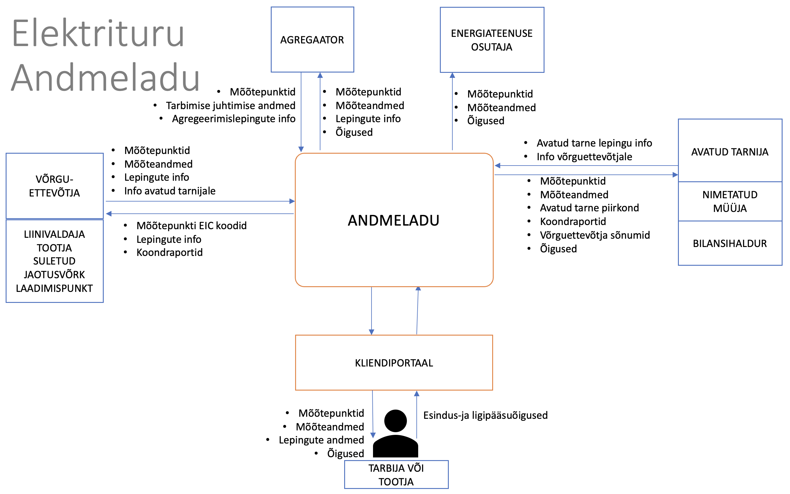

# Datahub description and general principles for data exchange

## Table of contents

- [Datahub description and general principles for data exchange](#datahub-description-and-general-principles-for-data-exchange)
  - [Table of contents](#table-of-contents)
  - [Data exchange platform in the context of electricity market](#data-exchange-platform-in-the-context-of-electricity-market)
  - [Datahub use agreement](#datahub-use-agreement)
  - [Datahub functionality](#datahub-functionality)
  - [EICs](#eics)
  - [General principles of information exchange](#general-principles-of-information-exchange)
    - [Introduction](#introduction)
    - [Environments](#environments)
    - [General rules](#general-rules)
    - [Date and time submission rules](#date-and-time-submission-rules)
    - [Response codes](#response-codes)

## Data exchange platform in the context of electricity market

Pursuant to the Electricity Market Act, in the open electricity market, the entire data exchange process takes place through a data exchange platform (hereinafter referred to as the **Datahub**).

The Datahub is a digital environment through which data is exchanged in the electricity market in order to change open suppliers and aggregators, transmit metering data between market participants, store the data, ensure that market participants fulfil their obligations under law and safeguard their rights.

The aim of the Datahub is to ensure an effective data exchange process in the open electricity market, taking into account the principles of equal treatment of market participants. The Datahub ensures that eligible market participants have equal access to electricity metering data and allows them to change suppliers quickly.

Elering is responsible for the development of the Datahub and for the future maintenance of the entire system. Grid operators are responsible for the volume and quality of the data entered, the accuracy of the metering data, allocation of 60-minute or 15-minute metering data resolution and the accuracy of the customer information entered. Open suppliers are responsible for the correctness of the information in the entered electricity sale agreements. Aggregators are responsible for the accuracy of the information in the aggregation agreements and the consumption management data transmitted.

The Datahub system consists of a software and hardware solution that manages the exchange of electricity metering data between market participants, supports the process of changing suppliers and stores the metering data. The Datahub defines the market participants operating in the Estonian electricity market and all metering points measuring the movement of electricity between market participants. All market participants and metering points will be uniquely identified by a unique code (EIC) issued by the Datahub.

Common data formats have been agreed for the use of the Datahub.

Market participants have access to their metering data and the possibility to download the data in Elering’s customer portal. The customer portal also provides the market participants with access to all the information related to them in the Datahub: agreement deadlines, open suppliers, aggregators, metering data, the market participant’s EIC and the EICs of the metering points related to the market participant. Each market participant can use the customer portal to grant access to metering data from previous periods, in particular for the purpose of receiving personalised offers from open suppliers, entering into an aggregation agreement or sharing their energy data with other energy services. Access to a market participant’s data is granted to market participants and other energy services that have a legal right to access them or have been granted such a right by the market participant in question.

All data relating to natural persons (including EICs) are personal data and the processing of personal data in the Datahub is subject to Regulation (EU) 2016/679 of the European Parliament and of the Council of 27 April 2016 on the protection of natural persons with regard to the processing of personal data and on the free movement of such data, and repealing Directive 95/46/EC (hereinafter referred to as the GDPR).

The legal basis for the use of the Datahub and the data exchange between all market participants is provided by the Electricity Market Act and the Network Code on the Operation of the Electricity Market.

## Datahub use agreement

Market participants who enter data in the Datahub are called operators, whose tasks and responsibilities are divided as follows.

- **Grid operator (GO)** means an electricity undertaking who provides grid services through a grid and **is responsible** for the metering points in its grid area and the collection and transmission of metering data to the Datahub. Each grid operator is a market participant with its own grid losses.  In addition to the legislation, if a market participant does not have an open supply agreement, their open supplier is automatically their grid operator or the supplier named by the operator.
- **Line operator (LO)** uses a direct line for the transmission of electricity and **is responsible** for the collection and transmission of metering data in its line area to the Datahub.
- **Closed distribution network operator (ISO)** provides grid services through a closed distribution network and **is responsible** for the metering points in its grid area and the collection and transmission of metering data to the Datahub. Each grid operator is a market participant with its own grid losses. A closed distribution network is a geographically confined system for the supply of electricity within the boundaries of a production site, a commercial building or a point of common services to commercial customers located therein, whose activities or production processes are interconnected for technical or safety reasons, or through which electricity is mainly supplied to the grid owner or operator who manages that network, or to an undertaking that has control over them.
- **Producer (PO)** transmits the data related to its metering point(s) if it does not hold a line operator licence.
- **Charging point operator (CO)** manages charging points which can be used to charge one EV at a time or to swap one EV battery at a time.
- **Storage operator (STO)** manages the metering points related to the storage of electricity in energy storage units, including two-way charging points for EVs.
- **Gas station operator (GST)** manages gas refuelling points for motor vehicles.
- **Other energy service provider (ES)** is a legal entity that provides energy services or implements other energy efficiency improvement measures in end-user equipment or premises.
- **Open supplier (OS)** is a seller or buyer of electricity who provides an open supply to the customer, i.e. either sells/buys the missing/surplus amount of electricity or sells/buys the entire measured amount of electricity, depending on the agreement with the market participant. The open supplier enters the details of open supply agreements with market participants in the Datahub.
- **Named supplier (NS)** is an open supplier selected by the grid operator to provide, on behalf of the grid operator, open supply services to customers in the grid operator’s service area who do not have an open supply agreement.
- **Balance responsible party (BRP)** is an open supplier at a higher hierarchical level that has a balance agreement with the system operator.
- **Aggregator (AGG)** is the provider of the consumption management service who transmits data related to aggregation agreements, consumption management metering points and data to the Datahub.
- **System operator (TSO)** is Elering, who ensures the balance of the Estonian electricity system, is an open supplier to balance responsible parties that have signed a balance agreement and manages and develops the Datahub under the Electricity Market Act.

Operators, with the exception of energy service providers, are ensured data exchange both via an API and an additional web application.

Energy service providers will only be granted access to data if a market participant grants them the authorisation through the Datahub customer portal and data exchange will be ensured through an API.

A customer portal has been created where end-users are able to access their data, administer their representation rights, grant access rights to other persons and view the logs related to data requests regarding their metering points.

In order to use the Datahub, a agreement must be entered into with the system operator for the use of the Datahub (except for end-users), which defines the rights and obligations between the parties for entering and requesting data in accordance with legislation.

**The system operator will ensure that operators can use the Datahub, by doing the following:**

1. ensuring the security of data transmitted electronically;
2. notifying operators by e-mail or via the Datahub of possible maintenance and development work that will affect the use of the Datahub no later than five (5) working days before the work is to be performed;
3. informing operators by e-mail or via the Datahub of planned maintenance work and downtimes at least three (3) working days in advance;
4. organising the maintenance and development necessary for the smooth operation of the Datahub on the basis of the principle that maintenance work is not scheduled between 8.00 and 12.00;
5. informing operators of any malfunctions in the operation of the Datahub as soon as possible, including by informing them within 15 minutes of any malfunctions that occur during the working day;
6. restoring the functioning of the Datahub as soon as possible (usually within four hours).

All the above electronic notifications are forwarded to the admin designated by the operator in the agreement (chapter 16 of this document). The admin can forward the above notifications to another e-mail address by informing the system operator’s Datahub administrator electronically.

## Datahub functionality

The Datahub as a system covers the following key processes:

1. encoding process;
2. process for transmitting metering point technical data and metering data;
3. process for change of supplier and the exchange of messages describing it;
4. process for grid operators to transmit network bills;
5. channel for information exchange between open suppliers and grid operators;
6. administration of uninterrupted open supply chain and balance portfolios (balance areas);
7. calculation and transmission of aggregated summary reports of balance settlements;
8. transmission of aggregation agreements and metering data of consumption management.

*Figure 1: Datahub key processes*

## EICs

An EIC (*Energy Identification Code*) is a unique identifier assigned to a market participant or a metering point on the basis of a unified encoding system. It is used for the automation of information exchange regarding the market participants operating in the electricity market.

Each market participant must have an EIC to which all its market activities are linked.

The register of EICs is located in the Datahub.

- **Market participant’s EIC** is a unique combination of characters that uniquely identifies the market participant. Market participant’s EIC is assigned automatically by the system operator or the system.
- **Metering point EIC** is a unique combination of characters that uniquely identifies the metering point. The system operator allocates a code range to the distribution network operator or line operator for use.

## General principles of information exchange

### Introduction

The automatic information change (API) between the Datahub and the customer’s information system is done using a REST interface. Systems use JSON format to exchange information.

### Environments

Datahub web application:

- [Test environment](https://public-test-datahub.elering.ee/login)
- [Live environment](https://datahub.elering.ee/login)

Datahub API endpoints:

- [Test environment](https://public-test-datahub.elering.ee)
- [Live environment](https://datahub.elering.ee)

Datahub OpenApi decriptions:

- [Test environment](https://public-test-datahub.elering.ee/swagger-ui/index.html)
- [Live environment](https://datahub.elering.ee/swagger-ui/index.html)
- [The vision of the future](https://github.com/Elering/Estfeed-API)

### General rules

- Mandatory attributes (marked with an asterisk) must always be included. In the absence of an attribute, the 
message cannot be processed and will not be accepted at the receiving end.
- Some attributes are only mandatory in certain cases. If it is so, the relevant indication can be found in the description of the message or attribute or in these documents.
- If an attribute is not mandatory, it may be left out.
- The default encoding used for messages is UTF-8.

### Date and time submission rules

- All dates and times are submitted in [ISO-8601](http://en.wikipedia.org/wiki/ISO_8601) format. The system supports both UTC and time zone offsets. Thus both `2023-04-01T00:00Z` and `2023-04-01T00:00+03:00` are allowed.

### Response codes

The Datahub uses classic REST API response codes. In the event of an error, the system will return information on the cause of the error if possible. Error descriptions are in both human-readable and machine-readable formats.

Read more in document [API error codes](35-error_codes.md)
