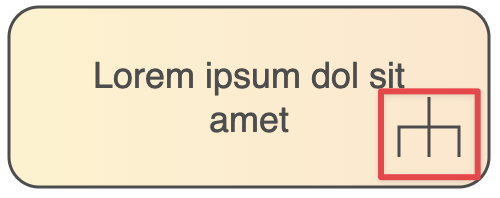

# Business processes

## Table of contents

- [Business processes](#business-processes)
  - [Table of contents](#table-of-contents)
  - [Introduction](#introduction)
  - [Metering point management](#metering-point-management)
    - [Register new metering point](#register-new-metering-point)
    - [Update metadata of a metering point](#update-metadata-of-a-metering-point)
  - [Customer management](#customer-management)
    - [Register new customer](#register-new-customer)
    - [Update metadata of a customer](#update-metadata-of-a-customer)
  - [Agreement management](#agreement-management)
    - [Register new grid agreement](#register-new-grid-agreement)
    - [Register new open supply agreement](#register-new-open-supply-agreement)
    - [Generate and distribute general service agreements](#generate-and-distribute-general-service-agreements)
    - [Exchange customer's billing information from grid operator to named supplier](#exchange-customers-billing-information-from-grid-operator-to-named-supplier)
  - [Connecting to and disconnecting from the grid](#connecting-to-and-disconnecting-from-the-grid)
    - [Disconnecting](#disconnecting)
    - [Reconnecting](#reconnecting)
  - [Joint invoice management](#joint-invoice-management)
    - [Add joint invoice](#add-joint-invoice)
    - [Update joint invoice](#update-joint-invoice)
  - [Network bill management](#network-bill-management)
    - [Add network bill](#add-network-bill)
    - [Update network bill](#update-network-bill)

## Introduction

This document describes the main Datahub related business processes and thereby tries to give an overview about the connection between different API-s and business processes.

The diagrams are composed in an object-oriented way, where complex processes reuse simpler processes. For example, the process "Register new grid agreement" reuses the following processes:

- Register new customer
- Update metadata of a customer
- Register new metering point

Indicator for reused process is:

## Metering point management

### Register new metering point

### Update metadata of a metering point

## Customer management

### Register new customer

### Update metadata of a customer

## Agreement management

### Register new grid agreement

### Register new open supply agreement

### Generate and distribute general service agreements

Business process:

Additional diagram, that helps to clarify how general service agreements are generated:

### Exchange customer's billing information from grid operator to named supplier

## Connecting to and disconnecting from the grid

### Disconnecting

### Reconnecting

## Joint invoice management

### Add joint invoice

### Update joint invoice

*Process is under development*

## Network bill management

### Add network bill

### Update network bill

