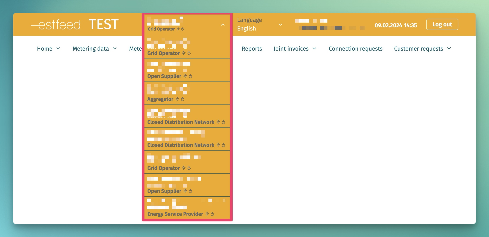

# Authentication and authorisation

## Table of contents

- [Authentication and authorisation](#authentication-and-authorisation)
  - [Table of contents](#table-of-contents)
  - [Introduction](#introduction)
  - [Authentication in web interface](#authentication-in-web-interface)
  - [Authentication in API](#authentication-in-api)
    - [Examples of JWT requests](#examples-of-jwt-requests)
      - [cURL](#curl)
      - [Python](#python)
  - [Authorisation](#authorisation)

## Introduction

This page describes the authentication and authorization rules implemented in the system.

User accounts must first be set up for successful authentication. Read about it on the page [Users management](03.02-users-management.md)

In addition, the Datahub applies data access restrictions, which are described on the page [Role based access rights](03.01-role-based-access-rights.md)

## Authentication in web interface

In order to authenticate in the Datahub web interface, the user has to authenticate himself with ID-card, mobile-ID or smart-ID. After successful authentication, the Datahub identifies the user's roles and allows the user to specify in which role he wants to use the Datahub.

The user can choose between the roles assigned to him:



If there are no assigned roles, the functionality of the web interface cannot be used.

## Authentication in API

The previously created technical user `client_id` and `client_secret` must be used for authentication in the API interface.

Authentication process:

| Step                                                                 | Result                                                                                                                                                                                           |
|----------------------------------------------------------------------|--------------------------------------------------------------------------------------------------------------------------------------------------------------------------------------------------|
| Sending an authentication request to the address provided by Elering | The Datahub validates the account, creates the session and returns a JWT valid for the length of the session                                                                                     |
| A JWT is added to each subsequent API message                        | The Datahub validates the JWT. If it is missing or invalid, an error code 401 (unauthorised) is returned. If it is valid, an authorisation follows, which you can read about in the next chapter |

Keycloak variables:
- Public test environment:
  - host: https://test-kc.elering.ee
  - vhost: `estfeed-public`

### Examples of JWT requests

#### cURL

```bash
#!/bin/bash
# Example cURL request for retrieving token for Estfeed public test.
# For use with API requests, must be passed as a header.

API_CLIENT="replace this client"
API_SECRET="replace this secret"

TOKEN=$(\
    curl \
        -s \
        -X POST \
        -d grant_type=client_credentials \
        -d client_id=$API_CLIENT \
        -d client_secret=$API_SECRET \
        -d scope=openid
        https://{replace this with Keycloak host}/realms/{vhost}/protocol/openid-connect/token \
)

if ! command -v jq &> /dev/null; then
    echo -e "WARN: jq not found for JSON parsing, printing out raw json\n"
    echo $TOKEN
    exit 0
fi

ACCESS_TOKEN=`echo $TOKEN | jq -er .access_token`
EXPIRES_IN=`echo $TOKEN | jq -r .expires_in`
REFRESH_ACCESS_TOKEN=`echo $TOKEN | jq -er .refresh_token`
REFRESH_EXPIRES_IN=`echo $TOKEN | jq -er .refresh_expires_in`

if [[  $ACCESS_TOKEN == null ]]; then
    echo 'FATAL: Access token not found, probably incorrect credentials.'
    exit 1
fi

echo "===================================================================================="
echo -e "\t\tAccess token:"
echo -e "Expires at\n\t`date --date=\"+$EXPIRES_IN seconds\"` ($EXPIRES_IN seconds)\n\nToken\n\t$ACCESS_TOKEN"
echo "===================================================================================="
echo -e "\t\tRefresh token:"
echo -e "Expires at\n\t`date --date=\"+$REFRESH_EXPIRES_IN seconds\"` ($REFRESH_EXPIRES_IN seconds)\n\nToken\n\t$REFRESH_ACCESS_TOKEN"
echo "===================================================================================="

```

#### Python

```python
import requests
import config

url = f'{config.keycloakHost}/auth/realms/{config.keycloakVhost}/protocol/openid-connect/token'
headers = {'Content-type': 'application/x-www-form-urlencoded'}
body = f'client_id={config.keycloakClientId}&grant_type=client_credentials&client_secret={config.keycloakClientSecret}&scope=openid'

response = requests.post(url, headers=headers, data=body)
access_token = response.json().get('access_token')
print(access_token)
```

Example

```text
grant_type=client_credentials&client_id=client123&client_secret=secret123&scope=openid
```

## Authorisation

Authorization is performed by the Datahub. Each activity in both the web- and API interfaces is associated with the selected role. The Datahub validates whether the given activity is allowed by the given user in the given role and with the given data or not.

In the web interface, authorization is done by selecting a role.

In the API interface, authorization is done through the right technical user access *token* and the `marketParticipantContext` section of the request, where the API message sender must define their role for sending the request. Its purpose is to create a clear understanding of who sends requests and why, and what the data are being used for.

The `marketParticipantContext` section consists of the following attributes:

```json
"marketParticipantContext": {
  "marketParticipantIdentification": "string", 
  "marketParticipantRole": "string", 
  "commodityType": "string"
}
```

Attributes description:

| Attribute                       | Description                                                                                                                                                                                                                                              |
|---------------------------------|----------------------------------------------------------------------------------------------------------------------------------------------------------------------------------------------------------------------------------------------------------|
| marketParticipantIdentification | The EIC X code of the market participant sending the message. Must refer to the same market participant defined in the JWT.                                                                                                                              |
| marketParticipantRole           | The role in which the market participant sends the message. E.g. if the open supplier is also a grid operator, then the request must define which role is currently being used. For example, an open supplier can request data in the OPEN_SUPPLIER role |
| commodityType                   | Type of energy product (electricity or gas). Important for companies that are involved in both the electricity and gas markets.                                                                                                                          |

If the defined `marketParticipantContext` does not match the rest of the message (e.g. tries to register a new metering point in the role ‘Open supplier’), the Datahub will respond with an error code.

Roles:

| Role                                 | `marketParticipantIdentification` code |
|--------------------------------------|----------------------------------------|
| Open supplier                        | OPEN_SUPPLIER                          |
| Grid operator                        | GRID_OPERATOR                          |
| Closed distribution network operator | CLOSED_DISTRIBUTION_NETWORK            |
| Line operator                        | LINE_OPERATOR                          |
| Charging point operator              | CHARGING_POINT_OPERATOR                |
| Aggregator                           | AGGREGATOR                             |
| Producer                             | PRODUCER_OPERATOR                      |
| Other energy service provider        | ENERGY_SERVICE_PROVIDER                |
