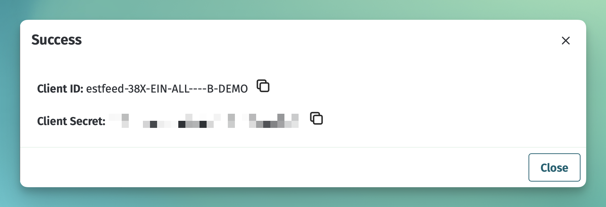

# Users management

## Table of contents

- [Users management](#users-management)
  - [Table of contents](#table-of-contents)
  - [Introduction](#introduction)
  - [Management of regular users](#management-of-regular-users)
  - [Management of technical users](#management-of-technical-users)

## Introduction

To use the Datahub, the market participant must go through the integration process with Elering. During this, at least one ADMIN user is created, who can then manage his own users.

Two types of users can be managed in the Datahub:

- Regular users - physical persons who can log in to the web interface and perform the necessary activities
- Technical users - non-physical users designed to use the API.

Regular and technical users are implemented somewhat differently in the Data Warehouse system:

- The prerequisite for a normal user is the identity of a physical person in the Datahub
- The technical user is not related to a physical person and is therefore independent of existing identities
- An regular user can represent different market participants in different roles (e.g. as a grid operator's viewer of the agreements and as an open supplier's editor of agreements)
- A technical user cannot represent different market participants
- An ordinary user must select the correct role to perform activities through the web interface (e.g. if a market participant is registered as both a grid operator and a closed distribution network operator, the user must select the correct role)
- The technical user can act within the assigned roles regardless of the market participant's current role and the type of commodity type

For both user types, it is possible to manage access rights by assigning or removing roles.

## Management of regular users

User rights of one user can be configured in combination with market participant roles, commodity types and user roles. For example:

| Market participant | Market participant role | Type of commodity | User role        | Result                                                                                                                           |
|--------------------|-------------------------|-------------------|------------------|----------------------------------------------------------------------------------------------------------------------------------|
| Company X          | Open supplier           | Electricity       | VIEWER_AGREEMENT | The user can view the electricity metering point agreements that Company X, as an open supplier, has the right to view           |
| Company X          | Open supplier           | Gas               | EDITOR_AGREEMENT | The user can view and edit the gas metering point agreements that Company X, as an open supplier, has the right to view and edit |
| Company X          | Grid operator           | Electricity       | EDITOR_AGREEMENT | The user can view and edit electricity metering point agreements that Company X, as a grid operator, has the right to view       |

To manage user rights, navigate to the "Home -> Users" page. If the user does not exist, the user must first be added with the "Register user" button.

If the user exists, but does not have previous user rights, rights can be assigned to the user using the "New authorization" button. If the user already has user rights, they can be changed using the "Modify" button.

In both cases, a modal window for adding and changing user roles opens:

## Management of technical users

Each user with the corresponding rights of the market participant has the opportunity to manage the necessary technical users themselves in the Datahub web interface.

Each integrated market participant, who wishes to use the API interface,  needs at least one technical user, but it may be necessary to create several in the following cases:

- The market participant's system is divided into smaller parts that interact with the Data Warehouse independently and the market participant wishes, for example, for security reasons, to allocate its own technical user to each subsystem
- The integrated system is common to several market participants and when sending messages on behalf of different market participants, it is necessary to use the specific technical user of the market participant

To create a technical user, navigate to the "Home -> Technical users" page and press the "New" button. In the opened window, the "suffix" of the technical user must be specified, the remaining part of the technical user ID is automatically added by the Datahub according to the selected market participant:

After creating a technical user, the necessary data for authentication is displayed to the user:

- Client ID
- Client Secret

> **Warning**
>
> Client ID and Client Secret values are displayed once. After the successful creation of the user, the values must be copied immediately, because it will not be possible to see these values later.

With these values, it is possible to request a *token* in the API interface. Read more in the document [Authentication and authorization](03-authentication-and-authorisation.md)

It is possible to manage technical user rights from the "Home -> Users" view in the same way as for regular users.
