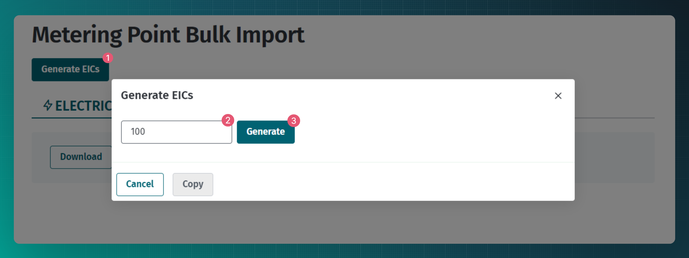
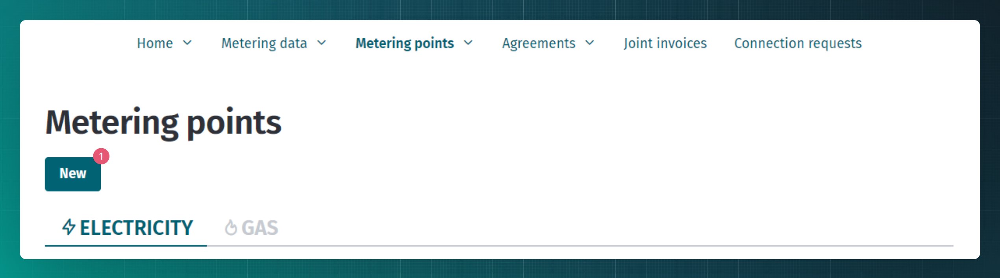
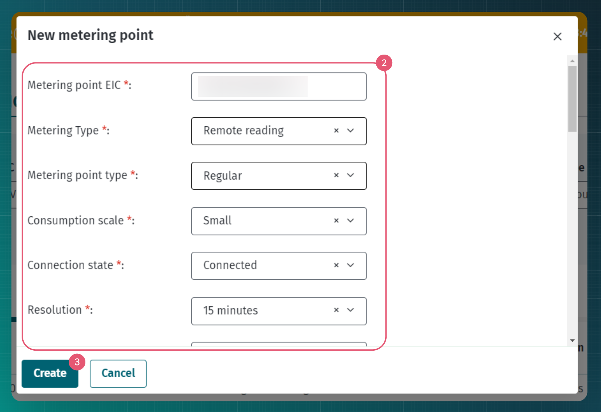
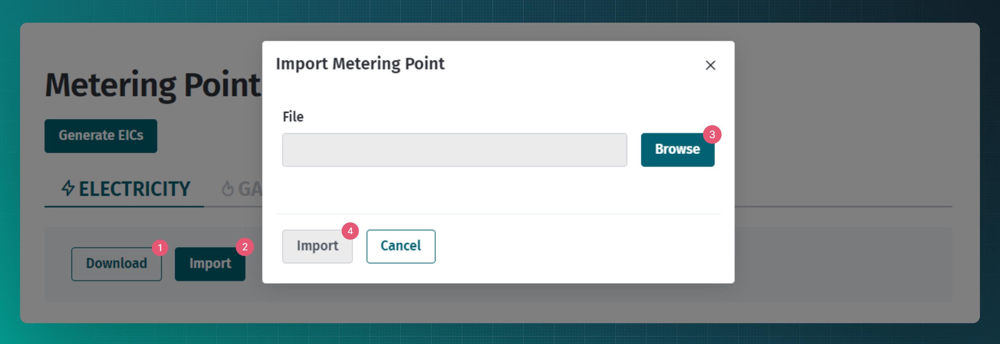
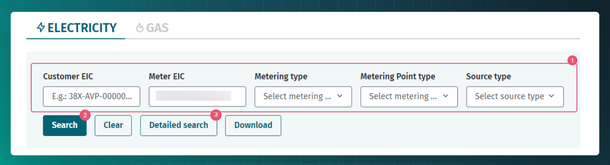
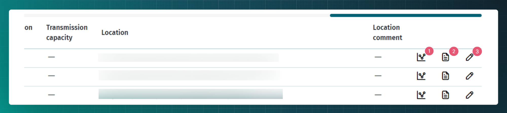

# Metering point

## Table of contents

<!-- TOC -->
* [Metering point](#metering-point)
  * [Table of contents](#table-of-contents)
  * [Introduction](#introduction)
  * [Transmitting metering point data](#transmitting-metering-point-data)
    * [Web interface](#web-interface)
    * [Mass import](#mass-import)
    * [API messages](#api-messages)
      * [Messages](#messages)
      * [Message rules](#message-rules)
  * [Requesting metering point data](#requesting-metering-point-data)
    * [API messages](#api-messages-1)
      * [Messages](#messages-1)
      * [Message rules](#message-rules-1)
        * [`meter/search` rules](#metersearch-rules)
        * [`meter/search/customer` rules](#metersearchcustomer-rules)
<!-- TOC -->

## Introduction

A metering point is a device that measures the amount of energy consumed and produced at a given location.

Metering points are managed by the following market participants:

- grid operator;
- line operator;
- closed distribution network operator;
- aggregator;
- producer;
- charging point operator;
- storage operator;
- gas station operator.

For the purpose of this document, they are collectively referred to as **metering point operators**.

Metering point operators are responsible for adding and updating metering point data for the metering points in their area in the Datahub.

> [!WARNING] 
> Please note! Metering point operators are obliged to update the metering point data as soon as possible.

## Transmitting metering point data

Metering point operators can transmit the technical data of metering points:

- one by one using web interface
- using mass import via web interface
- one by one using `meter` service
- using `import` service for mass import

The data of metering point is the same in all interfaces. The data of a metering point is:

- Common data for all metering point types:

| Attribute in the API | Column name in mass import template | Explanation        | Mandatory? | Other rules                                                     |
|----------------------|-------------------------------------|--------------------|------------|-----------------------------------------------------------------|
| meterEic             | Metering Point EIC                  | 16 digits EIC code | yes        | Must be valid EIC code and inside the range of issued EIC range |
| meteringType         | Metering Type                       |                    | yes        | One of: REMOTE_READING, VIRTUAL, NON_REMOTE_READING             |
| meteringPointType    | Metering Point Type                 |                    | yes        | One of: REGULAR, INTERNAL, BORDER, AGGREGATION                  |

- Specific data for electricity and gas metering points:

| Attribute in the API   | Column name in mass import template | Explanation                               | Mandatory?              | Other rules                                                                                                                                                                                                                   |
|------------------------|-------------------------------------|-------------------------------------------|-------------------------|-------------------------------------------------------------------------------------------------------------------------------------------------------------------------------------------------------------------------------|
| consumptionScale       | Consumption Scale                   |                                           | yes                     | One of: SMALL, LARGE                                                                                                                                                                                                          |
| connectionState        | Conection State                     |                                           | yes                     | One of: CONNECTED, DISCONNECTED                                                                                                                                                                                               |
| resolution             | Resolution                          |                                           | yes                     | One of: PT15M (15 minutes), PT1H (1 hour)                                                                                                                                                                                     |
| customerType           | Customer Type                       |                                           | yes                     | One of: CONSUMER, GRID_OPERATOR, PRODUCER, MICRO (micro producer), LINE_OPERATOR, ENERGY_STORAGE_UNIT, CHARGING_POINT_OPERATOR                                                                                                |
| production             | Production                          | is any production in metering point?      | yes                     | One of: TRUE (yes), FALSE (no)                                                                                                                                                                                                |
| productionSource       | Production Source                   |                                           | yes, if production=true | One of: SOLAR, WIND, HYDRO, BIOGAS, BIOMASS, NATURAL_GAS, OIL_SHALE, OTHER_RENEWABLE, OTHER_NON_RENEWABLE                                                                                                                     |
| transmissionNetworkEic | Transmission Network EIC            | 16 digit EIC code of transmission network | yes                     | EIC code of transmission network must be registered in the Datahub. Commodity type has to match Metering Point's commodity type. In case the correct code is missing it is possible to use the general code 38A-1234567890-1. |
| apartmentAssociation   | Apartment Association               | is it an apartment association?           | yes                     | One of: TRUE (yes), FALSE (no)                                                                                                                                                                                                |

- Specific data for electricity metering points:

| Attribute in the API  | Column name in mass import template | Explanation                                | Mandatory? | Other rules                                                                                 |
|-----------------------|-------------------------------------|--------------------------------------------|------------|---------------------------------------------------------------------------------------------|
| isolatedMeteringPoint | Isolated Metering Point             | is isolated metering point?                | yes        | One of: TRUE (yes), FALSE (no)                                                              |
| electricalHeating     | Electrical Heating                  | electrical heating used in metering point? | yes        | One of: TRUE (yes), FALSE (no)                                                              |
| chargingPoint         | Charging Point                      | is charging point?                         | yes        | One of: TRUE (yes), FALSE (no)                                                              |
| storageCapacity       | Storage Capacity                    | storage capacity in kW                     | no         | Must be integer or floating (max. 2 positions after comma) number. Leave empty if no value. |
| storageEnergy         | Storage Energy                      | storage capacity  energy in kWh            | no         | Must be integer or floating (max. 2 positions after comma) number. Leave empty if no value. |
| productionCapacity    | Production Capacity                 | production capacity in kW                  | no         | Must be integer or floating (max. 2 positions after comma) number. Leave empty if no value. |
| transmissionCapacity  | Transmission Capacity               | transmission capacity in kW                | no         | Must be integer or floating (max. 2 positions after comma) number. Leave empty if no value. |

- Specific data for aggregation metering points:

| Attribute in the API | Column name in mass import template | Explanation                                | Mandatory? | Other rules                   |
|----------------------|-------------------------------------|--------------------------------------------|------------|-------------------------------|
| parentMeterEic       | Parent Metering Point EIC           | 16 digit EIC code of parent metering point | yes        | Must be registered in Datahub |

- Common address data for all metering point types:

| Attribute in the API | Column name in mass import template | Explanation                                   | Mandatory?                               | Other rules                                                                                                                                                            |
|----------------------|-------------------------------------|-----------------------------------------------|------------------------------------------|------------------------------------------------------------------------------------------------------------------------------------------------------------------------|
| adrId                | Adr ID                              | Address ID (ADR_ID) of Land Board ADS system  | yes if county and municipality are empty | Must be an integer                                                                                                                                                     |
| comment              | Comment                             |                                               | no                                       |                                                                                                                                                                        |
| county               | County                              | ADS level 1                                   | yes                                      |                                                                                                                                                                        |
| municipality         | Municipality                        | ADS level 2                                   | yes                                      |                                                                                                                                                                        |
| locality             | Locality                            | ADS level 3                                   | no                                       |                                                                                                                                                                        |
| streetAddress        | Street Address                      | street, house, apartment etc (ADS levels 4-8) | yes                                      |                                                                                                                                                                        |
| postcode             | Postcode                            |                                               | yes                                      | When the correct code is not known then 00000 should be used.                                                                                                                                                       |
| latitude             | Latitude                            | latitude of coordinates                       | no                                       | In case LEST97, the value must be 7 positions before and 1-3 positions after comma. In case WGS84, the value must be 2 positions before and 4-8 positions after comma. |
| longitude            | Longitude                           | latitude of coordinates                       | no                                       | In case LEST97, the value must be 6 positions before and 1-3 positions after comma. In case WGS84, the value must be 2 positions before and 4-8 positions after comma. |
| coordinateSystem     | Coordinate Sytem                    |                                               | yes if coordinates are provided          | One of: WGS84, LEST97                                                                                                                                                  |

> [!NOTE]
> The structure and validation rules of address attributes are under development

### Web interface

When needed, it is possible to generate a new available EIC code via the web interface by navigating to the “Metering points” -> “Metering Point Bulk Import” page. You need to specify the number of EIC codes needed.

There are two options for adding metering points in the web interface:

- one by one
- using mass import

For one by one uploading you need to navigate to the "Metering points" page.

1. Click the "New" button.
2. Fill in all mandatory fields (marked with an asterisk) in the modal window.
3. If the “Create” button is inactive, there might be an unfilled mandatory field.

Metering point mass import is possible by navigating to "Metering points" -> "Metering Point Bulk Import" page and using a MS Excel file.

1. Download the template.
2. Use the “Import” button to open the modal window.
3. Add the data-filled file containing the metering point(s).

On the "Metering points" page it is possible to use the search functionality to find the needed metering points.

1. If needed 1 or more search requirements can be added.
2. Without any search requirements all metering points are shown. Otherwise, the results are shown based on the given search requirements.
3. It is possible to use more search categories by opening the detailed search.

From the metering point results it is possible to:
1. view the metering point metering data;
2. view the metering point agreements;
3. change the metering point data.

The described functionalities are for market participants who manage metering points, other roles do not have the possibility to edit the data.

### Mass import

Both web interface and API services provide option to perform metering point mass import using MS Excel file. To use that option, one has to use the web interface or `template` service and download commodity and metering point type specific template, add data and upload the filled template using the web interface or `import` service.

The data of the metering point is described in paragraph [Transmitting metering point data](#transmitting-metering-point-data), but there is one difference - as the template is already commodity and metering point type specific, then the additional metering point type (REGULAR või INTERNAL) has to be specified only for the electricity or gas metering points

### API messages

#### Messages

| Message                              | Objective                                          |
|--------------------------------------|----------------------------------------------------|
| `POST /api/{version}/meter`          | Create meter with metadata                         |
| `PUT /api/{version}/meter`           | Update meter metadata                              |
| `POST /api/{version}/template/meter` | Get metering point mass import templates           |
| `POST /api/{version}/meter/import`   | Mass import metering points with template          |
| `POST /api/{version}/eic/amount`     | Get a list of unused EICs from a range             |
| `POST /api/{version}/eic/range`      | Get a list of EIC ranges of the Market Participant |

#### Message rules

- The EIC of the metering point must be within one of the ranges of the grid operator’s EIC ranges.
- The `marketParticipantContext.commodityType` of the message defines the commodity type of the metering point and consequently the allowed metadata:
  - for `ELECTRICITY` value - electricity or aggregation metadata is allowed and required;
  - for `NATURAL_GAS` value - gas or aggregation metadata is allowed and required;
- The type of the metering point defines the allowed metadata:
  - regular, border, internal types – gas or electricity metadata are allowed;
  - aggregation – aggregation metadata are allowed.
- The resolution of the metering point is additional information and does not affect the transmission of metering data in the future, but only characterises whether the metering point is able to read consumption with an accuracy of 15 minutes, one hour or a day.
- Rules for XY coordinates:
  - XY coordinates are not mandatory
  - Values must be numerical, that can contain positions after comma
  - Values must fit inside the bounding box of Estonia
- For electricity regular metering point, the `marketParticipantRole` value must be one of:
  - GRID_OPERATOR
  - LINE_OPERATOR
  - CLOSED_DISTRIBUTION_NETWORK
  - PRODUCER_OPERATOR
  - CHARGING_POINT_OPERATOR
- For gas regular metering point, the `marketParticipantRole` value must be one of:
  - GRID_OPERATOR
  - PRODUCER_OPERATOR
- For any border metering point, the `marketParticipantRole` value must be one of:
  - GRID_OPERATOR
- For any aggregation metering point, the `marketParticipantRole` value must be AGGREGATOR
- For data quality reasons, please use the official [EHAK classification](https://klassifikaatorid.stat.ee/Item/stat.ee/c4c47742-12d7-4fea-bc8c-5aeca9112e2a/88) (county, municipality and settlement unit designations) for addresses submitted as text.

## Requesting metering point data

In general, all authorised users can request metering point data using the `search` services, but open suppliers and balance responsible parties can also request updates of new and changed metering point data using the `data-distribution/search` service.

### API messages

#### Messages

| Message                                     | Objective                                                                                                                                             |
|---------------------------------------------|-------------------------------------------------------------------------------------------------------------------------------------------------------|
| `POST /api/{version}/meter/search`          | Find Metering Points by attributes (check paragraph below for rules)                                                                                  |
| `POST /api/{version}/meter/search/customer` | Find Customer's Metering Points (with valid or future grid agreements) by Customer EIC **to create a new SUPPLY agreement** (Grid Code's §8(5) check) |
| `POST /api/{version}/meter/search/border`   | Get border Metering Points by customer                                                                                                                |
| `POST /api/{version}/meter/export`          | Export Metering Points by attributes (check paragraph below for rules)                                                                                |
| `POST /api/{version}/eic/amount`            | Find unused EIC codes from **own** EIC range                                                                                                          |
| `POST /api/{version}/eic/range`             | Find **own** EIC ranges                                                                                                                               |

> [!CAUTION] 
> Service `POST /api/{version}/meter/search/customer` is allowed to use only when adding new agreement. Legitimate usage of this service is monitored

#### Message rules

##### `meter/search` and `meter/export` rules

- The Datahub returns all data of the Metering Point if:
  - requester is the owner of the Metering Point
  - requester has the customer authorization, given by the Customer via the Self Service Portal
  - requester is the open/named supplier and has currently active (or had in the last 12 months) open supply or general service agreement with the Metering Point
  - requester is the aggregator and has currently active (or had in the last 12 months) aggregation agreement with one of the child Metering Points
  - requester is the owner of the parent Metering Point and request the data of some child aggregation Metering Point
- In all other cases Datahub returns no data

##### `meter/search/customer` rules

- The Datahub returns all data of the Metering Point if:
  - requester has the customer authorization, given by the Customer via the Self Service Portal
  - requester is the open/named supplier and has currently active (or had in the last 12 months) open supply or general service agreement with the Metering Point
  - requester is requesting the metering points of the legal person or organization and confirms, that he has authorization in a form enabling written reproduction from the Customer (`legalConsent` is set to `true`)
- In all other cases Datahub returns  only EIC code of the Metering Point
