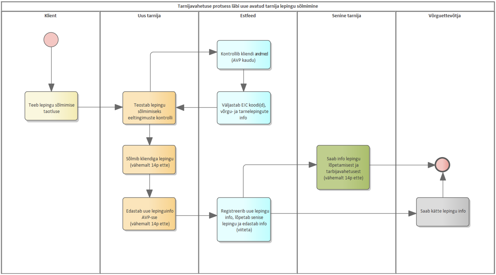
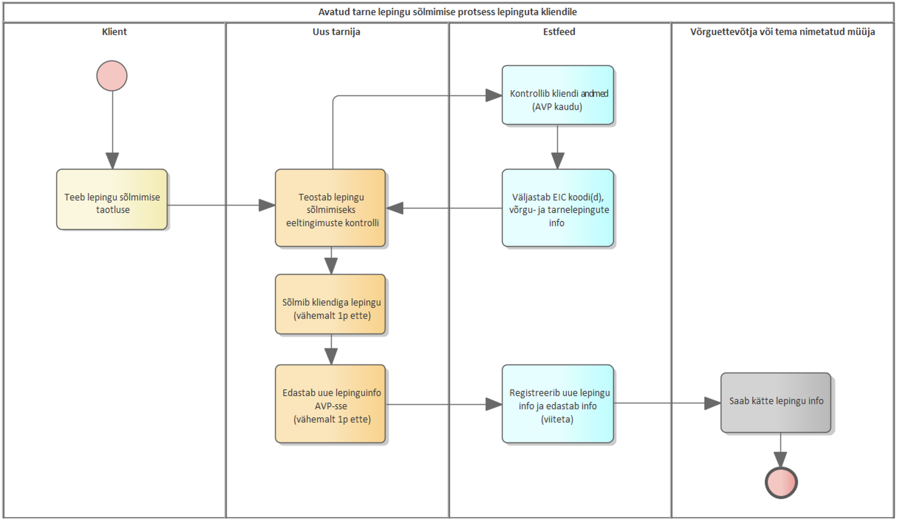

# Open supplier change process

## Table of contents

- [Open supplier change process](#open-supplier-change-process)
  - [Table of contents](#table-of-contents)
  - [Introduction](#introduction)
  - [General principles of open supplier change](#general-principles-of-open-supplier-change)
  - [Open supply agreements for a specified and unspecified period](#open-supply-agreements-for-a-specified-and-unspecified-period)
  - [Process description](#process-description)
    - [Open supplier change process schemes](#open-supplier-change-process-schemes)
      - [Open supplier change when the market participant has an open supply agreement](#open-supplier-change-when-the-market-participant-has-an-open-supply-agreement)
      - [Open supplier change when the market participant does not have an open supply agreement (uses the general service)](#open-supplier-change-when-the-market-participant-does-not-have-an-open-supply-agreement-uses-the-general-service)
    - [Open supplier change examples since 01.01.2023](#open-supplier-change-examples-since-01012023)
      - [Supplier change, no change in grid agreement](#supplier-change-no-change-in-grid-agreement)
      - [Supplier change, no change in grid agreement, customer cancels agreement within 14 days](#supplier-change-no-change-in-grid-agreement-customer-cancels-agreement-within-14-days)
      - [Adding a new agreement to a period without an open supply agreement, no change in grid agreement](#adding-a-new-agreement-to-a-period-without-an-open-supply-agreement-no-change-in-grid-agreement)
      - [Entering into an open supply agreement due to a change of consumer\*\*, new grid agreement!](#entering-into-an-open-supply-agreement-due-to-a-change-of-consumer-new-grid-agreement)
    - [Open supplier change FAQ](#open-supplier-change-faq)

## Introduction

The rules of open supply and supplier change are provided for in the Electricity Market Act and the requirements set out in the Network Code on the Operation of the Electricity Market. This document outlines the process and rules on how the open supplier change takes place as of **01.01.2023**.

The rules of the open supplier change process only apply if a market participant wishes to change an existing open supplier. In other words, there is an active open supply agreement in the Datahub or the market participant uses the general service.

This document does not repeat the rules described in [Open supply agreement](05.3-open-supply-agreement.md).

## General principles of open supplier change

The rules of the open supplier change procedure in the Datahub are based on the requirements provided for in the Electricity Market Act and the Network Code on the Operation of the Electricity Market.

1. The procedure for open supplier change in the Datahub **does not include** any **fixed supply** transactions agreed with the supplier. Fixed supply means the sale to or purchase form a market participant of a fixed amount of electricity which is agreed upon in advance for a trading period. A market participant may have several fixed supplies. The Datahub does not contain information on fixed supply transactions.
2. The supplier can be changed on any day.
3. The open supplier enters the start time of an open supply agreement at the metering point to the Datahub.
4. An open supply agreement can be terminated by the open supplier itself for its own open supply agreements or by the Datahub when a new open supplier registers a new open supply agreement for a customer at the metering point.
5. If an open supplier cancels or otherwise terminates an open supply agreement, they must enter the termination details in the Datahub.
6. The new open supplier submits a notice concerning the new open supply agreement to the Datahub by the deadline specified in the legislation.
7. Before entering into an open supply agreement, the new open supplier must check via the Datahub whether the market participant has a metering point with a valid grid agreement for which it wishes to enter into an open supply agreement and whether the market participant’s existing open supply agreement contains a termination fee requirement. In the latter case, it is the responsibility of the open supplier to inform the market participant of the requirement of the agreement to ensure that the market participant is aware of the potential costs of changing the supplier.

## Open supply agreements for a specified and unspecified period

An open supply agreement may be entered into with any market participant either for an unspecified or a specified period, depending on the arrangement between the open supplier and the market participant. The open supplier must submit agreement information to the Datahub as follows:

1. The open supplier enters the open supply agreement to the Datahub as a agreement entered into **for an unspecified period** if the agreement entered into with the market participant has no end date and the market participant does not incur fee claims from the open supplier upon the termination of the agreement.
2. The open supplier enters the open supply agreement to the Datahub as a agreement entered into **for a specified period** if such a agreement has been entered into with the market participant and the market participant may incur fee claims from the open supplier for early termination of the agreement. Therefore, in the case of a agreement entered into for a specified period, **the open supplier is obliged** to enter to the Datahub the end date of the open supply agreement and whether the market participant can incur early termination **fee claims** from the open supplier provided for in the agreement (**yes/no**). The proportionality of the fee requirements for agreements terminated early is supervised by the Estonian Competition Authority (fee information has not been transmitted to the Datahub).

## Process description

Open supplier change can take place on **any** calendar day by following the process below:

1. The process of changing suppliers in the Datahub begins with the transmission of new agreement information about the market participant from the new open supplier at least 14 days in advance. Upon receipt of the new agreement information, the Datahub will terminate the market participant’s current open supply immediately and will transmit the agreement change information to the associated open suppliers and the grid operator.
2. Before entering into an open supply agreement, the new open supplier must check via the Datahub whether the market participant has a metering point with a valid grid agreement for which it wishes to enter into an open supply agreement and whether the market participant’s existing open supply agreement contains a termination fee requirement. In the latter case, it is the responsibility of the open supplier to inform the market participant of the requirement of the agreement to ensure that the market participant is aware of the potential costs of changing the supplier.
3. The consumer can withdraw from the open supply agreement within 14 days. In this case, the open supplier cancels the agreement in the Datahub before the entry into force of the agreement (at least one day in advance). The open supplier can also, for any other reason, transmit to the Datahub information regarding the termination of the agreement with a market participant at least one day in advance.

### Open supplier change process schemes

#### Open supplier change when the market participant has an open supply agreement

To change the supplier, the market participant can terminate the existing open supply agreement via entering into a agreement with a new open supplier, authorising the new open supplier to terminate its existing open supply agreement through the Datahub. The timing of supplier change is determined by the Network Code on the Operation of the Electricity Market.

*Figure 1. Supplier change process via entering into a new open supplier agreement*

When the open supplier transmits new agreement information to the Datahub, the Datahub immediately verifies the transmission of the agreement information and sends a agreement termination message to the existing open supplier and a agreement registration message to the new open supplier. The Datahub ensures that the supplier is changed and information transmitted to the parties in less than 24 hours on the technical side.

When changing the supplier by entering into a agreement with a new open supplier, the customer does not remain on the general service.

#### Open supplier change when the market participant does not have an open supply agreement (uses the general service)

If the market participant does not have an open supply agreement for a metering point, their open supplier is the metering point’s grid operator or the supplier named by the grid operator. In this case, the customer can enter into a new open supply agreement provided that the new open supplier transmits the agreement information at least one day in advance.

*Figure 2. Entering into an open supply agreement when the customer does not have a agreement*

### Open supplier change examples since 01.01.2023

#### Supplier change, no change in grid agreement

1. The open supplier can request the Datahub for the EIC of the metering point and whether the metering point has a valid grid agreement and open supply agreements (without open supplier data) before sending the agreement information.

| Example: information on agreements in force as of 05.09.2022                             | On 05.09.2022 at 9:00 |
|------------------------------------------------------------------------------------------|-----------------------|
| Open supply agreement (supplier A, name is not transmitted)                              | 01.01.2022-….         |
| Open supply agreement (supplier B, name is not transmitted), early termination fee – YES | 01.01.2023-31.12.2023 |

2. The open supplier wishes to enter a agreement with a start date of 20.09.2022. **Please note,** in the case of a agreement for an unspecified term, the Datahub will terminate both the existing agreement and the new one, which will start on 01.01.2023. The supplier must check that the customer is allowed to terminate/cancel the agreement early or that it is suitable to them (the information is available in the Datahub). If the customer only wants a agreement until 31.12.2022, the supplier must provide the agreement information accordingly. In this case, the Datahub will not terminate the agreement that starts on 01.01.2023.

| Example: on 05.09.2022, supplier C transmits a agreement with a period of 20.09.2022-31.12.2022 | 05.09.2022                                        |
|-------------------------------------------------------------------------------------------------|---------------------------------------------------|
| Open supply agreement (supplier A)                                                              | 01.01.2022-19.09.2022 (terminated by the Datahub) |
| Open supply agreement (supplier C)                                                              | 20.09.2022-31.12.2022                             |
| Open supply agreement (supplier B), early termination fee – YES                                 | 01.01.2023-31.12.2023                             |

If the supplier submits information regarding a new agreement for an unspecified period, the agreements in the Datahub are as follows:

| Example: on 05.09.2022, supplier C transmits a agreement with a period of 20.09.2022-…. | 05.09.2022                                        |
|-----------------------------------------------------------------------------------------|---------------------------------------------------|
| Open supply agreement (supplier A)                                                      | 01.01.2022-19.09.2022 (terminated by the Datahub) |
| Open supply agreement (supplier C)                                                      | 20.09.2022-….                                     |
| Open supply agreement (supplier B), early termination fee – YES                         | cancelled                                         |

#### Supplier change, no change in grid agreement, customer cancels agreement within 14 days

1. An open supplier can cancel an open supply agreement in the Datahub within 14 days prior to the entry into force of the agreement following a request from the customer. Please note, the agreement cannot be cancelled once it is in effect.
2. The Datahub cancels the agreement that has not yet entered into force, and the customer in this case will use the general service/the price of balancing energy or enters into a new open supply agreement at least one day in advance. With cancellation, the Datahub does not change the status of already terminated agreements.

| Example: on 05.09.2022, supplier C transmitted a agreement with a period of 20.09.2022-31.12.2022. The supplier cancels the agreement on 10.09.2022 | 10.09.2022                                        |
|-----------------------------------------------------------------------------------------------------------------------------------------------------|---------------------------------------------------|
| Open supply agreement (supplier A)                                                                                                                  | 01.01.2022-19.09.2022 (terminated by the Datahub) |
| Open supply agreement (supplier C)                                                                                                                  | Cancelled                                         |
| Open supply agreement (supplier B), early termination fee – YES                                                                                     | 01.01.2023-31.12.2023                             |

#### Adding a new agreement to a period without an open supply agreement, no change in grid agreement

If the customer does not have an open supply agreement (on that day), a new open supply agreement can be transmitted at least one day in advance

| Example: on 11.09.2022, the following agreements are in the Datahub                                                                                | 11.09.2022                                        |
|----------------------------------------------------------------------------------------------------------------------------------------------------|---------------------------------------------------|
| Open supply agreement (supplier A)                                                                                                                 | 01.01.2022-19.09.2022 (terminated by the Datahub) |
| The agreement with a start date of 20.09.2022 can be transmitted until 19.09.2022                                                                  | Agreement start date is 20.09.2022                |
| The agreement with a start date of 21.09.2022 can be transmitted until 20.09.2022 In this case, the customer uses the general service for one day. | Agreement start date is 21.09.2022                |
| Etc.                                                                                                                                               | Etc.                                              |
| Open supply agreement (supplier B), early termination fee – YES                                                                                    | 01.01.2023-31.12.2023                             |

#### Entering into an open supply agreement due to a change of consumer**, new grid agreement!

**THE PROCESS DOES NOT CHANGE!**

An open supply agreement can enter into force on the date the grid agreement enters into force. In the event of the termination of the grid agreement, the open supply agreement ends at midnight on the day of the termination of the grid agreement.

Open suppliers can enter an open supply agreement up to two days after the start date of the grid agreement, i.e. within 48h from the entry into force of the grid agreement (regardless of the date of entry of the grid agreement).

- When a market participant changes, the new market participant of the metering point enters into a new open supply agreement no later than by the end date of the previous agreement.
- An open supply agreement can enter into force on the date the grid agreement enters into force. In the event of the termination of the grid agreement, the open supply agreement ends at midnight on the day of the termination of the grid agreement.
- Open suppliers can enter an open supply agreement up to two days after the start date of the grid agreement, i.e. within 48h from the entry into force of the grid agreement (regardless of the date of entry of the grid agreement).

Example:

| Start time of a new grid agreement                              | On 22.04.2017 at 00:00 |
|-----------------------------------------------------------------|------------------------|
| Grid operator deadline for entering a new grid agreement        | On 21.04.2017 at 23:59 |
| Open supplier deadline for entering a new open supply agreement | On 23.04.2017 at 23.59 |

### Open supplier change FAQ

| Question | Answer |
|---|---|
| The customer enters into a agreement with supplier A on date X 14 days in advance – the start date of the agreement is X+14. The agreement is entered in the Datahub. The customer enters into a new agreement on the same date X with supplier B. Can supplier B enter its agreement with a X+14 start date in the Datahub? | Yes. The agreement of supplier A is cancelled by the Datahub and the agreement entered later, i.e. the agreement of supplier B, remains in force. |
| What happens with a customer who withdraws three days before the start date of the agreement (agreement signed on date 5, start date 19 registered in the Datahub, customer withdraws on date 16)? | The supplier cancels its agreement in the Datahub as soon as possible and the customer is on the general service from the original start date of the cancelled agreement, that is, a new supplier can register a agreement one day in advance. |
| Will the agreement of the previous supplier be automatically restored in the Datahub if the new agreement is cancelled? | No. The customer will remain on the general service and the supplier will be able to register a new agreement from the first day of the general service. |
| A general service customer signs a agreement which will take effect from the following day. The customer withdraws from the agreement after 10 days. What are the rules in this case?| The customer cannot withdraw from a agreement that is already in force. In other words, the customer must pay for the energy supplied, and the agreement can be terminated on the day of withdrawal, and the customer remains on the general service from the next day. |
