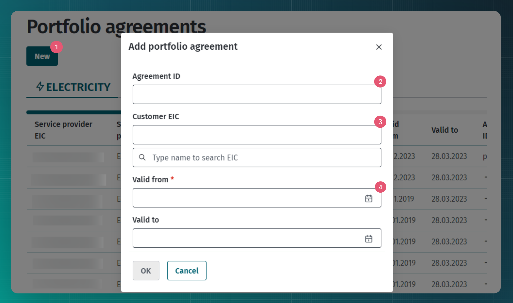
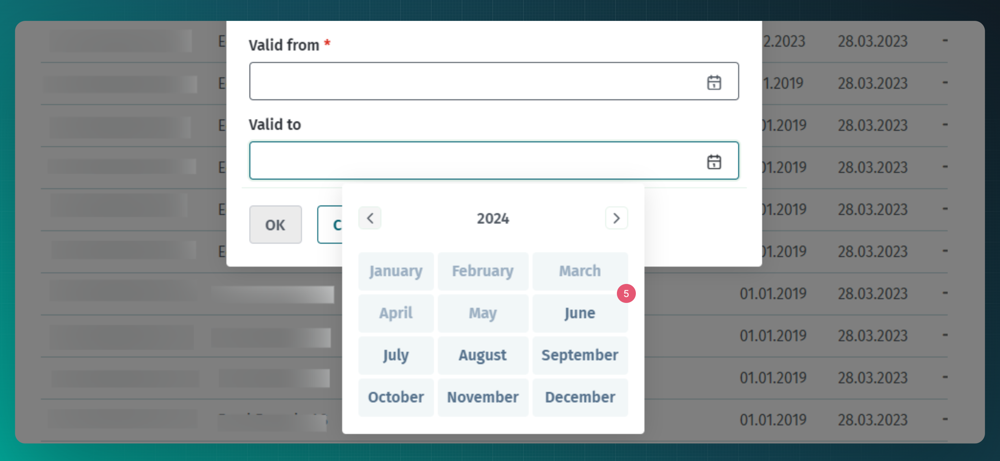

# Portfolio agreement

## Table of contents

<!-- TOC -->
* [Portfolio agreement](#portfolio-agreement)
  * [Table of contents](#table-of-contents)
  * [Introduction](#introduction)
  * [Transmitting portfolio agreements](#transmitting-portfolio-agreements)
    * [Transmitting portfolio agreements via web interface](#transmitting-portfolio-agreements-via-web-interface)
    * [API messages](#api-messages)
      * [Messages](#messages)
      * [Message rules](#message-rules)
<!-- TOC -->

## Introduction

Each grid operator and open supplier must have an open supply agreement with another open supplier for its portfolio, called a portfolio agreement in the Datahub (while the consumer and the producer
have open supply agreements for metering points, the grid operator and the open supplier, i.e. the seller, have open supply agreements per legal entity).

If an open supplier does not have an open supply portfolio agreement, it cannot act as an open supplier and the system operator terminates its operations and open supply agreements.

If a grid operator does not have an open supply portfolio agreement, its so-called master grid operator’s open supplier is designated as its open supplier and the system operator transmits the
relevant information to the Competition Authority.

A grid operator settles grid loss amounts with the open supplier specified in its portfolio agreement.

**Portfolio agreement for grid operator**:

Metering points between two grid operators are defined by the technical data of the metering point as the border metering points of a grid operator. When an open supplier enters a grid operator with a
portfolio agreement, all the border metering points of the grid operator where the grid operator is itself a customer (based on the metadata of the metering point) automatically move to its open
supply area.

**Portfolio agreement to another open supplier**:

When an open supplier adds another open supplier with a portfolio agreement, all metering points that are in the supply chain of the other open supplier are added to the supply chain. Metering points
of agreements of the other open supplier are only balance settlement metering points for the balancing responsible party if the grid operator of the metering point is in the area of the other balance
responsible party.

## Transmitting portfolio agreements

A portfolio agreement can only be entered in the Datahub by an open supplier who has accepted the respective grid operator or seller as its customer. The portfolio agreement for the grid operator
includes an open supply of its grid losses and general service portfolio.

The intended process for using agreement services is described in [Agreements](06-agreements.md). The following describes the additional actions of the Datahub related to portfolio agreements:

- The Datahub makes created or updated portfolio agreement available for the client via the `data-distribution/search` service.
- If a portfolio agreement has been entered into between an open supplier providing a portfolio service and a grid operator, then the Datahub automatically registers, for all border metering points of
  the grid operator, the border metering point open supply agreement(s) entered into with the person who transmitted the portfolio agreement. The validity periods of automatic open supply agreements
  are directly dependent on the validity periods of both the portfolio and the border metering point grid agreement, on the principle that the validity period of an open supply agreement must not
  exceed neither the portfolio nor the grid agreement. Thus, when generating open supply agreements, the validity periods are determined as follows:
    - the start date will be the largest of the start dates of the portfolio agreement and the grid agreement at the border metering point;
    - the end date will be the smallest of the end dates of the portfolio agreement and the grid agreement at the border metering point.
- When decreasing the end date of a portfolio agreement, the Datahub will assign the same end date to all automatically generated open supply agreements.
- When deleting a portfolio agreement, the Datahub also deletes all automatically generated open supply agreements.
- When extending the end date of a portfolio agreement, the Datahub will extend the end date of those automatically generated open supply agreements that were previously automatically shortened
  due to the decreased portfolio agreement date. The date can be extended until the end date of the portfolio agreement or the original end date of the open supply agreement or the end date of the
  border metering point.
- If a portfolio agreement has been entered into between two open suppliers, automatic open supply agreements are not registered by the Datahub.
- It is not possible to create, modify or delete automatically generated open supply agreements in any way via the data exchange interface.

### Transmitting portfolio agreements via web interface

For transmitting portfolio agreements via web interface need to select open supplier role and navigate to "Agreements" -> "Portfolio agreements" page. 

It is mandatory to add the named supplier and mark the beginning of the contract.
1. Once the button "New" is clicked modal window is opened. In the modal window agreement details can be added.
2. Customer EIC code needs to be added, customer is a different market participant.
3. When EIC code is not known, searching by name is possible.
4. Mandatory to add the agreement start date.
5. Contract can only be valid from the 1st day of the month, therefore only month needs to be selected. The start date needs to be at least 7 days in the future.

### API messages

#### Messages

For a description of the messages, see the general document [Agreements](06-agreements.md).

#### Message rules

The general rules for agreements are described in [Agreements](06-agreements.md#message-rules).

Additional rules of the portfolio agreement are:

- The start date of the agreement can only be the first day of the month.
- The start date of the agreement must be at least seven days in the future.
- The end date of the agreement can only be the last day of the month.
- The end date of the agreement must be at least seven days in the future.
- There must be no metering points in the agreement dataset.
- The agreement must not stipulate an early termination fee.
- The agreement cannot be deleted if there are less than seven days left until the agreement expires.
- Only a market participant in the role of an open supplier (OS) can add the agreement.
- The `serviceProvider` of the agreement must be the registrant of the agreement and the `customer` of the agreement may be any market participant.
- Adding an agreement to oneself is not allowed (`serviceProvider` and `customer` must not be the same).
