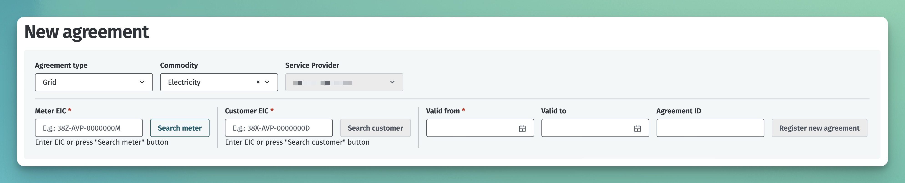
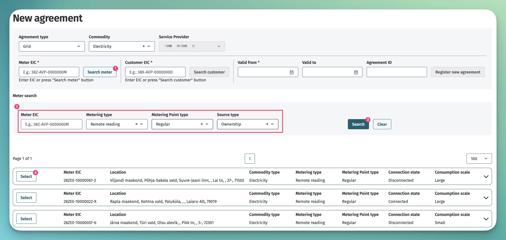
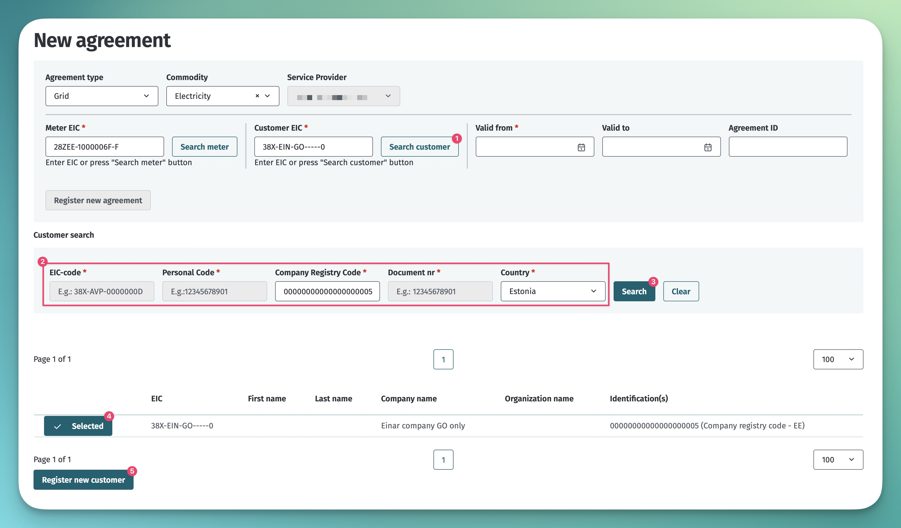

# Grid agreement and grid use agreement

## Table of contents

<!-- TOC -->
* [Grid agreement and grid use agreement](#grid-agreement-and-grid-use-agreement)
  * [Table of contents](#table-of-contents)
  * [Introduction](#introduction)
  * [Transmitting grid agreements](#transmitting-grid-agreements)
    * [API messages and rules](#api-messages-and-rules)
    * [Web interface](#web-interface)
<!-- TOC -->

## Introduction

A grid agreement or grid use agreement determines the conditions for the use of the grid at a metering point and is a prerequisite for the supply and aggregation of energy.

A grid agreement is entered into between the grid operator of the connection point and a market participant. A grid agreement is also entered into between the grid operator and its master grid operator. For example, between Elering and a distribution grid company. Such a grid agreement of a border metering point has, in conjunction with a portfolio agreement, an impact on automatically generated open supply agreements, as described in [Portfolio agreement](06.1-portfolio-agreement.md).

Grid agreements are divided into standard and border metering point grid agreements.

> [!WARNING] 
> In the initial scope, automatic open supply agreements are generated only when a portfolio agreement is created. The functions of checking the portfolio agreement and automatically creating open supply agreements upon the creation of a grid agreement of a border metering point are added later.

A grid use agreement is entered into between the line operator or closed distribution network operator and a market participant.

## Transmitting grid agreements

The intended process for using agreement services is described in [Agreements](06-agreements.md). The following describes the additional actions of the Datahub related to grid agreements:

- When decreasing the end date of an agreement, the Datahub will assign the same end date to all related open supply, general supply and aggregation agreements.
- When extending the end date of an agreement, the Datahub will extend the end date of those related open supply and aggregation agreements that were previously automatically shortened due to the decreased grid agreement date. The date can be extended until the end date of the grid agreement or the original end date of the open supply agreement (or aggregation agreement). But if some of the open supply or aggregation agreements got deleted because of shortening the grid agreement end data, then those agreements are not restored.
- When deleting an agreement (before it becomes effective), the Datahub will also delete the open supply, general service and aggregation agreements that will become valid in the future.
- The extension, shortening and deletion of a border metering point agreement also immediately results in the modification or deletion of the validity periods of automatically generated open supply agreements. See also [Portfolio agreement](06.1-portfolio-agreement.md).
- The Datahub makes updated grid agreement available for the open supplier and aggregator via the `data-distribution/search` service.

### API messages and rules

The general rules for agreements are described in [Agreements](06-agreements.md#message-rules).

Additional rules of the grid and border agrid agreements are:

- The agreement must not stipulate an early termination fee.
- The `serviceProvider` of the agreement must be the registrant of the agreement and the `customer` of the agreement may be any market participant.

Additional rules for grid agreement only:

- The agreement can only be added by a market participant in the role of a grid operator (GO), producer (PO), line operator (LO), charging point operator (CO) or closed distribution network operator (CDN) who is the owner of the metering point specified in the agreement, i.e. the metering point adder.
- The `serviceProvider` and the `customer` can be the same
- The end date of the agreement may only be changed retroactively if it does not affect the open supply or aggregation agreement. Read more about it in [Agreement amendments requiring coordination](06.8-agreement-amendments-requiring-coordination.md)
- If there are valid or future SUPPLY/AGGREGATION agreements at the metering point, then when changing the GRID contract, the `validTo` value must be in the future and minimum next day change. Example:
  - The current date and time is 07.01.2025 23:50 (Estonian time)
  - The minimum allowed `validTo` value is 08.01.2025 00:00 (Estonian time)

Additional rules for border grid agreement only:

- A border grid agreement is only allowed to be created for a border metering point.
- The agreement can only be added by a market participant in the role of a grid operator (GO) who is the owner of the metering point specified in the agreement, i.e. the metering point operator.
- Each grid operator must have a grid agreement with the master grid operator for at least one border metering point.
- The `customer` must be the grid operator (GO) or closed distribution network operator (CDN)
- The `serviceProvider` and the `customer` must be different

### Web interface

To add a grid agreement in the web interface, the user role must be "Grid Operator". Then navigate to the "Agreements" -> "New agreement" page, on which the view for adding a new agreement will open:

Grid agreement adding process consists of the following steps:

- entering the agreement and commodity types
- setting the metering point
- setting the customer
- Entering the validity dates and external ID of the agreement

There are 2 ways to set the metering point:

- if the EIC of the metering point is known, it can be entered immediately in the "Meter EIC" field
- if the EIC of the metering point is not known, it can be searched by pressing the "Search meter" button. After that, the search parameters will become visible. If the search parameters are filled and the "Search" button is pressed, the system will display the found metering points. A suitable metering point must be selected and the "Select" button must be pressed:

There are 3 ways to assign a client:

- if the customer's EIC is known, it can be entered immediately in the "Customer EIC" field
- if the customer's EIC is not known, it can be searched by pressing the "Search customer" button. After that, the search parameters will become visible:
  - You can search for a physical person based on the personal identification number or document number
  - A legal person can be searched based on the registry code
  - Other organizations can be searched based on the registry code or document number
  - If the search parameters are filled and the "Search" button is pressed, the system will display the found customers. If exactly one customer is found, the customer is automatically selected.
- if the customer is not found or if the found customer is not correct (e.g. the search by document number gave an incorrect result), it is possible to register a new customer by pressing the "Register new customer" button. In the opened modal window, the fields must be filled in according to the type of customer. Read more about mandatory data for different customer types in the chapter [Customer EIC](04-kliendi-eic.md#adding-and-changing-the-kliendi-and-his-metadata)

