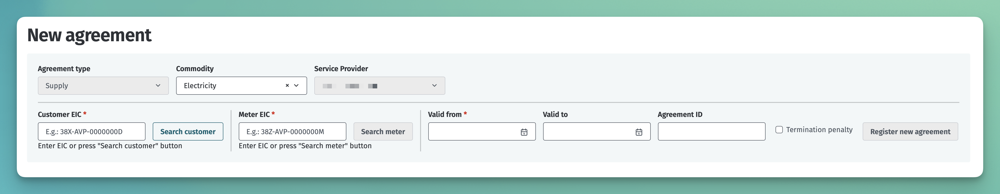
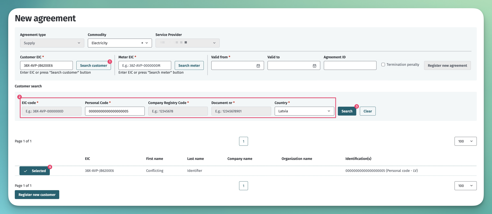
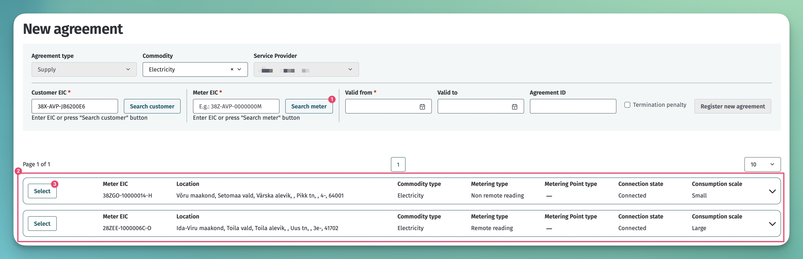

# Open supply agreement

## Table of contents

<!-- TOC -->
* [Open supply agreement](#open-supply-agreement)
  * [Table of contents](#table-of-contents)
  * [Introduction](#introduction)
  * [General principles for entering into an open supply agreement](#general-principles-for-entering-into-an-open-supply-agreement)
  * [Termination of an open supply agreement](#termination-of-an-open-supply-agreement)
  * [General service](#general-service)
  * [Entering into an open supply agreement due to a change of consumer](#entering-into-an-open-supply-agreement-due-to-a-change-of-consumer)
  * [Discontinuance of an open supply agreement](#discontinuance-of-an-open-supply-agreement)
  * [Cancellation of an open supply agreement](#cancellation-of-an-open-supply-agreement)
  * [Transmitting open supply agreements](#transmitting-open-supply-agreements)
    * [API messages and rules](#api-messages-and-rules)
    * [Web interface](#web-interface)
  * [Retroactive entering of open supply agreements](#retroactive-entering-of-open-supply-agreements)
<!-- TOC -->

## Introduction

Each market participant must enter into an agreement with one (and only one) open supplier, which ensures the market participant open supply (*open supply agreement*), i.e. ensures balance.

**Open supply** means the sale to a market participant of the total amount of electricity needed by the market participant or, in order to ensure the balance of a market participant, the sale to the market participant of an amount of electricity that the participant lacks in a trading period or the purchase from the market participant of surplus amount of electricity during a trading period.

## General principles for entering into an open supply agreement

1. When changing open suppliers, the market participant has to enter into a new open supply agreement, upon the registration of which with the Datahub, the Datahub will terminate the previous open supply agreement, if necessary.
2. If the market participant enters into a new open supply agreement with a new open supplier, the new open supplier enters the information in the Datahub by the deadline specified in the legislation. The information must include the period of validity of the open supply agreement and the terms and conditions (existence of a fee requirement) and the EICs of the metering points for which the agreement has been entered into.
3. Before entering into an open supply agreement, the open supplier must check via the Datahub whether the market participant has the right to change suppliers at the metering point in question and whether a fee requirement applies in case of early termination of the existing open supply agreement.
4. The open supplier transmits to the Datahub information on the period of validity of the open supply agreement of the market participant to whom they provide open supply services.
5. The open supplier changes at the time specified in the Network Code on the Operation of the Electricity Market.

> [!NOTE]
> Read more about the supplier change process and rules in [Open supplier change process](06.4-open-supplier-change-process.md).

## Termination of an open supply agreement

1. An open supply agreement can be terminated by sending the end date of the agreement, that has to be at least one day in the future.
2. If an open supplier cancels or otherwise terminates an open supply agreement, the open supplier must enter the termination details in the Datahub immediately after the decision to terminate the agreement has been taken.

## General service

When an open supply agreement ends, the market participant that has received the open supply service enters into a new open supply agreement no later than the end date of the previous agreement.

If the open supplier has not provided information on the new open supply agreement entered into by market participant by the deadline specified in the legislation, the new open supplier of this market participant is the grid operator to whose grid the market participant’s electrical installation is connected or the supplier named by that grid operator (with a named supplier agreement entered into). Read more in [Named supplier agreement](06.5-nimetatud-tarnija-leping.md).

Services without an open supply agreement are divided into three groups:

1. A small consumer with a connection point of up to 63A is a general service customer. The price of the general service is regulated by the Electricity Market Act.
2. A consumer with a connection point of more than 63A purchases the open supply service on the basis of the Electricity Market Act at the price of balancing energy.
3. In the absence of an open supply agreement, producers transmit electricity to the grid free of charge.

## Entering into an open supply agreement due to a change of consumer

1. When a market participant changes, the new market participant of the metering point enters into a new open supply agreement no later than by the end date of the previous agreement.
2. An open supply agreement can enter into force on the date the grid agreement enters into force. In the event of the termination of the grid agreement, the open supply agreement ends at midnight on the day of the termination of the grid agreement.
3. Open suppliers can enter an open supply agreement up to two days after the start date of the grid agreement, i.e. within 48h from the entry into force of the grid agreement (regardless of the date of entry of the grid agreement). This exception is allowed only in case, where the start dates of the grid and supply agreements are identical.

Example:

| Start time of a new grid agreement                              | On 22.04.2017 at 00:00 |
|-----------------------------------------------------------------|------------------------|
| Grid operator deadline for entering a new grid agreement        | On 21.04.2017 at 23:59 |
| Open supplier deadline for entering a new open supply agreement | On 23.04.2017 at 23.59 |

## Discontinuance of an open supply agreement

1. A discontinuance of an open supply agreement is deemed to be the termination of the agreement due to circumstances beyond the control of the market participant who is a customer of the agreement.
2. In the event of discontinuance of an open supply agreement, the open supplier changes at 00:00 on the date of the discontinuance of the agreement.
3. If after the discontinuance of an open supply agreement a new open supply agreement is entered into, the open supplier changes at 00:00 the day after the entry into the new agreement.

## Cancellation of an open supply agreement

1. An open supply agreement can be cancelled by the open supplier within 14 days of the entry into the agreement if the private consumer who entered into the agreement has let the open supplier know that they want to withdraw from the agreement.
2. Cancellation of an open supply agreement is not allowed if consumption has already started.

## Transmitting open supply agreements

The intended process for using agreement services is described in [Agreements](06-agreements.md). The following describes the additional actions of the Datahub related to grid agreements:

- The Datahub makes the added or changed open supply agreement information available to the grid operator and aggregator using the data-distribution service.
- In the case of an open supplier change, the Datahub makes the information available to the previous open supplier via the data-distribution service.

### API messages and rules

The general rules for agreements are described in [Agreements](06-agreements.md#message-rules).

Additional rules for an open supply agreement are:

- At a single point in time, a metering point can only have one valid open supply agreement.
- The start date of the agreement must be:
  - at least one day in the future if there is no prior active open supply agreement;
  - at least 14 days in the future if there is a prior active open supply agreement;
  - the same or later than the starting date of the grid agreement.
- The start date of the agreement may be up to 48h in the past if the open supplier registers the open supply agreement afterwards and the start date of the agreement coincides with the start date of the grid agreement.
- The end date of the agreement must be:
  - at least one day in the future.
  - no later than the end date of the grid agreement.
- An open supply agreement cannot be added directly to border metering points. The Datahub automatically creates open supply agreements in border metering points by adding a portfolio agreement. See also [Portfolio agreements](06.1-portfolio-agreement.md).
- Automatically generated open supply agreements cannot be amended or cancelled via the API or user interface.
- Only a market participant in the role of an open supplier (OS) can add the agreement.
- The `serviceProvider` of the agreement must be the registrant of the agreement and the `customer` of the agreement may be any market participant.
- The customer of the open supply and aggregation agreement must be the same person who is also the customer of the grid agreement.

### Web interface

To add an open supply agreement in the web interface, the user role must be "Open Supplier". Then navigate to the "Agreements" -> "New agreement" page, on which the view for adding a new agreement will open:

Open supply agreement adding process consists of the following steps:

- entering the commodity type
- setting the customer
- setting the metering point
- Entering the validity dates, external ID and termination penalty of the agreement

There are 2 ways to assign a client:

- if the customer's EIC is known, it can be entered immediately in the "Customer EIC" field
- if the customer's EIC is not known, it can be searched by pressing the "Search customer" button. After that, the search parameters will become visible:
  - You can search for a physical person based on the personal identification number or document number
  - A legal person can be searched based on the registry code
  - Other organizations can be searched based on the registry code or document number
  - If the search parameters are filled and the "Search" button is pressed, the system will display the found customers. If exactly one customer is found, the customer is automatically selected.

There are 2 ways to set the metering point:

- if the EIC of the metering point is known, it can be entered immediately in the "Meter EIC" field
- if the EIC of the metering point is not known, it can be searched by pressing the "Search meter" button. System will display metering points, where the customer at least a grid agreement

## Retroactive entering of open supply agreements

> [!NOTE]
> For the functionality of retrospective entering, see [Agreement amendments requiring coordination](06.8-agreement-amendments-requiring-coordination.md).
