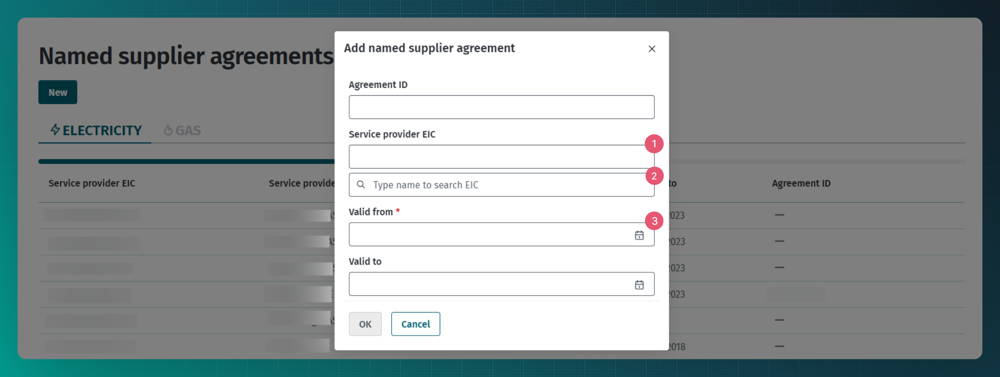

# Named supplier agreement

## Table of contents

<!-- TOC -->
* [Named supplier agreement](#named-supplier-agreement)
  * [Table of contents](#table-of-contents)
  * [Introduction](#introduction)
  * [Transmitting named supplier agreements](#transmitting-named-supplier-agreements)
  * [Transmitting named supplier agreements via web interface](#transmitting-named-supplier-agreements-via-web-interface)
  * [API messages](#api-messages)
    * [Messages](#messages)
    * [Message rules](#message-rules)
<!-- TOC -->

## Introduction

If a market participant has a valid grid agreement but there is no open supply agreement, the grid operator of its metering point is considered to be its open supplier, according to the Electricity Market Act. It is said that the market participant uses the general service.

The grid operator may delegate the provision of open supply services to another open supplier, in which case the grid operator must enter the agreement of the named supplier into the Datahub.

The Datahub informs the grid operator and if needed also the named supplier if the customer has no open supply agreement and the general service activates. See the document [General service notice](08-general-service-notice.md) for more information.

## Transmitting named supplier agreements

If the grid operator has a named supplier agreement, it must be entered into the Datahub.

The intended process for using agreement services is described in [Agreements](06-agreements.md).

## Transmitting named supplier agreements via web interface

For transmitting named supplier agreements via web interface need to select grid operator role and navigate to "Agreements" -> "Named supplier agreements" page. Once the button "New" is clicked modal window is opened. In the modal window agreement details can be added.

It is mandatory to add the named supplier and mark the beginning of the contract.

1. Named supplier EIC code needs to be added.
2. When EIC code is not known, searching by name is possible.
3. Mandatory to add the agreement start date.
4. Contract can only be valid from the 1st day of the month, therefore only month needs to be selected. The start date needs to be at least 7 days in the future.

## API messages

### Messages

> [!NOTE]
> The rights for transmitting and requesting data are described in [Authentication and authorisation](03-authentication-and-authorisation.md)

For a description of the messages, see the general document [Agreements](06-agreements.md).

### Message rules

The general rules for agreements are described in [Agreements](06-agreements.md#message-rules).

Additional rules for a named supplier agreement are:

- The start date of the agreement can only be the first day of the month.
- The start date of the agreement must be at least seven days in the future.
- The end date of the agreement can only be the last day of the month.
- The end date of the agreement must be at least seven days in the future.
- There must be no metering points in the agreement dataset.
- The agreement must not stipulate an early termination fee.
- The agreement cannot be deleted if there are less than seven days left until the agreement expires.
- Only a market participant in the role of a grid operator (GO) or a closed distribution network operator (CDN) can enter the agreement.
- The `serviceProvider` of the agreement must be the open supplier and the `customer` of the agreement must be the registrant of the agreement.
- Adding an agreement to oneself is not allowed (`serviceProvider` and `customer` must not be the same).
