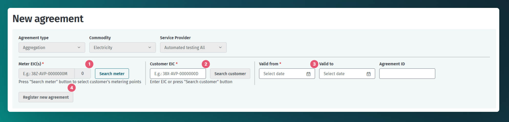
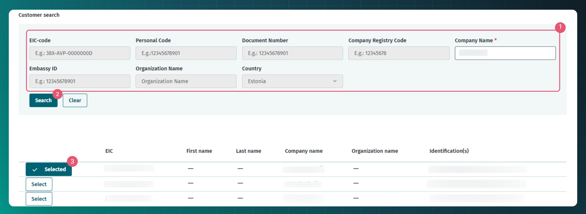
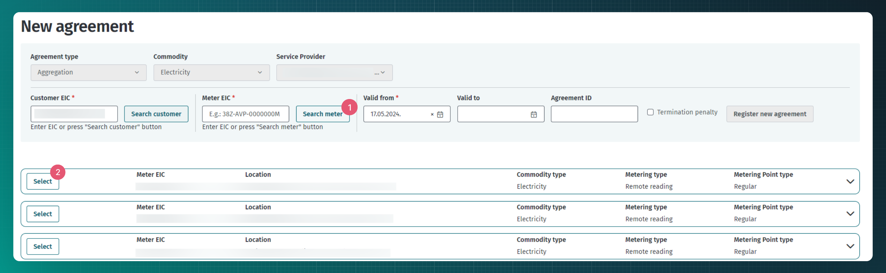

# Aggregation agreement

## Table of contents

<!-- TOC -->
* [Aggregation agreement](#aggregation-agreement)
  * [Table of contents](#table-of-contents)
  * [Introduction](#introduction)
  * [Transmitting aggregation agreements](#transmitting-aggregation-agreements)
  * [Transmitting aggregation agreements via web interface](#transmitting-aggregation-agreements-via-web-interface)
  * [API messages](#api-messages)
    * [Messages](#messages)
    * [Message rules](#message-rules)
<!-- TOC -->

## Introduction

Aggregation is the process of managing the consumption of the designated grid metering point(s) in order to reduce consumption (or increase production) during periods of increased energy demand and to increase consumption (reduce production) during periods of decreased energy demand. To this end, the aggregator controls the consumption and/or production of equipment behind the grid metering point and measures aggregated energy amounts with special aggregation metering points that fall under the relevant grid metering point.

In order to provide aggregation services, an aggregation agreement is entered into between the market participant and the aggregator, which determines the terms and conditions of aggregation. It is worth noting that the Datahub does not collect exact aggregation terms and conditions.

## Transmitting aggregation agreements

The aggregator is obliged to transmit the aggregation agreement to the Datahub.

The intended process for using agreement services is described in [Agreements](06-agreements.md). The following describes the additional actions of the Datahub related to aggregation agreements:

- The Datahub makes the information of new or changed aggregation agreements available to the open supplier of the parent metering point (using the `data-distribution/search` service), so that the supplier can consider when preparing forecasts whether the production or consumption of active energy of the given metering point can be affected by aggregation.

## Transmitting aggregation agreements via web interface

To add aggregation agreements via web interface aggregator role needs to be selected. Need to navigate to "Agreements" - > "New agreement" page. Now customer EIC code, metering point EIC code and valid from date need to be added. End date and agreement ID are not mandatory fields.

EIC codes can be searched while adding the new agreement.

- To find the customer EIC code "Search customer" button needs to be clicked.
- Now search criteria can be added
- Once the correct customer is found and "Select" button is clicked the correct customer EIC code is added to the agreement field above.

- To find metering points "Search meter" needs to be clicked.
- Once the correct metering point is found "Select" button needs to be clicked.

## API messages

### Messages

For a description of the messages, see the general document [Agreements](06-agreements.md).

### Message rules

The general rules for agreements are described in [Agreements](06-agreements.md#message-rules).

Additional rules of the aggregation agreement are:

- An aggregation agreement can only be entered into at an aggregation metering point.
- The duration of the aggregation agreement cannot exceed the duration of the grid agreement of the parent grid metering point at either end.
- The start date of the agreement must be at least one day in the future if there is no prior active aggregation agreement related to the parent grid metering point.
- The start date of the agreement must be at least 14 days in the future if there is a prior active aggregation agreement related to the parent grid metering point.
- The end date of the agreement must be at least one day in the future.
- Market participants can add the agreement only in the role of an aggregator (AGG).
- The `serviceProvider` of the agreement must be the registrant of the agreement and the `customer` of the agreement may be any market participant.
- Adding an agreement to oneself is allowed.
- The customer of the aggregation agreement must be the same person who is also the customer of the grid agreement on the parent metering point
- Rules for agregation agreement overlapping:
  - aggregation agreements of the same aggregation metering point cannot overlap
  - aggregations agreements of different aggregators within the same parent grid metering point are not allowed to overlap
  - aggregation agreements of the same aggregator within the same parent grid metering point are allowed to overlap
