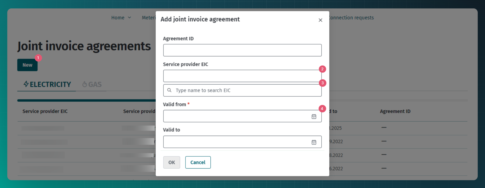

# Joint invoice agreement

## Table of contents

<!-- TOC -->
* [Joint invoice agreement](#joint-invoice-agreement)
  * [Table of contents](#table-of-contents)
  * [Introduction](#introduction)
  * [Transmitting joint invoice agreements](#transmitting-joint-invoice-agreements)
  * [Transmitting joint invoice agreements via web interface](#transmitting-joint-invoice-agreements-via-web-interface)
  * [API messages](#api-messages)
    * [Messages](#messages)
    * [Message rules](#message-rules)
<!-- TOC -->

## Introduction

A joint invoice allows all open suppliers to invoice consumers jointly for both energy supplied and the grid service.

In order to use the joint invoice service, the open supplier and the grid service provider enter into a joint invoice agreement which sets out the conditions for the implementation of joint invoices. Only the fact that the agreement has been entered into needs to be transmitted to the Datahub. The exact terms of the agreement are not transmitted.

After the entry into a joint invoice agreement, the grid service provider may send a network invoice to the open supplier using the services described in [Joint invoice](14-yhisarve.md).

## Transmitting joint invoice agreements

Only the grid operator can transmit a joint invoice agreement to the Datahub.

The intended process for using agreement services is described in [Agreements](06-agreements.md). The following describes the additional actions of the Datahub related to joint invoice agreements:

- The Datahub makes the information of new or changed joint invoice agreements available to the open supplier (using the `data-distribution/search` service)

## Transmitting joint invoice agreements via web interface

For transmitting joint invoice agreements via web interface need to select grid operator role and navigate to "Agreements" -> "Joint invoice agreements" page.

1. "New" button needs to be clicked
2. Open supplier EIC code needs to be added.
3. When EIC code is not known, searching by name is possible.
4. Mandatory to add the agreement start date.
5. Contract can only be valid from the 1st day of the month, therefore only month needs to be selected. The start date needs to be at least 7 days in the future.
6. Once all mandatory information is filled in "Ok" can be clicked and the new agreement will be saved.

## API messages

### Messages

> **Note**
> The rights for transmitting and requesting data are described in [Authentication and authorisation](03-authentication-and-authorisation.md)

For a description of the messages, see the general document [Agreements](06-agreements.md).

### Message rules

The general rules for agreements are described in [Agreements](06-agreements.md#message-rules).

Additional rules of the joint invoice agreement are:

- The start date of the agreement can only be the first day of the month.
- The start date of the agreement must be at least seven days in the future.
- The end date of the agreement can only be the last day of the month.
- The end date of the agreement must be at least seven days in the future.
- There must be no metering points in the agreement dataset.
- The agreement must not stipulate an early termination fee.
- The agreement cannot be deleted if there are less than seven days left until the agreement expires.
- Only a market participant in the role of a grid operator (GO) or a closed distribution network operator (CDN) can add the agreement.
- The `serviceProvider` of the agreement must be the open supplier and the `customer` of the agreement must be the registrant of the agreement.
- Adding an agreement to oneself is not allowed (`serviceProvider` and `customer` must not be the same).
