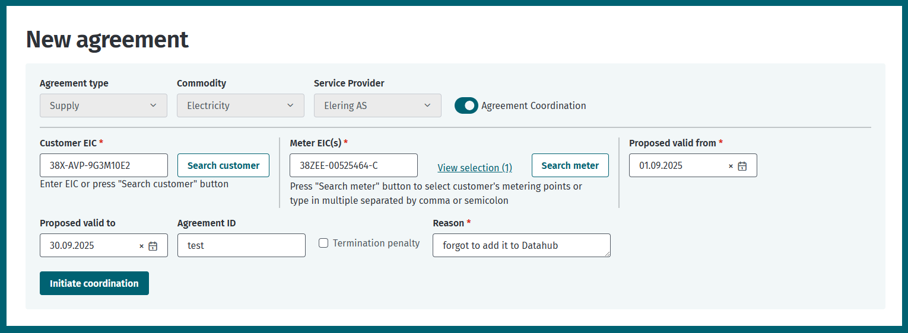
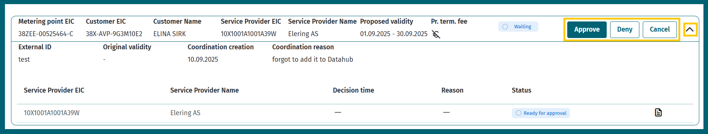
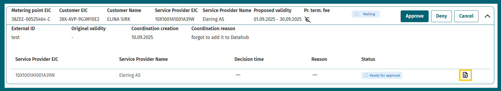

# Agreement amendments requiring coordination

## Table of contents

<!-- TOC -->
* [Agreement amendments requiring coordination](#agreement-amendments-requiring-coordination)
  * [Table of contents](#table-of-contents)
  * [Introduction](#introduction)
  * [Retroactive adding of agreements (changes to start or end date)](#retroactive-adding-of-agreements-changes-to-start-or-end-date)
    * [Open supply agreements](#open-supply-agreements)
  * [Agreement coordination via web interface](#agreement-coordination-via-web-interface)
    * [Add a new agreement that needs to be coordinated](#add-a-new-agreement-that-needs-to-be-coordinated)
    * [Modify an existing agreement that needs to be coordinated](#modify-an-existing-agreement-that-needs-to-be-coordinated)
    * [Search and approve Agreement Coordinations](#search-and-approve-agreement-coordinations)
  * [API messages](#api-messages)
    * [Messages](#messages)
    * [Message rules](#message-rules)
        * [`POST /api/{version}/agreement-coordinations/bulk` rules](#post-apiversionagreement-coordinationsbulk-rules)
        * [`GET /api/{version}/agreement-coordinations/{id}` rules](#get-apiversionagreement-coordinationsid-rules)
        * [`GET /api/{version}/agreement-coordinations` rules](#get-apiversionagreement-coordinations-rules)
        * [`POST /api/{version}/agreement-coordinations/{id}/cancel` rules](#post-apiversionagreement-coordinationsidcancel-rules)
        * [`POST /api/{version}/agreement-coordinations/{id}/approve` rules](#post-apiversionagreement-coordinationsidapprove-rules)
        * [`POST /api/{version}/agreement-coordinations/{id}/deny` rules](#post-apiversionagreement-coordinationsiddeny-rules)
<!-- TOC -->

## Introduction

In accordance with business rules, the prior agreement of the relevant market participants is required before entering
into or amending certain agreements. Separate services have been set up for these activities to support the coordination
process.

## Retroactive adding of agreements (changes to start or end date)

### Open supply agreements

Retroactive changes to open supply agreements require coordination between certain market participants. Coordinations
will be collected from everyone at the same time and in parallel. Below are message descriptions, examples and rules.

1. An open supplier enters a request to change the start or end date of an open supply agreement.
2. The request will be sent for coordination to the following market participants:
    - the open supplier of the metering point – only if the customer has an open supply agreement at the metering point;
    - the balance responsible party of the open supplier of the metering point – only if the customer has an open supply
      agreement at the metering point (and the open supplier is not itself the balance responsible party);
    - the general service provider of the metering point (grid operator or named supplier);
    - the balance responsible party of the general service provider (in the case of a supplier only if the supplier is
      not the balance responsible party itself).
3. If the aforementioned approvals and other conditions for switching suppliers are met, the application will be
   assigned to Elering for approval.
4. The change will be applied after approval by Elering.

## Agreement coordination via web interface

New coordinations can only be initiated in the open supplier role.

### Add a new agreement that needs to be coordinated

1. In the open supplier role, open the “New Agreement” page.
2. In the agreement creation form, select that you want to initiate agreement coordination.
   
3. Fill in all the required fields.
   
4. Click “Initiate Coordination”.
5. The coordination is now initiated and can be found on the “Agreement Coordination” page.

### Modify an existing agreement that needs to be coordinated

1. In the open supplier role, open the “Agreements” page.
2. Find the agreement you want to modify. Only active agreements can be modified.
   
3. Click “Modify”.
4. Choose the option "Agreement coordination"
   
5. Update the agreement dates as needed.
6. Add a justification for the modification.
7. Click “Initiate coordination” to submit the agreement for coordination.
8. The coordination is now initiated and can be found on the “Agreement Coordination” page.

### Search and approve Agreement Coordinations

1. Open the “Agreement Coordination” page.
2. Click "Search"
   
3. The results will display agreement coordinations along with related information and approvers.
   
4. By clicking the document icon in the approvers table, you can also view related agreements.
   
5. To approve or deny, click “Approve” or “Deny”.
6. In the confirmation window that opens, confirm your decision.

## API messages

### Messages

| Sõnum                                                      | Eesmärk                                             |
|------------------------------------------------------------|-----------------------------------------------------|
| `POST /api/{version}/agreement-coordinations/bulk`         | Create agreement coordinations                      |
| `GET /api/{version}/agreement-coordinations/{id}`          | Get agreement coordination by its ID                |
| `GET /api/{version}/agreement-coordinations`               | Search agreement coordination by various attributes |
| `POST /api/{version}/agreement-coordinations/{id}/cancel`  | Cancel agreement coordination                       |
| `POST /api/{version}/agreement-coordinations/{id}/approve` | Approve agreement coordination request              |
| `POST /api/{version}/agreement-coordinations/{id}/deny`    | Deny agreement coordination request                 |

### Message rules

##### `POST /api/{version}/agreement-coordinations/bulk` rules

- A request can only be created for supply agreements (`agreementType = SUPPLY`).
- The request sender must be in the role of an open supplier.
- The request sender must be in the role of a service provider in the agreement mentioned in the request.
- The active agreement coordination periods for a single metering point must not overlap.
- For modifying existing open supply agreement, the request must include the desired dates for the agreement:
    - `proposedValidFrom` indicates the new desired start date of the agreement;
    - `proposedValidTo` indicates the new desired end date of the agreement.
- For adding new open supply agreement, the request must additionally include open supply agreement data.
- The grid agreement must cover the entire period of the desired supply agreement.
- When adding a request, it is mandatory to add a justification.

##### `GET /api/{version}/agreement-coordinations/{id}` rules

- Requester must be either the initiator or candiate

##### `GET /api/{version}/agreement-coordinations` rules

- Requests can be queried for a maximum period of 30 days.
- Only past requests can be queried - `creationDateTo` must not be in the future.
- `agreementAction` indicates whether it is the creation or updating of an agreement. Possible options are: `CREATE`and
  `UPDATE`.

##### `POST /api/{version}/agreement-coordinations/{id}/cancel` rules

- The coordination process can only be cancelled by the initial request sender.
- Cancellation is possible if the status of agreement coordination is `WAITING_FOR_APPROVAL`. This means that
  cancellation is only possible if no one has yet approved or denied the request.

##### `POST /api/{version}/agreement-coordinations/{id}/approve` rules

- Coordination can be approved if the status of response is `READY_FOR_APPROVAL`.
- A canceled request cannot be approved.

##### `POST /api/{version}/agreement-coordinations/{id}/deny` rules

- Coordination can be denied if the status of response is `READY_FOR_APPROVAL`.
- A canceled request cannot be denied.
- When declining a coordination request, it is mandatory to add a justification.
- The first refusal to coordinate will end the coordination process and subsequent coordination responses cannot be
  sent.