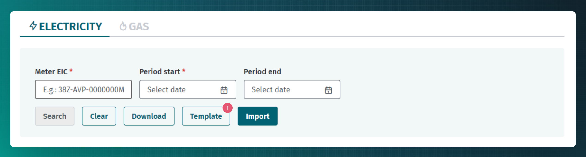
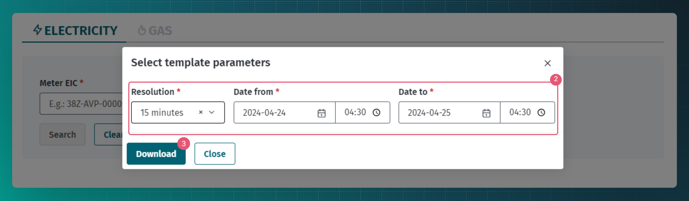
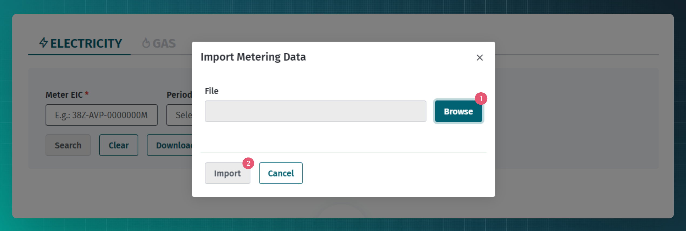
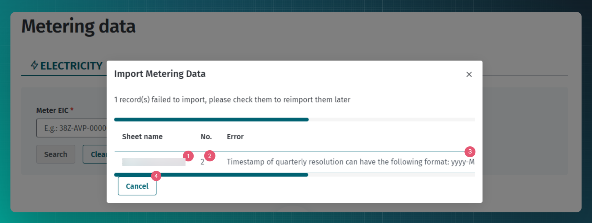
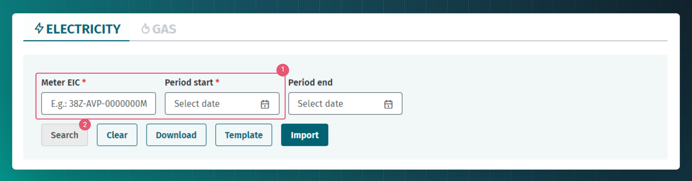

# Metering data

## Table of contents

<!-- TOC -->
* [Metering data](#metering-data)
  * [Table of contents](#table-of-contents)
  * [Introduction](#introduction)
  * [Transmitting metering data](#transmitting-metering-data)
    * [Transmitting metering data via the web interface](#transmitting-metering-data-via-the-web-interface)
    * [API messages](#api-messages)
      * [Messages](#messages)
      * [Message rules](#message-rules)
  * [Metering data requests](#metering-data-requests)
    * [Observation time type](#observation-time-type)
    * [Requesting metering data via the web interface](#requesting-metering-data-via-the-web-interface)
    * [API messages](#api-messages-1)
      * [Messages](#messages-1)
<!-- TOC -->

## Introduction

Metering data is the predicted or measured active energy consumption data associated with a specific metering point over a given period of time. Metering data is the basis for billing and is provided by metering point operators and used by other market participants (mainly open suppliers).

## Transmitting metering data

The metering point operator determines the active energy amounts in its metering points and transmits two-way hourly active energy amount data to the Datahub.

The aggregator transmits the energy quantities of demand response management.

Metering point operators transmit metering data per metering point under the following conditions:

1. for those metering points where data are read remotely, the initial metering data are transmitted to the Datahub by 10:00 every working day;
2. the final metering data for the calendar month at the metering points where data are read remotely are transmitted to the Datahub by the 5th day of the following month.

The amounts of grid and line losses are calculated by the Datahub.

The grid operator is the manager of load duration curves and responsible for the transmission of hourly amounts to the Datahub.

Grid operators and line operators can transmit metering data of metering points to the Datahub via a web interface by mass upload or by automatic data exchange message.

Relevant Datahub services have been set up to transmit metering data. The intended use process is as follows:

- The metering point operators sends a new or changed metering data message using the `meter-data` service.
- Since the processing of metering data in the Datahub is asynchronous, the Datahub first gives a quick response whether the message was received or not.
- The Datahub then queues the message.
- The metering point operator verifies the result of processing, using `meter-data/status` service (at the `originalDocumentIdentification` position of the message, the value of the attribute of the same name that was in the `header` of the previously transmitted metering data message must be transmitted. The UUID value must not be reused). Possible results are:
  - `PROCESSING` - processing not finished
  - `SUCCESSFUL` - processing finished successfully
  - `ERROR` - processing finished with errors.
  - `PARTIALLY_SUCCESSFUL` - processing finished partially successfully (for example, the message contained multiple metering points and processing of some metering point's data failed)
- If the message is processed without errors, then the data are added or changed in the database and the Datahub makes the addition or change of metering data available to open suppliers through the `data-distribution/search` service. For more details, see [Data distribution](30-data-distribution.md).
- If errors occur while processing the message, the Datahub will generate an error report and make it available to the metering point operator in the response of the  `meter-data/status` service.
- The metering point operator reads the error report addressed to it and resolves it according to its internal business logic.

> [!WARNING]
> **PLEASE NOTE! The Datahub transmits the metering data entered by the grid operators in unaltered form. The Datahub does not check the content of the metering data.**

> [!NOTE]
> It is worth knowing that there is a very small, but in theory still possible situation where the Data Warehouse receives a metering data message and responds with a "processing started" response, but in reality the message remains unprocessed and no ´meter_data_status´ record is created about it either.
> The metering point manager should keep track of what has been received from each metering data message and whether the processing ended with a result. If some of the metering data messages do not receive any result, it must be assumed that an unexpected problem occurred in the Datahub when processing the metering data (e.g. unexpected shut down of the application) and the metering data must be transmitted again.
> There are different options for monitoring the results. E.g. check the status one by one based on `originalDocumentIdentification` (in case the data volumes are small) or scan the `SUCCESSFUL` and `ERROR` statuses and internally keep track of which messages have reached the final state

### Transmitting metering data via the web interface

In order to transmit data via the web interface user will need to navigate to "Metering data" page.

For easier metering data transmitting it is possible to download the template. To generate the template the resolution and time range needs to be selected, based on it the prefilled template is generated. It is important to choose the time range correctly - it needs to fit the resolution.





To import metering data "Import" button needs to be clicked on the "Metering data" page. After that it is possible to add the metering data file. 



In case there is a mistake in the file the system will notify the user:
1. Metering data can be added to several MS Excel file sheets. The system will tell the user on which sheet the problem is located.
2. In addition, it is possible to see the row where the problem is.
3. Error description helps to understand the issue.
4. After the problem is found and fixed "Cancel" should be clicked and import process should be repeated.



### API messages

In the new Datahub, the ‘pos’ or ‘position’ attribute has been removed. The transmitter of metering data must define in the message the beginning of the period (pS) and the resolution (r), i.e. the frequency of data reading:

```json
"periods": [
  {
    "r": "PT1H",
    "aI": [
      {
        "pS": "2023-09-04T12:00:00.000Z",
        "inQty": {
          "rTime": "2023-09-04T12:48:13.368Z",
          "rType": "E",
          "kwh": 0
        },
        "outQty": {
          "rTime": "2023-09-04T12:48:13.368Z",
          "rType": "M",
          "kwh": 5
        }
      }
    ]
  }
]
```

Explanation of abbreviations used in the API service:

* r – resolution
* aI – account interval (interval of one reading result)
* pS – period start
* inQty – IN or the reading result of incoming energy
* outQty – OUT or the reading result of outgoing energy
* rTime – reading time
* rType – reading Type (E – estimated, M – read)

The Datahub does not check whether every one hour or 15 minute interval is filled with metering data. 

> [!NOTE] 
> The resolution of the data is rigidly fixed by the Datahub – for both electricity and gas, the resolution is one hour. In 2024, electricity will switch to the 15-minute resolution.
> 
> In the case of gas, it is also allowed to transmit daily data. In this case, the daily metering data must be added to the suitable gas day hour.

#### Messages

| Message                                   | Objective                                                           |
|-------------------------------------------|---------------------------------------------------------------------|
| `POST /api/{version}/meter-data`          | Create or update meter reading data                                 |
| `POST /api/{version}/meter-data/status`   | Find meter data processing status                                   |
| `POST /api/{version}/meter-data/import`   | Bulk import of metering data                                        |
| `POST /api/{version}/template/meter-data` | Generate and download the template for bulk import of metering data |

#### Message rules

- The resolution value must match the global resolution applied in the given time period. For example, if the entire market switches to a resolution of 15 minutes on date X, then for metering data from date X the resolution value must be 15 minutes in the message.
- The time period value must be consistent with the resolution. For example:
  - if the resolution is one hour, the start time of the period must be the beginning of the hour (hh:00);
  - if the resolution is 15 minutes, the start time of the period must be a quarter of the hour (hh:00, hh:15, hh:30, hh:45).
- Electricity metering data are always transmitted in kWh up to three decimal places. 
- Gas metering data are transmitted in both kWh and cubic metres to three decimal places.
- The direction of the metering data is always presented as viewed by the metering point operator:
  - in – energy entering the grid (generation);
  - out – energy leaving the grid (consumption).
- The amounts of incoming and outgoing energy can also be transmitted in separate messages.
- It is permitted to correct metering data retroactively for up to 12 months.
- The `import` service requires the same template, that the service `export` or `template/meter-data` returns.

## Metering data requests

Relevant Datahub services have been set up to transmit metering data. Access to data is limited. The rules are described in [Role-based access rights](03.01-role-based-access-rights.md).

The following options are available for making metering data requests:

- Open suppliers, named suppliers and portfolio providers can scan metering data changes using the `data-distribution/search` service.
- Authorised users can request metering data using the `search` service.

### Observation time type

Compared to the old system, the `billingSequence` concept has disappeared. Instead, the metering point manager transmits the reading time (**reading time**) together with the metering data.
When receiving metering data, the Datahub adds a data storing time (**snapshot time**) to the data.

Since both time values are available in the Datahub, the Datahub allows to search for metering data based on these time values. Examples:

1. The open supplier is interested in the last known metering data at metering point X. For this, he has 2 options:
  * Omits `observationTimeType` and `observationTime` attributes in the message
  * sets the attributes in the message:
    * `observationTimeType` = `SNAPSHOT_TIME`.
    * `observationTime` = current date and time
2. The open supplier is interested of metering data at metering point X as of 01.01.2024 00:00. To do this, it sets the attributes in the message:
  * `observationTimeType` = `SNAPSHOT_TIME`
  * `observationTime` = `2024-01-01T00:00:00+02:00`
3. The open supplier is interested of the metering data at the metering point X, where the reading time is not greater than 31.12.2023 23:59. To do this, it sets the attributes in the message:
  * `observationTimeType` = `READING_TIME`
  * `observationTime` = `2023-12-31T23:59:59+02:00`

> [!WARNING]
> At the moment, the `observationTimeType` = `SNAPSHOT_TIME` and `observationTime` combination (example nr 2) is not supported. Development task is created and planned to be finished during year 2024.

### Requesting metering data via the web interface

Metering data can be requested by navigating to "Metering data" page. There metering point EIC code and search period start need to be defined. If needed the end date can be added as well. 



### API messages

#### Messages

| Message                                 | Objective         |
|-----------------------------------------|-------------------|
| `POST /api/{version}/meter-data/search` | Find meter data   |
| `POST /api/{version}/meter-data/export` | Export meter data |
