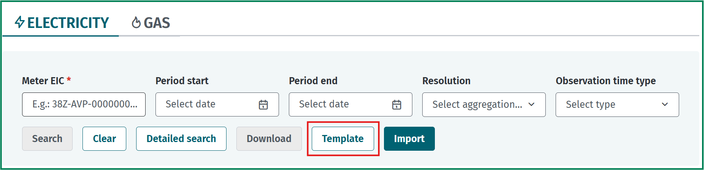
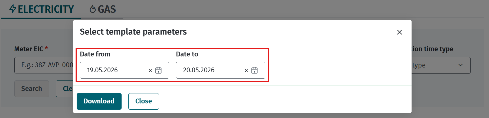
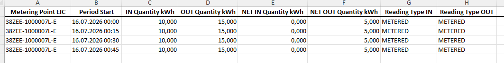
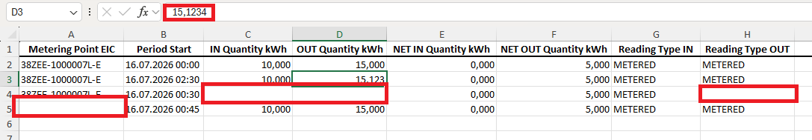
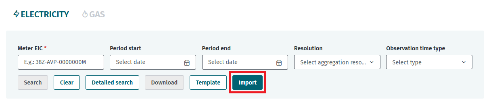
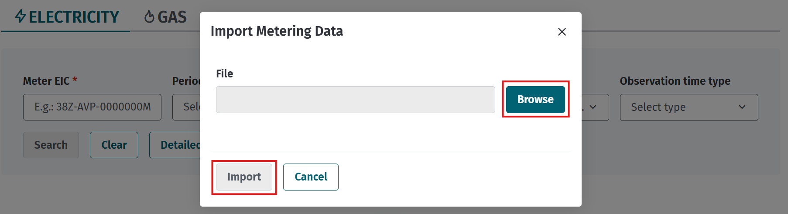
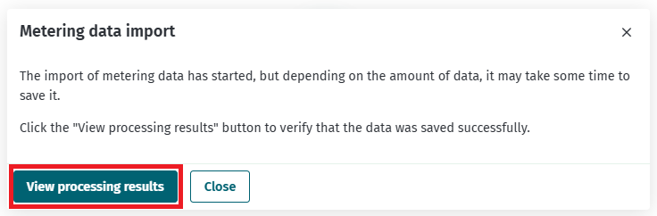
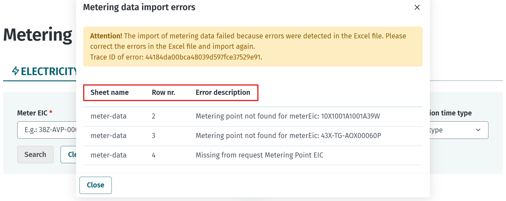
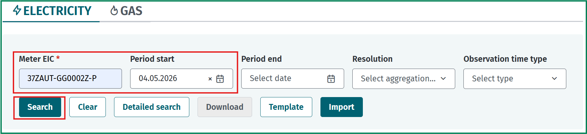

# Metering data


## Table of contents
* [Introduction](#introduction)
* [General principles of metering data](#general-principles-of-metering-data)
  * [Metering data directions](#metering-data-directions)
  * [Net measured metering data](#net-measured-metering-data)
  * [Metering data resolution](#metering-data-resolution)
  * [Transmitting metering data](#transmitting-metering-data)
  * [Legal bases for access to metering data](#legal-bases-for-access-to-metering-data)
  * [External consent](#external-consent)
  * [Time type](#time-type)
* [Transmitting metering data via API](#transmitting-metering-data-via-api)
  * [Message rules](#message-rules)
  * [API abbreviations](#api-abbreviations)
  * [Throttling of metering data input](#throttling-of-metering-data-input)
* [Requesting metering data via API](#requesting-metering-data-via-api)
  * [Purpose of the request](#purpose-of-the-request)
* [Transmitting metering data via the web interface](#transmitting-metering-data-via-the-web-interface)
  * [Navigating to the metering data page](#navigating-to-the-metering-data-page)
  * [Generating the metering data Excel template](#generating-the-metering-data-excel-template)
  * [Transmitting metering data with an Excel file](#transmitting-metering-data-with-an-excel-file)
    * [Excel column descriptions](#excel-column-descriptions)
    * [The following rules apply when filling in net quantities](#the-following-rules-apply-when-filling-in-net-quantities)
    * [Possible errors when filling in Excel](#possible-errors-when-filling-in-excel)
  * [Importing the Excel file into Estfeed Datahub](#importing-the-excel-file-into-estfeed-datahub)
* [Metering data requests via the web interface](#metering-data-requests-via-the-web-interface)
  

## Introduction

Metering data is measured or forecasted active energy quantities related to a specific metering point for a defined time period. Metering data is the basis for billing and market processes.

Metering data is submitted by metering point managers, such as grid operators, line operators and other market participants who have the right to submit data for the relevant metering point. Metering data is used by other market participants, mainly open suppliers, balance responsible parties and other entitled parties.

Estfeed Datahub enables metering data to be:
- transmitted with an Excel file via the web interface;
- transmitted via API;
- searched via the web interface;
- requested via API;
- distributed to entitled market participants through the data distribution service.

The options for submitting and requesting metering data depend on the market, the market participant's role and the rights related to the metering point.

## General principles of metering data

### Metering data directions

The direction of metering data is presented as follows:
- **IN** – energy entering the grid, i.e. production.
- **OUT** – energy leaving the grid, i.e. consumption.

### Net measured metering data

As of 1 August 2026, according to the Electricity Market Act, electricity invoices for consumption points with a bidirectional meter are based on net measured metering data. Net measured metering data shows the difference between produced and consumed quantities for each 15-minute metering period. If more electricity is consumed from the grid during the metering period than is supplied to the grid, net consumption occurs. If more electricity is supplied to the grid during the metering period than is consumed from the grid, net injection to the grid occurs.

Net quantities are calculated by the electricity market grid operator before the data is transmitted to Estfeed Datahub. Gas market participants and other electricity market participants (for example aggregators or line operators) cannot transmit net measured metering data.

Example where production is greater than consumption:

| Metering data type / direction | Quantity |
|-------------------------|-------|
| Production i.e. IN | 15 kWh |
| Consumption i.e. OUT | 10 kWh |
| Net production i.e. NET IN | 5 kWh |
| Net consumption i.e. NET OUT | 0 kWh |

Example where consumption is greater than production:

| Metering data type / direction | Quantity |
|-------------------------|-------|
| Production i.e. IN | 10 kWh |
| Consumption i.e. OUT | 15 kWh |
| Net production i.e. NET IN | 0 kWh |
| Net consumption i.e. NET OUT | 5 kWh |

> [!NOTE]
> Estfeed Datahub receives the net measured metering data transmitted by the grid operator. The grid operator is responsible for the correctness of the data.

### Metering data resolution

The resolution of metering data depends on the market.

| Market | Resolution |
|------|--------------|
| Electricity | 15 minutes |
| Gas | 1 hour or 1 day|

The start of the period must correspond to the selected resolution.

Examples:

- in the case of 15-minute resolution, period start times must be `hh:00`, `hh:15`, `hh:30` or `hh:45`;
- in the case of 1-hour resolution, period start times must be full hours, i.e. `hh:00`;
- in the case of daily data, the quantity must be added to the first hour of the gas day, i.e. `07:00`.

Estfeed Datahub does not validate that the entire period is fully covered with metering data. For example, it is not checked whether every 15-minute interval for electricity or every hourly interval for gas is filled separately.

### Transmitting metering data

The metering point manager ensures the determination of active energy quantities for its metering points and transmits the metering data to Estfeed Datahub.

In the electricity market, metering data is transmitted with 15-minute resolution. In the gas market, metering data is generally transmitted with hourly resolution, but transmitting daily data is also allowed.

Metering point managers transmit metering data by the following deadlines:

1. initial metering data for the previous day:
   - in the electricity market by 10:00 on every working day;
   - in the gas market by 13:00 on every working day;
2. final metering data for the previous calendar month:
   - in the electricity market by the 5th day of the following month;
   - in the gas market by the 7th day of the following month.

Metering data can be transmitted, for example, by:

- grid operator;
- line operator;
- closed distribution network;
- charging point operator;
- aggregator, if this is allowed according to its market role and business process.

The general process for transmitting metering data is as follows:

1. The metering point manager prepares a metering data message or Excel file.
2. The metering point manager transmits the metering data to Estfeed Datahub.
3. Estfeed Datahub receives the message and gives an initial response on whether the message was successfully received.
4. Since metering data processing is asynchronous, the message is added to the processing queue.
5. The metering point manager checks the processing result through the status request.
6. If processing is successful, the metering data is saved to the database.
7. If errors occur during processing, Estfeed Datahub makes an error report available. The error report is available for 7 days.
8. The metering point manager resolves the errors according to its internal business logic and, if necessary, transmits the metering data again.


Possible processing status values are:

- `PROCESSING` – processing has not yet finished;
- `SUCCESSFUL` – processing finished without errors;
- `ERROR` – processing finished with errors.

> [!NOTE]
> A situation may occur where Estfeed Datahub receives a metering data message and responds that processing has started, but the message does not actually reach processing and no status record is created for it either.
>
> The metering point manager must keep track of what has happened to each metering data message and whether the processing reached a final state. If no final status is created for a message, it must be assumed that an unexpected problem occurred during processing, and the metering data must be transmitted again.
>
> To monitor results, it is possible, for example, to:
>
> - request the status based on a single `originalDocumentIdentification` value;
> - scan `SUCCESSFUL` and `ERROR` statuses;
> - internally keep track of which messages have reached a final state.

### Legal bases for access to metering data
Metering data access is restricted and depends on the market participant's role, agreements related to the metering point and existing rights.

Access rules are described in the document [Role-based access rights](03.01-role-based-access-rights.md).

The following main options are available for making metering data requests:

- open supplier, named supplier and portfolio service provider scan metering data changes through the data distribution service;
- entitled user requests metering data through the `GET /metering-data` service;
- user searches metering data in the web interface.

### External consent

> [!WARNING]
> As of 01.2027, the use of external consent is no longer allowed and the user must be directed to share access rights in the Estfeed client portal.

Both natural and legal persons can grant access rights to their data through the client portal. The general principles of access rights are described in the document [Role-based access rights](03.01-role-based-access-rights.md).

For natural persons, the access right must be granted through the client portal.

For legal persons, an alternative workflow is also possible, where the client grants access rights outside Estfeed Datahub and the client portal, but in a form that enables written reproduction directly to the open supplier.

In this case, the open supplier can confirm the existence of the right in the `GET /metering-data` service by confirming the existence of the right in the window opened in the web interface or by adding the following to the request:

```json
{
  "legalConsent": true
}
```

If `"legalConsent": true` is added, the open supplier can request metering data for the metering point provided that the client of the metering point's grid agreement is a legal person or organization.

> [!CAUTION]
> The use of `"legalConsent": true` is allowed only if the client's authorization exists. The lawful use of this right is monitored.

### Time type

In metering data requests, **Reading Time**, i.e. the measurement time, is used as the time value.

The metering point manager transmits the measurement time, i.e. `reading time`, together with the metering data. This indicates the time when the metering data was received from the meter.

## Transmitting metering data via API

Metering data can be transmitted via API in both the electricity and gas markets. Message specifications are available in Swagger: https://datahub.elering.ee/swagger-ui/index.html#/ 

| Message | Purpose | Market |
|-------|---------|------|
| `POST /api/v2/metering-data/electricity` | Adding metering data | Electricity |
| `POST /api/v2/metering-data/natural-gas` | Adding metering data | Gas |
| `GET /api/v2/metering-data/status` | Metering data message processing status request | Electricity, gas |

### Message rules

When transmitting metering data via API, the following rules apply:

- the start of the period must correspond to the market resolution;
- electricity metering quantities are presented in kWh with 3 decimal places;
- gas metering quantities are presented in kWh and cubic meters with 3 decimal places;
- the metering data direction is presented from the perspective of the metering point manager that measures it;
- IN means energy entering the grid, i.e. production;
- OUT means energy leaving the grid, i.e. consumption;
- quantities of incoming and outgoing energy may also be transmitted in separate messages;
- for bidirectional electricity metering points, net quantities must also be transmitted;
- metering data may be corrected retroactively for up to 12 months;
- metering data may be transmitted up to 45 days into the future;
- if even one metering result fails validation, the entire message receives status `ERROR`;
- if the start of the period is further in the future than allowed, error code `period-start-too-far-in-future` is returned;
- in the `import` service, the same template must be used that is returned by the corresponding template service or export service.
- When sending metering data via V2 API, a limit applies to the number of periods that can be transmitted in one message. Up to 35,040 periods of metering data can be sent at once. If one day of data is sent daily, one message can transmit data for up to 365 metering points. For a longer period, the number of metering points must be reduced accordingly.

### API abbreviations

| Abbreviation | Explanation | Market |
|--------|----------|------|
| `periods` | Interval of one metering result | Electricity, gas |
| `pS` | Period Start | Electricity, gas |
| `inQty` | IN, i.e. quantity of energy entering the grid | Electricity, gas |
| `outQty` | OUT, i.e. quantity of energy leaving the grid | Electricity, gas |
| `netInQty` | Net production, i.e. NET IN | Electricity |
| `netOutQty` | Net consumption, i.e. NET OUT | Electricity |
| `rTime` | Reading Time, i.e. measurement time | Electricity, gas |
| `rType` | Reading Type, i.e. measurement type | Electricity, gas |
| `kwh` | Measured quantities in kWh | Electricity, gas |
| `m3` | Measured quantities in cubic meters | Gas |

### Throttling of metering data input

Processing of received metering data takes place in two steps:

1. the metering data message is received, `202` is returned as the response and the message is placed in the processing queue;
2. the metering data processor takes the message from the queue, processes it, saves the data to the database and updates the processing status.

If metering data processing is slower than new messages are received, the processing queue starts to grow.

If the queue contains data for 100,000 requests, the `POST /metering-data` request responds with:

- HTTP status `503`;
- HTTP header `Retry-After: 300`.

The solution is based on the following specifications:

- [HTTP 503 Service Unavailable](https://developer.mozilla.org/en-US/docs/Web/HTTP/Status/503)
- [Retry-After header](https://developer.mozilla.org/en-US/docs/Web/HTTP/Headers/Retry-After)

## Requesting metering data via API

Metering data can be requested via API using the following services. Message specifications are available in Swagger: https://datahub.elering.ee/swagger-ui/index.html#/ 

| Message | Purpose | Market |
|-------|---------|------|
| `GET /api/{version}/metering-data/electricity` | Electricity metering data search | Electricity |
| `GET /api/{version}/metering-data/natural-gas` | Gas metering data search | Gas |


Metering data requests made through V1 API do not return electricity net quantities. To request electricity net quantities, V2 metering data services must be used.

Data distribution services are additionally in use.

### Purpose of the request

The attribute `purpose` is used in the metering data request.

The purpose describes the business context in which metering data is requested. For example, an open supplier may request metering data for fulfilling an open supply agreement, for balance management purposes or for billing.

In the open supplier role, the possible purposes are:

- `OPEN_SUPPLY` – requesting metering data as an open supplier;
- `PORTFOLIO` – requesting metering data as a balance responsible party;
- `BILLING` – requesting metering data for billing purposes.

In the metering point manager role, the possible purposes are:

- `OWN_MP_MANAGEMENT` – requesting data of own metering points;
- `OTHER` – requesting data of other metering points.

The energy service provider does not have to add the request purpose. In other roles, adding the purpose is mandatory.


## Transmitting metering data via the web interface

Before transmitting metering data, the user must make sure that the metering points are registered and grid agreements are concluded.

To transmit metering data via the web interface, navigate to the **Metering data** page. The user must then complete the following steps:
1. The first time or after the template has been updated, click the "Template" button to download the Excel template.
2. In the template, add the date range for which data is to be added. In the gas market, it must additionally be specified whether data is to be added with 1-day or 1-hour resolution.
3. In Excel, add the metering point EIC code whose data is transmitted to each row and fill in the rest of the cells in the row. To avoid problems, we strongly recommend not changing the Excel format or the dates and times. The data exchange platform will not accept data with incorrect formatting.
4. When the Excel file is completed and saved to the computer, click the "Import" button in the data exchange platform. 
5. In the opened window, add the previously completed Excel file and click the "Import" button again.
6. If the Excel file was completed correctly, the data upload is then started. Please note that starting the processing does not guarantee successful saving of the data.
7. The data submitter is required to monitor the data processing status. This can be done after uploading the Excel file by clicking the "View processing result" button in the opened window or on the page "Metering data" -> "Metering data status".

All steps are described in more detail in the following documentation chapters.

### Navigating to the metering data page

To open the metering data page, make sure that you are in the correct role. For example, metering data cannot be added while in the open supplier role. Then open the "Metering data" page by clicking on the menu title.


### Generating the metering data Excel template

To transmit metering data with an Excel file, the metering data template must first be generated.



When generating the template, times are not entered manually. The system compiles the periods automatically based on the selected dates and market resolution.



In the electricity market, to generate the template select:

- start date;
- end date.

The electricity metering data template is generated with 15-minute resolution.

In the gas market, to generate the template select:

- start date;
- end date;
- resolution (in the gas market, a suitable resolution can be selected depending on whether hourly data or daily data is transmitted)


### Transmitting metering data with an Excel file

Metering data can be transmitted with an Excel file via the web interface.

It is recommended to always prepare the Excel file based on the template generated by Estfeed Datahub. The template contains the necessary structure and periods according to the selected market, dates and resolution.

Several metering points' metering data may be transmitted in one file. Metering point data may be:

- one after another on the same Excel sheet;
- divided between several Excel sheets.

The file must not contain empty sheets, formulas or information not related to metering data.

If one day of data is sent daily, one Excel file or API message can transmit data for up to 365 metering points. For a longer period, the number of metering points must be reduced accordingly; for example, when sending 1 year of data, data for 1 metering point can be transmitted at once.

Example of correctly completed Excel:


#### Excel column descriptions

| Column name | Market | Description | Example | Mandatory? |
|-----------|------|-----------|--------|--------------|
| Meter EIC | Electricity, gas | Metering point EIC code. The code must be added to all rows of the table. The market participant must have the right to transmit metering data for the metering point. Several metering points' metering data may be sent in one file; they may be one after another on one sheet or divided between several Excel sheets. | `38ZEE-1000009--Z` | Yes |
| Period Start | Electricity, gas | Start of the period. The value is generated automatically when the template is created according to the selected dates and resolution. | `01.11.2024 00:00:00` | Yes |
| IN Quantity kWh | Electricity, gas | Quantity given to the grid in kWh. | `1,534` | No, if OUT quantity is filled |
| OUT Quantity kWh | Electricity, gas | Quantity taken from the grid in kWh. | `1,234` | No, if IN quantity is filled |
| IN Quantity M3 | Gas | Quantity given to the grid in cubic meters. | `1,534` | No, if OUT Quantity M3 is filled |
| OUT Quantity M3 | Gas | Quantity taken from the grid in cubic meters. | `1,234` | No, if IN Quantity M3 is filled |
| NET IN Quantity kWh | Electricity | Net quantity given to the grid. Positive if production is greater than consumption. | `0,300` | Mandatory for bidirectional electricity metering points if net quantities are transmitted |
| NET OUT Quantity kWh | Electricity | Net quantity taken from the grid. Positive if consumption is greater than production. | `0,000` | Mandatory for bidirectional electricity metering points if net quantities are transmitted |
| Reading Type IN | Electricity, gas | Measurement type of the quantity given to the grid. Possible values are metered or estimated. In the Excel template, the suitable value can be selected from the drop-down menu. | `METERED` or `ESTIMATED` | Yes, if IN quantity is filled |
| Reading Type OUT | Electricity, gas | Measurement type of the quantity taken from the grid. Possible values are metered or estimated. In the Excel template, the suitable value can be selected from the drop-down menu. | `METERED` or `ESTIMATED` | Yes, if OUT quantity is filled |

#### The following rules apply when filling in net quantities

- net quantities can be transmitted only by permitted market roles, which are `GRID_OPERATOR` and `CLOSED_DISTRIBUTION_NETWORK`;
- if one net quantity is filled, the other net quantity must also be filled;
- `NET IN` and `NET OUT` must not both be positive in the same period;
- if `NET IN` is greater than `0,000`, `NET OUT` must be `0,000`;
- if `NET OUT` is greater than `0,000`, `NET IN` must be `0,000`;
- if IN and OUT quantities are both `0,000`, the net quantities must also be `0,000`;
- the precision of net quantities must be 3 decimal places.

#### Possible errors when filling in Excel

| Problem | Solution |
|----------|----------|
| The metering point does not belong to the market participant or the market participant does not have the right to transmit data. | The market participant can transmit metering data only for those metering points for which it has the corresponding right. |
| The file contains empty Excel sheets. | The Excel file must not contain completely empty sheets or other sheets not related to metering data. |
| The file contains formulas. | Data must be entered as values, not as formulas. |
| Quantities are presented with more than 3 decimal places. | Remove the excess decimal places from the file. |
| The period start does not correspond to the resolution. | In the case of 1-hour resolution, the period start must be a full hour. In the case of 15-minute resolution, the period start must be a quarter hour. |
| The date or time is in the wrong format. | The date and time format in the template must be used. |
| Mandatory columns are not filled. | All mandatory fields must be filled according to the Excel column description. |
| The metering point EIC code is missing from some rows. | The metering point EIC code must be added to all metering data rows. |
| An attempt is made to send Excel in the wrong market role. | Metering data can be transmitted only in a role that has the right to do so. If a market participant operates in several roles, the suitable role must be selected at the time of sending. |
| Net quantities are filled in contrary to IN and OUT quantities. | It must be checked that net quantities are calculated correctly and that only one net quantity is positive. |
| Only one of the net quantity columns is filled. | If `NET IN` is filled, `NET OUT` must also be filled, and vice versa. |

Example of a problematic Excel file; several problems are marked in the image:
- the metering point EIC code has not been added to cell A5
- only net quantities have been added to cells C4 and D4, but the IN and OUT quantity columns have been left empty.
- a value with 4 decimal places has been added to cell D3; although this is not visible at first glance, the excess decimal places are visible when clicking on the cell.
- the value 'Metered' has not been added to cell H4.



Please make sure that the Excel file meets the requirements. If necessary, try uploading the Excel file in smaller parts, i.e. delete some rows. This helps to understand the problem more precisely.

### Importing the Excel file into Estfeed Datahub

To import metering data, select the "Import" button on the metering data page. Then select the suitable file for upload in the opened modal and click the "Import" button.



If the import is successful, the user is shown the corresponding message and is directed to view the Excel processing status. The grid operator must make sure that the Excel file is successfully processed:


If an error has occurred in the file, the system informs the user. Metering point data may also be added to several MS Excel file sheets, therefore the system informs users on which sheet the problem is located. In addition, it is possible to see the number of the incorrect row. The problem description helps to understand the content of the problem. Once the problem has been found and the file corrected, click "Cancel" and repeat the import process.



## Metering data requests via the web interface

Metering data requests allow an entitled user to search and download metering data. Metering data can be searched in the web interface on the **Metering data** page.

To search, enter:

- metering point EIC code;
- search period start date;
- search period end date, if desired.

To download metering data to Excel, first click the **Search** button. Then the **Download** button becomes active.




