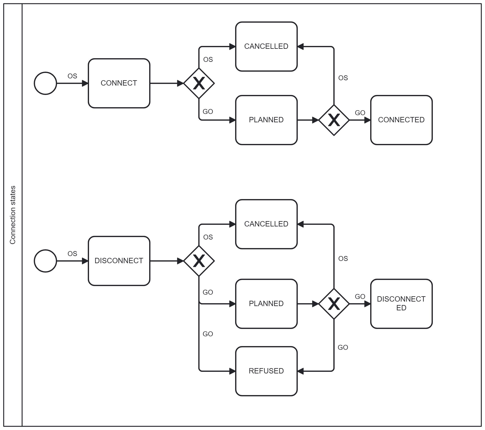

# Connecting to and disconnecting from the grid

## Table of contents

<!-- TOC -->
* [Connecting to and disconnecting from the grid](#connecting-to-and-disconnecting-from-the-grid)
  * [Table of contents](#table-of-contents)
  * [Introduction](#introduction)
  * [Connection and disconnection request and confirmation](#connection-and-disconnection-request-and-confirmation)
    * [API messages](#api-messages)
      * [Messages](#messages)
      * [Message rules](#message-rules)
<!-- TOC -->

## Introduction

If a grid service provider and an open supplier have entered into a joint invoice agreement, a market participant will always be sent a joint invoice (the market participant cannot choose otherwise) and the open supplier will have the right to request that the grid connection be turned off if the market participant has not paid its joint invoice.

## Connection and disconnection request and confirmation

Relevant Datahub services have been set up to transmit the request and confirmation for connecting and disconnecting. The intended use process is as follows:

1. An open supplier sends a request to turn the connection on or off using the service `intiate` and setting desired activity (`CONNECT` or `DICONNECT`).
2. The Datahub verifies that there is (or has been in the last six months) a valid joint invoice agreement between the designated recipient and the sender and whether the designated customer has (or has had within the past 12 months) a valid open supply agreement with the sender at this metering point and whether the combination of the designated customer and the metering point has (or has had within the past 12 months) a valid grid agreement with the recipient:
   - if not, the Datahub responds with an error message;
   - if yes, the Datahub stores the data in the database.
3. If necessary, the open supplier can cancel the connection and disconnection request using the `message` service and setting the state to `CANCELLED`.
4. The grid operator can scan connection and disconnection requests using the `connection-state/search` service.
5. The grid operator can search for the connection and disconnection requests using the `search` service.
6. The grid operator updates the status of the request using the `message` service. Possible options are:
   - connect or disconnect a metering point is planned (`PLANNED`);
   - refusal to disconnect a metering point (`REFUSED`);
   - confirming connecting or disconnecting a metering point (`CONNECTED` or `DISCONNECTED`).
7. The open supplier scans the grid operator’s responses using the `connection-state/search` service.
8. The open supplier can search for the connection and disconnection requests using the `search` service.
9. The grid operator and the open supplier can query the message history of the connection and disconnection request using the `message-history` service.

State diagram of statuses for `message` service:

### API messages

#### Messages

| Message                                                | Objective                             |
|--------------------------------------------------------|---------------------------------------|
| `POST /api/{version}/connection-state/initiate`        | Initiate connection state change      |
| `POST /api/{version}/connection-state/search`          | Find connection states                |
| `POST /api/{version}/connection-state/message`         | Create connection state message       |
| `POST /api/{version}/connection-state/message-history` | Find connection state message history |

For a description of message structures and validations, see [Datahub description and general principles for data exchange](01-datahub-description-and-general-principles-for-data-exchange.md)

#### Message rules

- Allowed states for `initiate` message are `CONNECT` or `DISCONNECT`
- `initiate` service is open for open suppliers only.
- The open supplier is allowed to send only `CANCELLED` state in the `message` service.
- The grid operator is allowed to send `PLANNED`, `REFUSED`, `CONNECTED` and `DICONNECTED` states in the `message` service.
- If the state of the connection and disconnection request is `CONNECTED`, `DISCONNECTED`, `REFUSED` or `CANCELLED`, then no additional messages can be sent in the `message` service.

> **Note**
> The rights for transmitting and requesting data are described in [Authentication and authorisation](03-authentication-and-authorisation.md)
