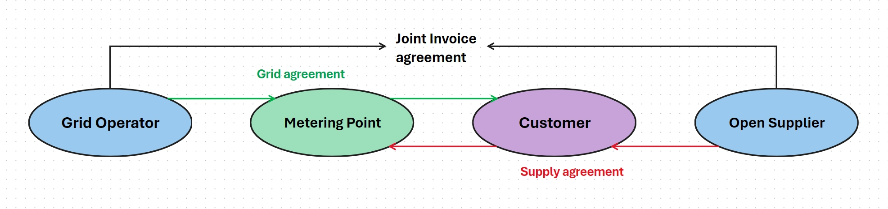

# Estfeed user manual

## Contents

<!-- TOC -->

  * [Registering a new user](#registering-a-new-user)
  * [Creating a new techincal user](#creating-a-new-technical-user)
  * [Adding or changing user rights](#adding-or-changing-user-rights)
  * [Creating a new metering point](#creating-a-new-metering-point)
  * [Metering point search](#metering-point-search)
  * [Metering point bulk import](#metering-point-bulk-import)
  * [Importing and downloading metering data](#importing-and-downloading-metering-data)
  * [Metering data search](#metering-data-search)
  * [Registering a new customer to the system](#registering-a-new-customer-to-the-system)
  * [Creating a new agreement](#creating-a-new-agreement)
    * [Grid agreement](#grid-agreement)
    * [Supply agreement](#supply-agreement)
    * [Joint invoice agreement](#joint-invoice-agreement)
  * [Agreement search](#agreement-search)
  * [Connection requests](#connection-requests)
    * [Sending a connection request](#sending-a-connection-request)
    * [Reading a connection request](#reading-a-connection-request)
    * [Answering to a connection request](#answering-to-a-connection-request)

## Registering a new user

 - 'Home' -> 'Users'
 - 'New authorization' or 'Register user'
    - Choosing 'Register user' -> fill all of the manditory fields -> 'Register' (*with this action a new user is created but it won't have any rights, the rights need to be added manually, see [Adding or changing user rights](#adding-or-changing-user-rights)*)
    - Choosing 'New autorization' -> 'Regular user' -> fill all the mandotory fields -> choose the rights you wish the user to have -> 'Assign' -> fill the "First name" and "Last name" fields -> 'Register and assign'
- A new user is registered

## Creating a new technical user

- 'Home' -> 'Technical users' -> 'New'
- Enter the suffix that will defina this technical user
- 'Create'
- New technical user is created 

> **NB!**
>
>In the module window there are shown User ID and Seceret ID that you need to copy somewhere, because **later there is no way to get them from anywhere!!!**

## Adding or changing user rights

Adding rights to the new (technial) user:
- 'Home' -> 'Users & Roles' -> 'New authorization'
- Choose the type of user and fill all of the necessary fields
- Choose rights for the user
- 'Assign'
- The rights have been added to the user

Changing already existing rights:
- 'Home' -> 'Users & Roles' -> *(specify the search based on your needs)* -> 'Search'
- Choose the row with the selected user -> scroll right -> 'Change'
- Add or remove rights based on your needs
- 'Assign'
- Users rights are updated

## Creating a new metering point

This action can be performed by Grid Operator, Aggregator and Closed Distribution Network roles.

- 'Metering points' -> 'Metering Point Bulk Import' -> 'Generate EICs' -> choose how many metering point EIC codes are needed -> 'Generate'
- Copy the generated EIC codes
- 'Metering points' -> 'New'
- Fill all of the necessary fields (mandatory fields are marked with red asterisk)
- 'Create'
- New metering point is created

> **NB!!!**
> 
> -> **Grid Operator** and **Closed Network Distribution** roles need to have "Transmission network EIC"
> -> **Aggregator** role needs to have a "Parent Metering Point EIC", under which the agregation metering point will be 

## Metering point search

- 'Metering points' 
- Specify the search if according to your needs (more parameters for specifiyng the search are available by clicking on 'Detailed search')
- 'Search'
- Search results show the metering points that 

## Metering point bulk import

- 'Metering points' -> 'Metering point bulk import' -> 'Download'
- Fill the downloaded file with all of the metering points information and save the file to the computer
- 'Import' -> 'Search' -> choose the filled file -> 'Import'
- In case of a successful importing all of the metering points described in the file, have been added to the system. To check it go to the metering point search (see [Metering point search](#metering-point-search)) and search for some of the metering points that were just imported.

## Importing and downloading metering data

Importing metering data to Estfeed:
- 'Metering data' -> 'Template' -> choose the parameters needed for uploading metering data (*for uploading hour-resolution data the timestamps need to be full hours and for uploading 15-min-resolution data the timestamps need to be full 15 minutes(:00, :15, :30, :45)*) -> 'Download'
- Fill all of the columns in the downloaded tempelate and save in your computer. Guide how to fill the Excel file can be found here: [Transmitting metering data via Excel](#transmitting-metering-data-via-excel).
- 'Metering data' -> 'Import' -> choose the file to upload -> 'Import'
- If the file has no mistakes then the metering data is imported on is being importated
- To see if the metering data has beed imported can be checked by two flows:
  - 'Metering data' -> 'Metering Data Status' -> choose a time period -> 'Search'
  - 'Metering data' -> 'Fill the necessary fields' -> 'Search' -> Check if the metering data you uploaded comes up in the search

Downloading the metering data:
- 'Metering data' -> fill all of the necessary fields -> 'Search' -> 'Download'
- File with the requested metering data is downloaded

## Metering data search

- 'Metering data'
- Add "Meter EIC" and "Period start" (the search can be specified by using different parameters)
- 'Search'
- The metering data corresponding to the entered search is displayed in the search results

## Registering a new customer to the system

This action can only be performed by Grid Operator role.
- 'Agreements' -> 'New agreement' -> 'Search meter' -> specify the search -> 'Search'
- Choose one or many metering points
- 'Search customer' -> 'Register new customer'
- Choose the customer type (Physical person, Legal person, Organization)
- Fill all of the mandatory fields
- 'Save'
- New customer is registered into the system so now new agreements can be formed with them

## Creating a new agreement

### Grid agreement

This action can only be performed by Grid Operator role.

- 'Agreements' -> 'New agreement'
- Choose the agreement type (Grid, Border Grid)
- 'Search meter'
- According to the selected parameters, find the metering point for which you want to create the agreement
- Choose one or many metering points
- 'Search customer'
- Choose a customer (*or register a new customer if the intended customer is not in the system yet, see [Registering a new customer to the system](#registering-a-new-customer-to-the-system))
- Add the 'Valid from' date (and 'Valid to' date)
- 'Register new agreement'
- New agreement is registered

### Supply agreement

This action can only be performed by Open Supplier role.

- 'Agreements' -> 'New agreement' 
- Enter the customers EIC code or click 'Search customer' to search for a customer by different parameters
- When the client is chosen -> 'Search meter' -> 'I consent'
- Choose one or many metering points for which the agreement is being created
- Add 'Valid from' date (and 'Valid to' date)
- 'Register new agreement'
- New agreement is registered

### Joint invoice agreement

This action can be prformed by Grid Operator or Closed Network Distribution roles.

- 'Agreements' -> 'Joint invoice agreements' -> 'New'
- Add Servce provider EIC code (if needed, the service provider can be searched by name)
- Add 'Valid from' date (and 'Valid to' date)
- 'OK'
- Joint invoice agreement has been registered

## Agreement search

- 'Agreements'
- Fill the fields to specify the search (more options under 'Detailed search')
- 'Search'
- Agreements corresponding to the chosen parameters are displayed in the search results

## Connection requests

To send any connection requests, there already needs to be current joint invoice agreement (see [Joint invoice agreement](#joint-invoice-agreement)), grid agreement (see [Grid agreement](#grid-agreement)) and supply agreement (see [Supply agreement](#supply-agreement)).

***Diagram 1.** Schema of assumptions for network connection requests* 

### Sending a connection request

This action can only be performed by Open Supplier role. If all of the prerequisite contracts are in place, then:
- 'Connection requests' -> 'Initiate'
- Fill all of the necessary fields (marked with a red asterisk)
- *To "Receiver EIC" - Grid Operator EIC code who has active Grid agreement with this customer at this metering point*
- *To "Customer EIC" - EIC code of the customer who has active Grid and Supply agreements in this metering point*
- *"Metering point EIC" - Metering point EIC code that has active Grid and Supply agreements with this customer*
- If needed, a message can be added
- 'Send'
- The connection request has been sent

### Reading a connection request

This action can be performed by Open Supplier, Closed Network Distribution or Grid Operator roles.

- 'Connection requests'
- Choose a timeperiod ("Creation Date From" and "Creation Date To") so the time connection request was sent would be in that timeperiod
- 'Search'
- In the search results are shown all of the connection requests that have been made during that time period
- Connection requests history can be viewed by opening the 'Message history' icon from the right side of chosen message requests row

### Answering to a connection request

This action can be performed by Open Supplier and Grid Operator roles.

- 'Connection requests'
- Search for messages in certain timeperiod
- Choose a connection request message to respond to
- Click on 'Quick reply' icon, second icon from right on that messages row
- Fill all of the necessary fields
- 'Reply'
- Reply to the connection request has been sent. It can be checked by clicking on 'Message history'.

