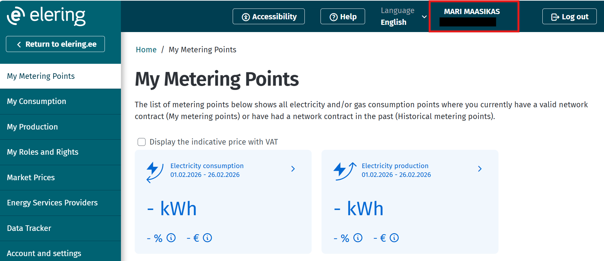
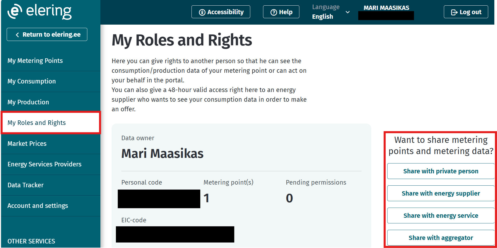

# Creating customer authorizations in the client portal

## Table of contents

<!-- TOC -->
* [Sharing rights in the client portal](#sharing-rights-in-the-client-portal)
  * [Table of contents](#table-of-contents)
  * [Introduction](#introduction)
  * [General rocess for sharing rights](#general-process-for-sharing-rights)
    * [Sharing rights with a private person](#sharing-rights-with-a-private-person)
    * [Sharing rights with another legal entity](#sharing-rights-with-another-legal-entity)
    * [Sharing rights with an energy supplier](#sharing-rights-with-an-energy-supplier)
    * [Sharing rights with an energy service provider](#sharing-rights-with-an-energy-service-provider)
    * [Sharing rights with an aggregator](#sharing-rights-with-an-aggregator)
    * [Accepting a customer authorization](#accepting-a-customer-authorization)
<!-- TOC -->

## Introduction

In the client portal, users can manage their representation and access rights. As a private person, rights can be granted to another private person, electricity and gas suppliers, and energy service providers. In the role of a legal entity, rights can also be granted to other legal entities, and a representative may be assigned either full or limited representation rights.

The recipient of a granted right must accept it within 7 days; otherwise, the right becomes invalid. All granted rights can be modified or revoked in the client portal. Detailed conditions are described in [Section 5.5 of the Terms of Service](https://estfeed.elering.ee/terms-of-service).

## General process for sharing rights

- Log in at https://estfeed.elering.ee
- Ensure that you are in the correct role under which you want to create the customer authorization. To switch roles, click on your name

- From the left-hand menu, select 'My Roles and Rights'
- 'Want to share metering points and metering data?' -> select to whom you want to create the customer authorization and follow the instructions in the respective subsection

### Sharing rights with a private person

The recipient of the right is a private person (i.e., an individual).

- 'Share with private person' -> 'Start' -> enter the personal identification code and click 'Next'
- Select the right you wish to grant to a private person and click 'Next'
- Choose whether the authorization applies to electricity or gas metering points and click 'Next'. If in the previous step you selected representation rights and wish to authorize the private person as a representative for all metering points, click the 'Choose all metering points' link.
- From the list, select the metering points to be included in the customer authorization and click 'Next'
- Select the validity period of the customer authorization and click 'Next'. If a suitable period is not available in the quick selection options, choose 'Select a custom validity period' to manually enter the start and end date.
- Review the customer authorization details and click 'Confirm'
- The created customer authorization can be found under the 'Granted by me' tab with the status "Pending"
- The recipient can accept or reject permission in their client portal ('My Roles and Permissions' -> 'Pending') within 7 days. If no decision is made within this period, the application becomes invalid and the customer authorization expires.
- If the recipient accepts the customer authorization, the status changes to "Active".
- A customer authorization with the status "Pending" can be revoked and its details viewed. A customer authorization with the status "Active" can be edited, deleted, and its permission details viewed. The customer authorization can be deleted by both the grantor and the recipient.

### Sharing rights with another legal entity

This option is visible only when acting in the role of a legal entity.
Access can only be granted to another company operating in the energy market. In other cases, please grant access to a private person.

- 'Share with legal entity' -> 'Start' -> enter the registry code and click 'Next'
- Select the right you wish to grant to the legal entity and click 'Next'
- Choose whether the authorization applies to electricity or gas metering points and click 'Next'. If in the previous step you selected representation rights and wish to authorize the legal entity as a representative for all metering points, click the 'Choose all metering points' link.
- From the list, select the metering points to be included in the customer authorization and click 'Next'
- Select the validity period of the customer authorization and click 'Next'. If a suitable period is not available in the quick selection options, choose 'Select a custom validity period' to manually enter the start and end date.
- Review the customer authorization details and click 'Confirm'
- The created customer authorization can be found under the 'Granted by me' tab with the status "Pending"
- The recipient can accept or reject the authorization in their client portal ('My Roles and Permissions' -> 'Pending') within 7 days. If no decision is made within this period, the application becomes invalid and the customer authorization expires.
- If the recipient accepts the customer authorization, the status changes to "Active".
- A customer authorization with the status "Pending" can be revoked and its details viewed. A customer authorization with the status "Active" can be edited, deleted, and its details viewed. The customer authorization can be deleted by both the grantor and the recipient.

### Sharing rights with an energy supplier

The recipient of the right is a registered electricity or gas supplier who requires metering point consumption data to provide services and billing.

- 'Share with energy supplier' -> 'Start'
- Choose whether the customer authorization applies to electricity or gas metering points and click 'Next'
- Select the energy supplier(s) to be included in the customer authorization and click 'Next'
- Review the customer authorization details and click 'Confirm'
- The created customer authorization can be found under the 'Granted by me' tab with the status "Active"
- The created customer authorization can be deleted and its permission details viewed

### Sharing rights with an energy service

The recipient of the right is an energy service provider, a registered legal entity that provides energy services or implements energy efficiency measures in the end user’s devices or premises.

- 'Share with energy service' -> 'Start'
- Select the energy service(s) with whom you want to share your metering point data, and click 'Next'
- Select the metering point(s) which data you wish to share with energy service and click 'Next'
- Select the validity period of the customer authorization and click 'Next'. If a suitable period is not available in the quick selection options, choose 'Select a custom validity period' to manually enter the start and end date.
- Review the customer authorization details and click 'Confirm'
- The created customer authorization can be found under the 'Granted by me' tab with the status "Active"
- The created customer authorization can be deleted and its details viewed

### Sharing rights with an aggregator

The recipient of the right is an aggregator registered by Elering AS, who combines consumers’ load or producers’ generation capacity for sale or purchase on the electricity market.

- 'Share with aggregator' -> 'Start'
- Select the metering point(s) which data you wish to share with aggregator and click 'Next'
- Select the aggregator(s) you are giving your metering point rights to and click 'Next'
- Review the customer authorization details and click 'Confirm'
- The created customer authorization can be found under the 'Granted by me' tab with the status "Active"
- The created customer authorization can be deleted and its permission details viewed

### Accepting a customer authorization

A representation right or access right request must be accepted or rejected in the client portal within 7 days from the moment it was granted. If no action is taken within this period, the authorization becomes invalid.

- Log in at https://estfeed.elering.ee
- From the left-hand menu, select 'My Roles and Rights'
- Open the 'Requests' tab to view pending authorizations
- Select the authorization and choose 'Accept' or 'Reject'