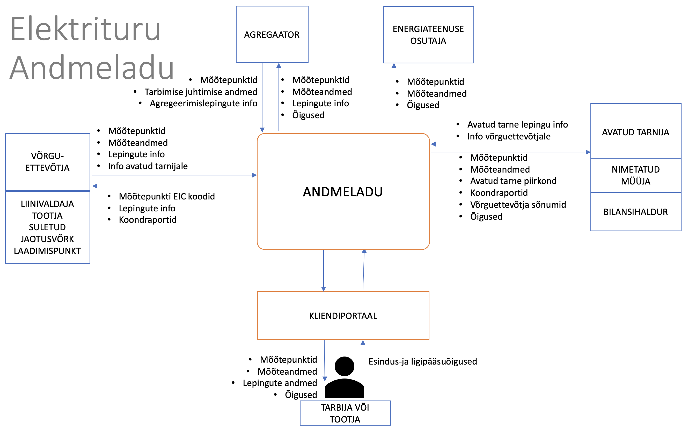

# Andmevahetusplatvormi Estfeed Datahub kirjeldus ja infovahetuse üldpõhimõtted

## Sisukord

<!-- TOC -->
* [Andmevahetusplatvormi Estfeed Datahub kirjeldus ja infovahetuse üldpõhimõtted](#andmevahetusplatvormi-estfeed-datahub-kirjeldus-ja-infovahetuse-üldpõhimõtted)
  * [Sisukord](#sisukord)
  * [Andmevahetusplatvorm Estfeed Datahub](#andmevahetusplatvorm-estfeed-datahub)
  * [Estfeed Datahub kasutamise leping](#estfeed-datahub-kasutamise-leping)
  * [Estfeed Datahub funktsionaalsus](#estfeed-datahub-funktsionaalsus)
  * [EIC koodid](#eic-koodid)
<!-- TOC -->

## Andmevahetusplatvorm Estfeed Datahub

Vastavalt elektrituruseaduses ja maagaasiseaduses sätestatule toimub avatud elektri- ja gaasiturul kogu andmevahetusprotsess läbi andmevahetusplatvormi (edaspidi **Estfeed Datahub**).

Estfeed Datahub on digitaalne keskkond, mille kaudu toimub elektri- ja gaasiturul andmevahetus avatud tarnija (elektriturul ka agregaatori) vahetuseks, mõõteandmete edastamiseks turuosaliste vahel, nende säilitamiseks ning turuosalisele seadusega pandud kohustuste täitmiseks ja talle antud õiguste tagamiseks.

Estfeed Datahubi eesmärk on turuosaliste võrdse kohtlemise printsiipe arvestav efektiivse andmevahetuse protsessi tagamine avatud elektri- ja gaasiturul. Estfeed Datahub tagab selleks õigusi omavatele turuosalistele võrdsetel alustel juurdepääsu mõõteandmetele ja võimaldab kiiret tarnija vahetuse protsessi.
Estfeed Datahubi arenduse eest vastutab Elering, kelle ülesandeks on ka kogu süsteemi edaspidine hooldus. Võrguettevõtjad vastutavad sisestatud andmete mahu ja nende kvaliteedi, mõõteandmete täpsuse, tunni või 15 minuti resolutsiooni põhise jaotuse ja sisestatud kliendiinfo korrektsuse eest. Avatud tarnijad vastutavad sisestatud elektri- ja gaasimüügi lepingute info õigsuse eest. Agregaatorid vastutavad agregeerimislepingute info ja edastatud tarbimise juhtimise andmete õigsuse eest.
Estfeed Datahub süsteem koosneb tarkvara ja riistvara lahendusest, mille abil hallatakse elektrienergia ja gaasi mõõteandmete vahetamist turuosaliste vahel, toetatakse elektrienergia ja gaasi tarnijate vahetuse protsessi ja säilitatakse mõõteandmed.
Estfeed Datahubis on defineeritud Eesti elektri- ja gaasiturul tegutsevad turuosalised, samuti kõik turuosaliste vahelist elektrienergia ja gaasi liikumist mõõtvad mõõtepunktid. Kõik turuosalised ja mõõtepunktid identifitseeritakse üheselt Estfeed Datahubi poolt väljastatud unikaalse koodiga (EIC kood).
Estfeed Datahubi kasutamiseks on kokku lepitud ühtsed andmeformaadid.

Turuosalised saavad Eleringi kliendiportaali kaudu oma mõõteandmetele ligipääsu ja võimaluse andmete allalaadimiseks. Samuti on kliendiportaalis turuosalisele nähtav kogu Andmelaos teda puudutav info: lepingute tähtajad, avatud tarnijad, agregaatorid, mõõteandmed, turuosalise EIC kood ja turuosalisega seotud mõõtepunktide EIC koodid. Iga turuosaline saab anda kliendiportaali kaudu volitusi eelmiste perioodide mõõteandmetele juurdepääsuks, seda eelkõige eesmärgiga saada avatud tarnijatelt personaalseid pakkumisi, agregeerimislepingu sõlmimiseks või oma energiaandmete jagamiseks muule energiateenusele. Turuosalise andmetele saavad ligipääsu need turuosalised ja muud energiateenused, kellel selleks on seadusjärgne õigus või kellele turuosaline ise on sellise õiguse andnud.

Kõik füüsiliste isikutega seotud andmed (sh EIC koodid) on isikuandmed ja isikuandmete töötlemisele Andmelaos kohaldub Euroopa Parlamendi ja Nõukogu määrus (EL) 2016/679, 27. aprill 2016, füüsiliste isikute kaitse kohta isikuandmete töötlemisel ja selliste andmete vaba liikumise ning direktiivi 95/46/EÜ kehtetuks tunnistamise kohta (edaspidi isikuandmete kaitse üldmäärus).

Õiguslikud alused andmevahetusplatvormi Estfeed Datahub kasutamiseks ja andmevahetuseks kõikidele turuosalistele tulenevad elektriturul Elektrituruseadusest ja Elektrituru toimimise võrgueeskirjast ning gaasiturul Maagaasiseadusest ja gaasituru võrgueeskirjast.

##Estfeed Datahub kasutamise leping

Andmelattu andmete sisestajaid nimetatakse operaatoriteks, kelle ülesanded ja vastutused jagunevad järgmiselt:

- **Võrguettevõtja (GO)** on elektriettevõtja, kes osutab võrguteenust võrgu kaudu ning kes **vastutab** oma võrgupiirkonna mõõtepunktide ja mõõteandmete kogumise ja edastamise eest Andmelattu. Iga võrguettevõtja on turuosaline oma võrgukadudega.  Lisaks vastavalt seadusandlusele,  kui turuosalisel ei ole avatud tarne lepingut, siis on tema avatud tarnijaks automaatselt tema võrguettevõtja või viimase poolt nimetatud müüja.
- **Liinivaldaja (LO)** kasutab elektrienergia edastamiseks otseliini ning kes **vastutab** oma liinipiirkonna mõõteandmete kogumise ja edastamise eest Andmelattu.
- **Suletud jaotusvõrgu ettevõtja (CDN)** osutab võrguteenust suletud jaotusvõrgu kaudu kaudu ning kes **vastutab** oma võrgupiirkonna mõõtepunktide ja mõõteandmete kogumise ja edastamise eest Andmelattu. Iga võrguettevõtja on turuosaline oma võrgukadudega. Suletud jaotusvõrgus edastatakse elektrienergiat geograafiliselt piiratud tootmiskoha, ärirajatise või ühisteenuste koha piires seal asuvatele äritarbijatele, kelle tegevus või tootmisprotsess on tehnilistel või ohutusega seotud põhjustel omavahel ühendatud, või mille kaudu edastatakse elektrienergiat peamiselt võrgu omanikule või võrguettevõtjale, kes seda võrku haldab, või nendega valitseva mõju kaudu seotud ettevõtjale.
- **Tootja (PO)**  edastab oma mõõtepunkti(de)ga seotud andmed, kui ei oma liinivaldaja tegevusluba.
- **Laadimispunkti operaator (CO)** haldab laadimispunkte, mille kaudu on võimalik laadida korraga ühte elektrisõidukit või vahetada korraga ühe elektrisõiduki aku.
- **Salvestusjaama operaator (STO)** haldab mõõtepunkte, mis on seotud elektrienergia salvestamisega energiasalvestusüksustes, kus salvestatakse energiat, sealhulgas kahesuunalist laadimist võimaldav elektrisõiduki laadimispunkt.
- **Gaasitankla operaator (GST)** haldab laadimispunkte, mille kaudu on võimalik tankida gaasi mootorsõidukitele.
- **Muu energiateenuse osutaja (ES)** on juriidiline isik, kes osutab energiateenuseid või rakendab muid energiatõhususe parandamise meetmeid lõpptarbija seadmetes või ruumides.
- **Avatud tarnija (OS)** on elektri müüja või ostja, kes osutab kliendile avatud tarnet ehk müüb/ostab kas puudujääva/ülejääva elektrienergia koguse või müüb/ostab kogu mõõdetud elektrienergia koguse sõltuvalt poolte vahelisest kokkuleppest turuosalisega. Avatud tarnija sisestab Andmelattu avatud tarne lepingu andmed turuosalisega.
- **Nimetatud müüja (NS)** võrguettevõtja poolt valitud avatud tarnija, kes osutab võrguettevõtja asemel avatud tarne teenust võrguettevõtja teeninduspiirkonna klientidele, kellel puudub avatud tarne leping.
- **Bilansihaldur (BRP)** on hierarhiliselt kõrgemal olev avatud tarnija, kellel on bilansileping süsteemihalduriga.
- **Agregaator (AGG)** on tarbimise juhtimise teenuse osutaja ning edastab Andmelattu agregeerimislepingu info, tarbimise juhtimise mõõtepunkti ja andmed.
- **Süsteemihaldur (TSO)** on Elering, tagab Eesti elektrisüsteemi bilansi, on avatud tarnijaks bilansilepingu sõlminud bilansihalduritele, haldab ja arendab elektrituruseaduse alusel Estfeed Datahub.

Operaatoritele, v.a energiateenuse osutajad, tagatakse andmete edastamiseks ja kättesaamiseks andmevahetus nii masinliidestuse (API) kui täiendava veebirakenduse kaudu.

Energiateenuste osutajatele võimaldatakse andmetele ligipääs ainult turuosalise poolt Estfeed Datahubi kliendiportaali kaudu antud ligipääsuõiguse alusel ning tagatakse andmevahetus masinliidestuse (API) kaudu.

Lõppklientidele on oma andmetele ligipääsuks loodud kliendiportaal, mille kaudu saab klient hallata oma esindusõigusi, anda õigusi teistele isikutele andmetele ligipääsuks ning vaadata tema mõõtepunktidega seotud andmete päringute logisid.
Estfeed Datahub kasutamiseks, v.a lõppklient, tuleb sõlmida süsteemihalduriga Andmevahetusplatvormi Estfeed Datahub kasutamise leping, millega määratakse poolte vahelised õigused ja kohustused andmete sisestamiseks ja pärimiseks vastavalt seadusandlusele.

**Süsteemihaldur tagab operaatoritele Estfeed Datahubi kasutamise järgmiselt:**

1. tagab elektroonilisel teel edastatavate andmete turvalisuse;
2. teavitab Operaatorit võimalikest hooldus- ja arendustöödest, mis mõjutavad Estfeed Datahubi kasutamist e-posti teel või Estfeed Datahubi vahendusel hiljemalt 5 (viis) tööpäeva enne tööde teostamist;
3. teavitab Operaatorit e-posti teel või Estfeed Datahubi vahendusel planeeritavatest hooldustöödest ja seisakutest vähemalt 3 (kolm) tööpäeva ette;
4. korraldama Estfeed Datahubi tõrgeteta tööks vajalikku hooldust ja arendust lähtudes põhimõttest, et hooldustöid ei planeerita ajavahemikus 8.00-12.00;
5. informeerima Operaatorit tõrgetest Estfeed Datahubi töös esimesel võimalusel, sh teavitades tööpäeva perioodil tekkinud tõrgetest operaatoreid 15 minuti jooksul;
6. taastama Estfeed Datahubi kasutamise esimesel võimalusel (reeglina 4 tunni jooksul).

Kõik ülaltoodud elektroonsed teavitused edastatakse operaatori poolt lepinguga määratud Haldurile (käesoleva dokumendi peatükk 16). Halduril on võimalus ülaltoodud teadete edastamine delegeerida mõnele teisele e-posti aadressile, teavitades sellest elektroonselt süsteemihalduri Estfeed Datahubi administraatorit.

##Estfeed Datahub funktsionaalsus

Estfeed Datahub kui süsteem katab järgmised põhiprotsessid:

1. kodeerimise protsess;
2. mõõtepunkti tehniliste andmete ja mõõteandmete esitamise protsess;
3. tarnijavahetuse ja seda kirjeldava sõnumite vahetamise protsess;
4. võrguettevõtja võrguarve edastuse protsess;
5. avatud tarnija ja võrguettevõtja vahelise infovahetuse kanal;
6. katkematu avatud tarne ahela ja bilansiportfellide (bilansipiirkondade) haldus;
7. bilansiselgituse agregeeritud koondraportite arvutamine ja edastamine;
8. agregeerimislepingute ja tarbimise juhtimise mõõteandmete edastamine.

*Joonis 1:Estfeed Datahub põhiprotsessid*

## EIC koodid

EIC kood (*Energy Identification Code*) on unifitseeritud kodeerimissüsteemi alusel turuosalisele või mõõtepunktile määratud unikaalne identifikaator, mis on vajalik elektri- ja gaasiturul tegutsevate turuosaliste kohta käiva infovahetuse automatiseerimiseks.

Iga turul osalev isik peab omama EIC koodi, millega seostatakse kõik tema turutegevused.

EIC koodide register asub Andmelaos.

- **Turuosalise EIC kood** on turuosalist üheselt identifitseeriv unikaalne märgikombinatsioon. Turuosalise EIC koodi määrab süsteemihaldur või süsteem automaatselt.
- **Mõõtepunkti EIC kood** on mõõtepunkti üheselt identifitseeriv unikaalne märgikombinatsioon. Süsteemihaldur eraldab jaotusvõrguettevõtjale või liinivaldajale kasutamiseks koodivahemiku.
