# Äriprotsessid

## Sisukord

- [Äriprotsessid](#äriprotsessid)
  - [Sisukord](#sisukord)
  - [Sissejuhatus](#sissejuhatus)
  - [Mõõtepunkti haldus](#mõõtepunkti-haldus)
    - [Mõõtepunkti registreerimine](#mõõtepunkti-registreerimine)
    - [Mõõtepunkti metaandmete uuendamine](#mõõtepunkti-metaandmete-uuendamine)
  - [Klientide haldus](#klientide-haldus)
    - [Kliendi registreerimine](#kliendi-registreerimine)
    - [Kliendi metaandmete uuendamine](#kliendi-metaandmete-uuendamine)
  - [Lepingute haldus](#lepingute-haldus)
    - [Võrgulepingu registreerimine](#võrgulepingu-registreerimine)
    - [Avatud tarne lepingu registreerimine](#avatud-tarne-lepingu-registreerimine)
    - [Üldteenuse lepingute genereerimine ja levitamine](#üldteenuse-lepingute-genereerimine-ja-levitamine)
    - [Kliendi arveldusandmete vahendamine võrguettevõtjalt nimetatud müüjale](#kliendi-arveldusandmete-vahendamine-võrguettevõtjalt-nimetatud-müüjale)
  - [Võrguühenduse välja- ja sisselülitamine](#võrguühenduse-välja--ja-sisselülitamine)
    - [Lahti ühendamine](#lahti-ühendamine)
    - [Sisse lülitamine](#sisse-lülitamine)
  - [Ühisarve haldus](#ühisarve-haldus)
    - [Ühisarve lisamine](#ühisarve-lisamine)
    - [Ühisarve muutmine](#ühisarve-muutmine)
  - [Võrguteenuse arve haldus](#võrguteenuse-arve-haldus)
    - [Võrguteenuse arve lisamine](#võrguteenuse-arve-lisamine)
    - [Võrguteenuse arve muutmine](#võrguteenuse-arve-muutmine)

## Sissejuhatus

Käesolev dokument kirjeldab peamisi Andmelaoga seotud äriprotsesse ja proovib seeläbi anda ülevaadet, kuidas erinevad masinliidese sõnumid äriprotsesside suhestuvad.

Diagrammid on koostatud selliselt, et keerukamad äriprotsessid taaskasutavad lihtsamaid äriprotsesse. Näiteks protsess "Võrgulepingu registreerimine" taaskasutab järgmisi olemasolevaid protsesse:

- Kliendi registreerimine
- Kliendi metaandmete uuendamine
- Mõõtepunkti registreerimine

Taaskasutatud protsesside tähis on diagrammidel järgmine:

## Mõõtepunkti haldus

### Mõõtepunkti registreerimine

### Mõõtepunkti metaandmete uuendamine

## Klientide haldus

### Kliendi registreerimine

### Kliendi metaandmete uuendamine

## Lepingute haldus

### Võrgulepingu registreerimine

### Avatud tarne lepingu registreerimine

### Üldteenuse lepingute genereerimine ja levitamine

Alljärgnev diagram aitab paremini mõista protsessi, kuidas üldteenuse lepinguid genereeritakse:

### Kliendi arveldusandmete vahendamine võrguettevõtjalt nimetatud müüjale

## Võrguühenduse välja- ja sisselülitamine

### Lahti ühendamine

### Sisse lülitamine

## Ühisarve haldus

### Ühisarve lisamine

### Ühisarve muutmine

*protsessi kirjeldus on loomisel*

## Võrguteenuse arve haldus

### Võrguteenuse arve lisamine

### Võrguteenuse arve muutmine

