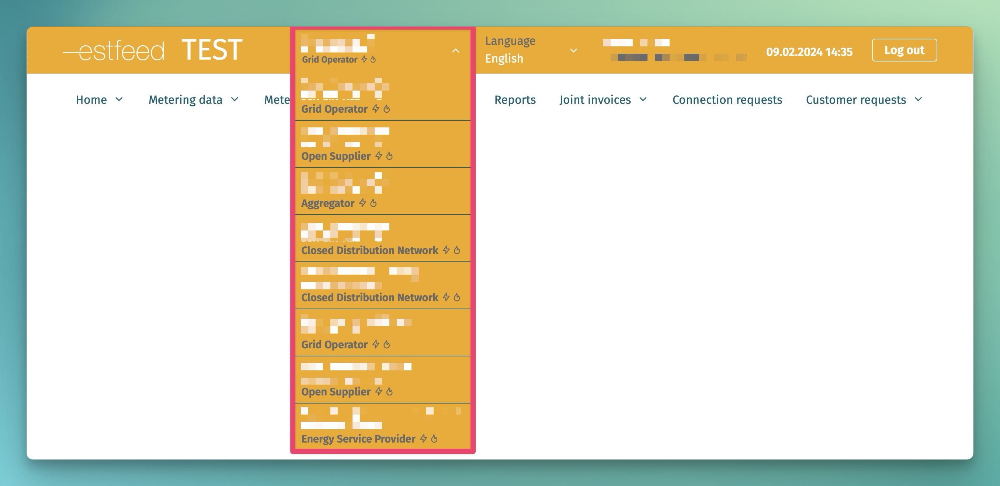

# Autentimine ja autoriseerimine

## Sisukord

- [Autentimine ja autoriseerimine](#autentimine-ja-autoriseerimine)
  - [Sisukord](#sisukord)
  - [Sissejuhatus](#sissejuhatus)
  - [Veebiliideses autentimine](#veebiliideses-autentimine)
  - [API liideses autentimine](#api-liideses-autentimine)
    - [Näited JWT tokeni küsimiseks](#näited-jwt-tokeni-küsimiseks)
      - [cURL](#curl)
      - [Python](#python)
  - [Autoriseerimine](#autoriseerimine)

## Sissejuhatus

Käesolev leht kirjeldab süsteemis realiseeritud autentimise ja autoriseerimise reegleid.

Edukaks autentimiseks on vaja esmalt seadistada kasutajakontod. Loe selle kohta lehelt [Kasutajate haldus](03.02-kasutajate-haldus.md)

Lisaks rakendab Andmeladu andmete ligipääsupiiranguid, mis on kirjeldatud lehel [Rollipõhised ligipääsuõigused](03.01-rollipohised-ligipaasuoigused.md)

## Veebiliideses autentimine

Andmelao veebiliideses autentimiseks on vaja läbida Elering autentimisprotsess ID-kaardi, mobiil-ID või smart-ID abil. Peale edukat autentimist tuvastab Andmeladu kasutaja rollid ning võimaldab kasutajal määrata, millises rollis ta soovib Andmeladu kasutada.

Kasutaja saab valida talle määratud rollide vahel:



Kui määratud rollid puuduvad, siis veebiliidese funktsionaalsust kasutada ei saa.

## API liideses autentimine

Masinliideses autentimiseks tuleb kasutada eelnevalt loodud tehnilise kasutaja `client_id` ja `client_secret`.

Autentimise protsess:

|Samm|Tulemus|
|----|-------|
|Autentimispäringu saatmine Eleringi poolt antud aadressile|Andmeladu valideerib konto, loob sessiooni ja tagastab JWT tokeni, mis kehtib sessiooni pikkuse|
|JWT tokeni lisamine igale järgnevale API sõnumile|Andmeladu valideerib JWT tokeni. Kui puudub või kehtetu, siis tagastab veakoodi 401 (unauthorized). Kui valiidne, siis järgneb autoriseerimine, mille kohta loe järgmisest peatükist|

Keycloak muutujad:
- Public test keskkond:
  - host: https://test-kc.elering.ee
  - vhost: `estfeed-public`

### Näited JWT tokeni küsimiseks

#### cURL

```bash
#!/bin/bash
# Example cURL request for retrieving token for Estfeed public test.
# For use with API requests, must be passed as a header.

API_CLIENT="replace this client"
API_SECRET="replace this secret"

TOKEN=$(\
    curl \
        -s \
        -X POST \
        -d grant_type=client_credentials \
        -d client_id=$API_CLIENT \
        -d client_secret=$API_SECRET \
        -d scope=openid
        https://{replace this with Keycloak host}/realms/{vhost}/protocol/openid-connect/token \
)

if ! command -v jq &> /dev/null; then
    echo -e "WARN: jq not found for JSON parsing, printing out raw json\n"
    echo $TOKEN
    exit 0
fi

ACCESS_TOKEN=`echo $TOKEN | jq -er .access_token`
EXPIRES_IN=`echo $TOKEN | jq -r .expires_in`
REFRESH_ACCESS_TOKEN=`echo $TOKEN | jq -er .refresh_token`
REFRESH_EXPIRES_IN=`echo $TOKEN | jq -er .refresh_expires_in`

if [[  $ACCESS_TOKEN == null ]]; then
    echo 'FATAL: Access token not found, probably incorrect credentials.'
    exit 1
fi

echo "===================================================================================="
echo -e "\t\tAccess token:"
echo -e "Expires at\n\t`date --date=\"+$EXPIRES_IN seconds\"` ($EXPIRES_IN seconds)\n\nToken\n\t$ACCESS_TOKEN"
echo "===================================================================================="
echo -e "\t\tRefresh token:"
echo -e "Expires at\n\t`date --date=\"+$REFRESH_EXPIRES_IN seconds\"` ($REFRESH_EXPIRES_IN seconds)\n\nToken\n\t$REFRESH_ACCESS_TOKEN"
echo "===================================================================================="

```

#### Python

```python
import requests
import config

url = f'{config.keycloakHost}/auth/realms/{config.keycloakVhost}/protocol/openid-connect/token'
headers = {'Content-type': 'application/x-www-form-urlencoded'}
body = f'client_id={config.keycloakClientId}&grant_type=client_credentials&client_secret={config.keycloakClientSecret}&scope=openid'

response = requests.post(url, headers=headers, data=body)
access_token = response.json().get('access_token')
print(access_token)
```

Example

```text
grant_type=client_credentials&client_id=client123&client_secret=secret123&scope=openid
```

## Autoriseerimine

Autoriseerimist teostab Andmeladu. Iga tegevus nii veebi- kui ka masinliideses on seotud valitud rolliga. Andmeladu valideerib, kas antud tegevus antud kasutaja poolt antud rollis ja antud andmetega on lubatud või mitte.

Veebiliideses toimub autoriseerimine läbi rolli valimise.

Masinliideses toimub autoriseerimine läbi õige tehnilise kasutaja ligipääsu *tokeni* ja päringu `marketParticipantContext` sektsiooni, kus API sõnumi saatja peab ära defineerima enda rolli. Selle eesmärgiks on luua selge arusaam kes ja milleks sõnumeid saadab ja milline on andmete kasutamise eesmärk.

Sektsioon `marketParticipantContext` koosneb järgmistest atribuutidest:

```json
"marketParticipantContext": {
  "marketParticipantIdentification": "string", 
  "marketParticipantRole": "string", 
  "commodityType": "string"
}
```

Atribuutide selgitus:

|Atribuut|Selgitus|
|--------|--------|
|marketParticipantIdentification|Turuosalise EIC X-kood, kes sõnumit saadab. Peab viitama samale turuosalisele, kes on defineeritud JWT tokenis.|
|marketParticipantRole|Roll, milles turuosaline sõnumit saadab. Nt kui avatud tarnija on üksiti ka võrguettevõtja, siis tuleb päringu saatmised defineerida, mis rolli hetkel selle sõnumiga täidetakse.Näiteks avatud tarnija saab andmeid pärida OPEN_SUPPLIER rollis|
|commodityType|Energiatoote tüüp (elekter või gaas). Oluline nende ettevõtete jaoks, kes osalevad nii elektri kui gaasi turul.|

Kui defineeritud `marketParticipantContext` ei lähe kokku sõnumi ülejäänud sisuga (nt proovib uut mõõtepunkti registreerida rollis "Avatud tarnija"), siis Andmeladu vastab veakoodiga.

Rollid:

| Roll                          | `marketParticipantIdentification` kood |
|-------------------------------|----------------------------------------|
| Avatud tarnija                | OPEN_SUPPLIER                          |
| Võrguettevõtja                | GRID_OPERATOR                          |
| Suletud jaotusvõrgu ettevõtja | CLOSED_DISTRIBUTION_NETWORK            |
| Liinivaldaja                  | LINE_OPERATOR                          |
| Laadimispunkti operaator      | CHARGING_POINT_OPERATOR                |
| Agregaator                    | AGGREGATOR                             |
| Tootja                        | PRODUCER_OPERATOR                      |
| Muu energiateenuse osutaja    | ENERGY_SERVICE_PROVIDER                |
