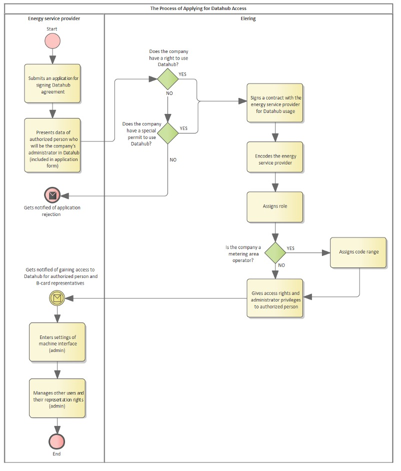

# Rollipõhised ligipääsuõigused

## Sisukord

- [Rollipõhised ligipääsuõigused](#rollipõhised-ligipääsuõigused)
  - [Sisukord](#sisukord)
  - [Sissejuhatus](#sissejuhatus)
  - [Elektriettevõtja ja energiateenuse osutajate registreerimine ja ligipääsuõigused](#elektriettevõtja-ja-energiateenuse-osutajate-registreerimine-ja-ligipääsuõigused)
  - [Avatud tarne lisarollid](#avatud-tarne-lisarollid)
  - [Andmevahetuse ligipääsuõigused](#andmevahetuse-ligipääsuõigused)
    - [Võrguoperaatorite (sh liinivaldajad, laadimispunktid) andmevahetus ja ligipääsud](#võrguoperaatorite-sh-liinivaldajad-laadimispunktid-andmevahetus-ja-ligipääsud)
    - [Avatud tarnija ligipääs andmetele](#avatud-tarnija-ligipääs-andmetele)
    - [Bilansihalduri ligipääs andmetele](#bilansihalduri-ligipääs-andmetele)
    - [Nimetatud müüja ligipääs andmetele](#nimetatud-müüja-ligipääs-andmetele)
    - [Agregaatori ligipääs andmetele](#agregaatori-ligipääs-andmetele)
    - [Energiateenuse osutajate ligipääs andmetele](#energiateenuse-osutajate-ligipääs-andmetele)
    - [Süsteemihalduri ligipääs andmetele (bilansihaldus ja taastuvenergia äriprotsess)](#süsteemihalduri-ligipääs-andmetele-bilansihaldus-ja-taastuvenergia-äriprotsess)

## Sissejuhatus

Elering tagab, et turuosalise andmetele Andmelaost saavad ligipääsu vaid need osapooled, kellel on selleks seadusjärgne õigus või kellele turuosaline ise on selle õiguse andnud.

Ligipääsuõiguste üldpõhimõtted on järgmised:

1. Andmelao andmetele ligipääsuks tuleb Eleringiga sõlmida leping kõikidel elektriettevõtjatel ning energiateenuste osutajatel, kes taotlevad turuosalise andmetele ligipääsu.
2. Võrgulepingu kliendile tagatakse juurdepääs kliendiportaali kaudu edastatavatele andmetele. Kliendil on õigus volituse andmise kaudu edastada oma mõõtepunkti ja mõõteandmeid teistele isikutele ja süsteemidele.

> [!WARNING]
> NB! Kõik füüsiliste isikutega seotud andmed (sh EIC koodid) on isikuandmed ja kohaldub isikuandmete kaitse üldmäärus. Iga Andmelao kasutaja vastutab päringute teostamisel õigusliku aluse olemasolu eest, sh on mõõtepunkti päring lubatud ainult elektrituru toimimise võrgueeskirjas sätestatud kontrollkohustuse täitmiseks. Kõik tarbijad saavad esitada Eleringile kaebusi ja päringuid turuosaliste poolt teostatud päringute kohta ja päringu teostaja peab kliendi andmete töötlemisel tõendama õiguslikku alust.

## Elektriettevõtja ja energiateenuse osutajate registreerimine ja ligipääsuõigused

Kui elektriettevõtja või energiateenuse osutaja on **Eleringiga sõlminud Andmelao kasutamise lepingu**, kodeerib Elering ettevõtte ja määrab ligipääsuõigused. Iga elektriettevõtja tüüp on eristatud oma rollilühendiga ning tal on rollist lähtuvalt seadusega tagatud ligipääsuõigused. NB! avatud tarnijal ei ole vaikimisi võrguettevõtjale loodud õigusi ning võrguettevõtjal puuduvad avatud tarnija õigused, mis tähendab, et iga elektriettevõtja roll sätestatakse eraldi (mh võrguettevõtja saab olla mitmes rollis).

| Andmelao kasutaja tüüp | Lühend | Selgitus | Avatud tarne portfellilepingu kohustus |
|---|---|---|---|
| Võrguettevõtja | GO | Oma koodivahemik.Vastutab oma võrgupiirkonna mõõtepunktide tehniliste andmete, võrgulepingute info ja mõõteandmete edastamise eest. | Jah. Lepingu puudumisel sisestab Elering ta ülem-võrguettevõtja avatud tarnija portfelli. |
| Liinivaldaja | LO | Oma koodivahemik. Vastutab oma mõõtepunktidega seotud andmete ja mõõteandmete kogumise ja edastamise eest. | Ei. Bilansiväline - LO mõõtepunktidesse avatud tarne lepinguid ei lisata |
| Suletud jaotusvõrk | CDN | Oma koodivahemik. Vastutab oma võrgupiirkonna mõõtepunktide tehniliste andmete, võrgulepingute info ja mõõteandmete edastamise eest. | Jah. |
| Tootja operaator | PO | Oma koodivahemik. Vastutab oma mõõtepunktidega seotud andmete ja mõõteandmete kogumise ja edastamise eest. | Ei, bilansiväline – PO mõõtepunktidesse avatud tarne lepinguid ei lisata. |
| Laadimis-punkti operaator | CO | Oma koodivahemik. Vastutab oma mõõtepunktidega seotud andmete ja mõõteandmete kogumise ja edastamise eest. | Ei, bilansiväline - CO mõõtepunktidesse avatud tarne lepinguid ei lisata. |
| Avatud tarnija | OS | Avatud tarnija sisestab turuosalisega sõlmitud avatud tarne lepingu andmed ning sisestab ka portfellilepingu, kui ta osutab avatud tarne teenust mõnele teisele avatud elektriettevõtjale. | Jah. Avatud tarne lepingu puudumisel kaotavad avatud tarnija poolt turuosalisega sõlmitud lepingud kehtivuse.|
| Agregaator | AGR | Oma koodivahemik. Agregaator sisestab turuosalisega sõlmitud agregeerimise lepingu andmed ning edastab tarbimise juhtimise andmed. | Jah. Avatud tarne lepingu puudumisel kaotavad agregaatori poolt turuosalisega sõlmitud lepingud kehtivuse.|
| Energiateenuse osutaja | ES | Energiateenuse osutaja saab andmetele ligipääsu ainult lõppkliendi enda poolt antud ligipääsuõiguse alusel. | Ei Roll on vaid andmetele ligipääs ligipääsuõiguste alusel. |

## Avatud tarne lisarollid

Avatud tarne teenusega tekivad lepingutest lähtuvalt veel järgmised lisarollid:

| Avatud tarnija lisaroll | Lühend | Selgitus                                                                                                                                                                                                                                                                                                                                                                                     | Avatud tarne portfellilepingu kohustus                  |
|-------------------------|--------|----------------------------------------------------------------------------------------------------------------------------------------------------------------------------------------------------------------------------------------------------------------------------------------------------------------------------------------------------------------------------------------------|---------------------------------------------------------|
| Nimetatud müüja         | Named  | Kui võrguettevõtja ei osuta avatud tarne teenust oma võrgupiirkonna klientidele ise (juhuks, kui kliendil puudub avatud tarne leping), nimetab ta ühe avatud tarnija kogu oma tegevuspiirkonna kohta. Nimetatud müüja lepingu andmed sisestab Andmelattu võrguettevõtja. **Nimetatud müüjal on mõõtepunkti ja mõõteandmete osas samad õigused nagu avatud tarne lepinguga avatud tarnijal.** | Jah, avatud tarnija reeglid                             |
| Bilansihaldur           | BRP    | Bilansihaldur on avatud tarnija, kes on sõlminud bilansi lepingu Eleringiga.                                                                                                                                                                                                                                                                                                                 | Jah. Bilansilepingu andmed sisestab Andmelattu Elering. |
| Süsteemihaldur          | TSO    | Elering on bilansihaldurite avatud tarnija.                                                                                                                                                                                                                                                                                                                                                  | Andmelao väline.                                        |

Elektriettevõtja registreerimisel Andmelao kasutajaks sisestab Elering lepingus toodud isiku (rollinimega "Haldur") ettevõtte andmete eest põhivastutavaks isikuks. Iga elektriettevõtja Halduril on kohustus sisestada masinliidese seaded ning sisestada/hallata oma ettevõtte teisi kasutajaid ja nende esindusõigusi. Haldur loob ise oma ettevõtte volitatud töötajatele kasutajakontod ning vastutab oma ettevõtte volitatud töötajate ligipääsu koosseisu haldamise eest.

*Joonis 1 Registreerimise protsess*

## Andmevahetuse ligipääsuõigused

### Võrguoperaatorite (sh liinivaldajad, laadimispunktid) andmevahetus ja ligipääsud

Võrguettevõtja, suletud jaotusvõrk, liinivaldaja/tootja ja laadimispunkti operaatori poolt edastatakse Andmelattu alljärgnevad andmed:

|Info, mida edastab| Võrgu-ettevõtja (GO) | Suletud jaotusvõrk (CDN) | Liinivaldaja ja tootja (LO ja PO)| Laadimis-punkt (CO)| Andmelao roll| Selgitus |
|---|---|---|---|---|---|---|
|Kliendi andmed|JAH|JAH|JAH|JAH|Kodeerib kliendi EIC (X) koodiga.||
| Mõõtepunkti tehnilised andmed kodeerituna oma koodivahemikus ning andmed kui on mõõtepunkti kohta registreeritud võrgulepingu isik ja algusaeg, lõppaeg | JAH| JAH| JAH| JAH| Formaadi kontroll, salvestamine, andmevahetus.  | Tehniliste andmete formaat. Eelnevalt vajalik koodivahemik Andmelaost.|
| Mõõtepunkti lõikes tunnimõõteandmed (hiljem 15 minutit mõõteandmed)| JAH | JAH | JAH| JAH| Formaadi kontroll, salvestamine, andmevahetus| Võrgueeskirja alusel kohustus|
| Avatud tarne lepingu muudatustaotluste vastus| JAH | JAH| EI | EI | | Kui ei ole nimetatud müüja lepingut|
| Võrguettevõtja nimetatud müüja leping| JAH | JAH| EI | EI | Lepingu info salvestamine ja ligipääsuõiguste tagamine| Nimetatud müüja osutab võrguettevõtja eest avatud tarnet üldteenuse klientidele|
| Ühisarve leping avatud tarnijaga| JAH | JAH| EI | EI | Lepingu info salvestamine ja andme-vahetuse tagamine| Avatud tarnija edastab võrguettevõtja asemel kliendile võrguarve|
| Võrguarve ühisarve kliendile| JAH | JAH| EI | EI | Andmevahetus| *sama* |
| Kliendi pöördumiste vastus avatud tarnijale| JAH | JAH | EI | EI | *sama* | *sama* |
| Ühisarvega seotud väljalülitamise taotluse kinnitus avatud tarnijale| JAH | JAH | EI | EI | *sama* | *sama* |
| Võrguarve väljastuse sõnum | JAH | JAH | EI | EI | *sama* | *sama* |
| Teabevahetus teistele kasutajatele | JAH | JAH | JAH | JAH | *sama* | Teabevahetus teistele kasutajatele -kõikidele või väljavalitud avatud tarnijale jms |

Võrguettevõtja, suletud jaotusvõrk, liinivaldaja/tootja ja laadimispunkti operaatori kasutajatele on ligipääs alljärgnevale infole:

| Ligipääs infole | Võrgu-ettevõtja | Suletud jaotusvõrk | Liinivaldaja ja tootja | Laadimis-punkt | Selgitus |
|---|---|---|---|---|---|
|Kliendi andmed|JAH|JAH|JAH|JAH||
| Mõõtepunktide oma koodivahemik | JAH | JAH | JAH | JAH | Mõõtepunktide info sisestamiseks|
| Mõõtepunkti tehnilised andmed, võrgulepingu isik ja algusaeg, lõppaeg | JAH | JAH | JAH | JAH | Ligipääs oma piirkonna andmetele |
| Mõõtepunktidega seotud lepingute andmed (avatud tarne ja agregeerimislepingute isikud, algusaeg, lõppaeg) | JAH | JAH | EI | EI | Ligipääs oma piirkonna andmetele |
| Mõõtepunktide mõõteandmed | JAH | JAH | JAH | JAH | Ligipääs oma piirkonna andmetele |
| Mõõtepunktide, sh piirimõõtepunktide mõõteandmed | JAH | JAH | JAH | JAH | Ligipääs andmetele võrguettevõtja kui klient |
| Mõõteandmete edastuse staatus | JAH | JAH | JAH | JAH | Uus. Andmeladu monitoorib iga mõõtepunkti lõikes andmeedastust. Oma mõõtepunktide andmed. |
| Mõõtepunktide agregaatori tarbimise juhtimise andmed | JAH | JAH | JAH | JAH | Uus. Alus: võrgueeskiri (draft hetkel). Oma mõõtepunktide kohta. |
| Avatud tarne lepingu muudatustaotluste andmed | JAH | JAH | EI | EI | Ligipääs oma piirkonna andmetele |
| Registreeritud oma piirkonna lepingud: ühisarve leping, nimetatud müüja leping, piirkonna avatud tarnija ja bilansihaldur | JAH | JAH | EI | EI | Ligipääs oma piirkonna andmetele |
| Ühisarvega seotud väljalülitamise taotluse ja kliendipöördumiste sõnumid avatud tarnijalt ja oma vastused nendele | JAH | JAH | EI | EI | Ligipääs oma piirkonna andmetele |
| Teabevahetusega seotud sõnumid | JAH | JAH | JAH | JAH | Kasutajate vaheline infovahetus |
| Võrgukadude arvutus | JAH | JAH | EI | EI | Uus funktsionaalsus. |
| Koondraportid oma piirkonnaga seotud lepingute lõikes | JAH | JAH | JAH | JAH | Raportite sisu kirjeldatud eraldi. |

### Avatud tarnija ligipääs andmetele

Avatud tarnija poolt edastatakse Andmelattu alljärgnevad andmed:

| Info, mida edastab | Avatud tarnija | Andmelao roll | Selgitus |
|---|---|---|---|
| Avatud tarne lepingu info mõõtepunkti lõikes: algusaeg, lõppaeg, ennetähtaegse lepingu lõpetamise tasunõue (jah/ei). | JAH | 1. Kehtiva avatud tarne lepinguga klient:   Andmeladu lõpetab senise avatud tarne lepingu 14 päeva ette (sõnumi ajakava kontroll), registreerib uue ja tagab infovahetuse.   2. Avatud tarne lepinguta klient:   Andmeladu registreerib uue avatud tarne lepingu 1 päev ette (sõnumi ajakava kontroll), registreerib uue ja tagab infovahetuse | Uus müüjavahetuse protsess alates 01.01.2023 |
| Avatud tarne portfellileping teise elektriettevõtjaga: algusaeg, lõppaeg. | JAH | Lepingu registreerimine | Lepingu registreerimine 7p ette |
| Avatud tarne lepingu muudatustaotluse vastus | JAH | Andmevahetus | Võrguettevõtja BH-na/nimetatud müüjana antav vastus taotlusele |
| Ühisarvega seotud lülitamise taotlus | JAH | Andmevahetus | Ainult oma avatud tarne lepingu mõõtepunktide kohta võrguettevõtjale, kellega on ühisarve leping sõlmitud |
| Kliendipöördumistega seotud info | JAH | Andmevahetus | Ainult oma avatud tarne lepingu mõõtepunktide kohta |

Avatud tarnija ligipääs infole on alljärgnev:

| Ligipääs infole | Potentsiaalne avatud tarnija | Tuleviku-lepinguga avatud tarnija | Kehtiva lepinguga avatud tarnija | Kuni 12 kuud perioodil lõppenud lepinguga avatud tarnija | Selgitus |
|---|---|---|---|---|---|
| Kliendi andmed| JAH (ilma ligipääsu õiguseta ainult EIC kood) | JAH | JAH | JAH | Vajalik avatud tarne lepingu registreerimiseks                                                |
| Turuosalise mõõte­punktide EIC koodi­de nimekiri koos kehti­vate võrgu-, avatud tarne ja agregeerimis­lepingute kehtivuse aegadega | JAH | JAH | JAH | JAH | Turuosalise avatud tarne lepingu õiguse kontroll. Eesmärk: uue avatud tarne lepingu sõlmimine |
| Turuosalise poolt antud volitus mõõte­punkti tehnilistele andmetele ja 12 kuu mõõteandmetele ligipääsuks | JAH | JAH | JAH | JAH | Võrgueeskirja alusel turuosaline saab anda ligipääsuõiguse oma andmetele ligipääsuks          |
| Turuosalise mõõtepunktide tehnilistele andmetele ligipääs | EI | JAH | JAH | JAH | Aluseks leping |
| Turuosalise **12 kuu** mõõteandmetele ligipääs | EI | EI | JAH | JAH (oma lepingu­perioodi mõõteandmed) | Aluseks leping |
| Turuosalise mõõtepunkti mõõteandmed avatud tarnija lepingu perioodil | EI (leping puudub) | EI (leping pole jõustunud) | JAH | JAH (oma lepingu-perioodi andmed) | Aluseks leping |
| **Agregaatori tarbimise juhtimise andmed** | **EI** | **EI**| **JAH** | **JAH** | **Aluseks leping** |
| Avatud tarnija lepingud turuosalise mõõtepunkti(de)s koos võrgu- ja agregeerimislepingu(te) kehtivuse ja osapoolega | EI (leping puudub) | JAH | JAH | JAH | Enda poolt registreeritud lepingute info |
| Avatud tarnija poolt registreeritud portfellilepingud | EI (leping puudub) | JAH | JAH | JAH | Enda poolt registreeritud lepingute info |
| Tema enda avatud tarne portfelli-lepingu andmed | JAH | JAH | JAH | JAH | Avatud tarnijal peab olema alati nn ülem- avatud tarnija |
| Avatud tarne lepingu lõpetamised kas võrguettevõtja või teise avatud tarnija poolt | EI (leping puudub) | JAH | JAH | JAH | Enda lepingutega seotud info |
| Nimetatud müüjaks olemise lepingu info | EI (leping puudub) | JAH | JAH | JAH | Enda lepingutega seotud info |
| Ühisarve leping võrguettevõtjaga | EI (leping puudub) | JAH | JAH | JAH | Enda lepingutega seotud info |
| Ühisarve info (arve sisu) | EI | EI | JAH | JAH | Enda lepingutega seotud info |
| Ühisarvega seotud lülitamise taotlusega seotud info | EI (leping puudub) | EI (andme-vahetuseks leping peab kehtima) | JAH | EI | Enda lepingutega seotud info            |
| Kliendipöördumistega seotud info | EI | EI | JAH | JAH | |
| Võrguarve koostamise info | EI | EI | JAH | JAH | Enda lepingutega seotud info |
| Avatud tarne lepingu muudatus­taotluste andmed | EI | JAH | JAH | JAH | Enda esitatud taotluste andmed ja enda kinnitamiseks taotluste andmed |
| Teabevahetus teise elektriettevõtja või Eleringiga | JAH | JAH | JAH | JAH | Kasutajate vaheline infovahetus |
| Koondraportid oma piirkonna ja seotud lepingute kohta | EI | EI | JAH | JAH kuni 3 kuud | Raportite sisu kirjeldatud eraldi. |

### Bilansihalduri ligipääs andmetele

Bilansihaldur on hierarhiliselt kõrgemal olev avatud tarnija, kellel on **bilansileping Eleringiga**. Lepinguinfo Andmelattu sisestab Elering. Muus osas kehtivad bilansihaldurile avatud tarnija õigused ja kohustused.

**Bilansihalduri bilansipiirkonna mõõtepunktid on mõõtepunktid, kus turuosalise bilansihaldur ja võrguettevõtja bilansihaldur selles mõõtepunktis on erinevad.**

Tarbija ja/või tootja mõõtepunkti kuuluvus bilansihalduri bilansiselgitusse on määratletud järgmiselt:

| Turuosalise mõõtepunkt on bilansihalduri avatud tarne ahelas | Mõõtepunkti haldav võrguettevõtja on bilansihalduri avatud tarne ahelas | Mõõtepunkti kuuluvus bilansihalduri bilansiselgitusse   (+) mõõtepunktis kogused lisatakse   (-) mõõtepunktis kogused lahutatakse |
|---|---|---|
| Jah | Jah | Ei |
| Jah | Ei | Jah (+) |
| Ei | Jah | Jah (-) |
| Ei | Ei | Ei |

Võrguettevõtja piirimõõtepunkti (punkt, mille kaudu elektrienergia siseneb teiselt võrguette­võtjalt tema võrku) kuuluvus bilansihalduri bilansiselgitusse on määratletud järgmiselt:

| Võrguettevõtja on bilansihalduri avatud tarne ahelas | Võrguettevõtjast hierarhiliselt kõrgemal olev võrguettevõtja (tema piiripunktide haldaja) avatud tarnija on bilansihaldur | Mõõtepunkti kuuluvus bilansihalduri bilansiselgitusse   (+) mõõtepunktis kogused lisatakse   (-) mõõtepunktis kogused lahutatakse |
|---|---|---|
| Jah | Jah | Ei |
| Jah | Ei | Jah (+) |
| Ei | Jah | Jah (-) |
| Ei | Ei | Ei |

Bilansihaldurile ligipääs infole on alljärgnev:

| Ligipääs infole | Tuleviku-lepinguga bilansihaldur | Kehtiva lepinguga bilansihaldur | Kuni 12 kuud perioodil lõppenud lepinguga bilansihaldur | Andmelao roll | Selgitus |
|---|---|---|---|---|---|
| Tarbija ja/või tootja bilansiselgituse mõõtepunktid, mis kuuluvad bilansipiirkonda: kliendi EIC, mõõtepunkti EIC, **tehnilised andmed**, seotud lepingute osapooled, algus- ja lõppajad | JAH lepingu perioodi lõikes | JAH lepingu perioodi lõikes | JAH lepingu perioodi lõikes | Automaatne avatud tarne ahela puu ja bilansipiirkondade loomine | Vajalik bilansi-selgituse tagamiseks |
| Võrguettevõtja bilansihaldurile mõõtepunktid, mis on välja arvatud bilansipiirkonnast: mõõtepunkti EIC ja võrguettevõtja | JAH lepingu perioodi lõikes | JAH lepingu perioodi lõikes | JAH lepingu perioodi lõikes | *sama* | *sama* |
| Tarbija ja/või tootja bilansiselgituse mõõtepunktide lõikes mõõteandmed, mis kuuluvad bilansipiirkonda | JAH lepingu perioodi lõikes | JAH lepingu perioodi lõikes | JAH lepingu perioodi lõikes | *sama* | *sama* |
| Võrguettevõtja bilansihaldurile agregeeritud mõõteandmed mõõtepunktidest, mis on välja arvatud bilansipiirkonnast | JAH lepingu perioodi lõikes | JAH lepingu perioodi lõikes | JAH lepingu perioodi lõikes | *sama* | *sama* |

### Nimetatud müüja ligipääs andmetele

Nimetatud müüja on avatud tarnija, kellel on **leping võrguettevõtjaga** tema tegevuspiirkonnas avatud tarne lepinguta turuosalistele elektrienergia müügiks või ostuks. Lepinguinfo Andmelattu sisestab võrguettevõtja.

**Nimetatud müüjal on mõõtepunkti ja mõõteandmete osas samad õigused nagu avatud tarne lepinguga avatud tarnijal**. Nimetatud müüja ligipääs infole on alljärgnev:

| Ligipääs infole | Tuleviku-lepinguga nimetatud müüja | Kehtiva lepinguga nimetatud müüja | Kuni 12 kuud perioodil lõppenud lepinguga nimetatud müüja | Andmelao roll | Selgitus |
|---|---|---|---|---|---|
| Turuosalise mõõtepunktid, mis kuuluvad avatud tarne piirkonda nimetatud müüja rolli kaudu: kliendi EIC, mõõtepunkti EIC, seotud lepingute osapooled, algus- ja lõppajad | JAH lepingu perioodi lõikes | JAH lepingu perioodi lõikes | JAH lepingu perioodi lõikes | Automaatne avatud tarne ahela ja andme-vahetuse haldus | Nimetatud müüja rolliga on samad õigused, kui lepinguga avatud tarnijal |
| Turuosalise mõõte­punktide mõõteandmed, mis kuuluvad avatud tarne piirkonda nimetatud müüja rolli kaudu | JAH lepingu perioodi lõikes | JAH lepingu perioodi lõikes | JAH lepingu perioodi lõikes | *sama* | *sama* |
| Nimetatud müüja lepingu info (osapooled ja kehtivus) | JAH | JAH | JAH | *sama* | *sama* |
| Koondraportid nimetatud müüjale | JAH lepingu perioodi lõikes | JAH lepingu perioodi lõikes | JAH lepingu perioodi lõikes | *sama* | *sama* |
| Kõik muud avatud tarnija ligipääsud avatud tarne lepingu õiguse alusel | JAH lepingu perioodi lõikes | JAH lepingu perioodi lõikes | JAH lepingu perioodi lõikes | | |

### Agregaatori ligipääs andmetele

Agregaatori poolt edastatakse Andmelattu alljärgnevad andmed:

| Info, mida edastab | Agregaator | Andmelao roll | Selgitus |
|---|---|---|---|
| Agregeerimislepingu info võrgu­lepingu mõõtepunkti lõikes: algus­aeg, lõppaeg. | JAH | Uue agregeerimislepingu regist­reerimise alus on, et turuosalisel ei ole vähemalt 14p ette kehtivat agregeerimislepingut andmelaos | Agregaatorid registreerivad ja lõpetavad oma lepingute info ise |
| Mõõtepunkti tehnilised andmed kodeerituna oma koodivahemikus | JAH | Mõõtepunkti tehnilise info salvestamine | Agregaatori mõõtepunktid |
| Mõõtepunktide lõikes tunnimõõte­andmed (hiljem 15 minutit mõõte­andmed) | JAH | Andmete salvestamine ja andmevahetus | Võrgulepingu mõõtepunkti lõikes tarbimise juhtimise andmete edastamine |

Agregaatori ligipääs infole on alljärgnev:

| Ligipääs infole | Potentsiaalne agregaator | Tuleviku-lepinguga agregaator | Kehtiva lepinguga agregaator | Kuni 12 kuud perioodil lõppenud lepinguga agregaator | Selgitus |
|---|---|---|---|---|---|
| Turuosalise EIC kood | JAH ligipääsuõiguse alusel | JAH | JAH | JAH | Vajalik agregeerimis- lepingu registreerimiseks |
| Turuosalise mõõte­punktide EIC koodide nimekiri koos kehtivate võrgu- ja agregee­rimis-lepingute kehtivuse aegadega | JAH ligipääsuõiguse alusel | JAH | JAH | JAH | Turuosalise võrgulepingu õiguse kontroll. Eesmärk: uue agregeerimis-lepingu sõlmimine |
| Turuosalise poolt antud ligipääsuõigus mõõtepunkti tehni­listele andmetele ja 12 kuu mõõteand­metele ligipääsuks | JAH | JAH | JAH | JAH | Võrgueeskirja alusel turuosaline saab anda õiguse oma andmetele ligipääsuks |
| Turuosalise mõõte­punktide tehnilistele andmetele ligipääs | EI | JAH | JAH | JAH | Aluseks leping |
| Turuosalise 12 kuu mõõteandmetele ligipääs | EI | EI | EI | EI | Vajalik ligipääsuõigus |
| Turuosalise mõõte­punkti mõõteand­med agregeerimis- lepingu perioodil | EI (leping puudub) | EI | JAH | JAH (oma lepingu-perioodi andmed) | Aluseks leping |
| Agregaatori enda lepingud turuosalise mõõtepunkti(de)s koos võrgu- ja avatud tarne lepingu kehtivuse ja osapoolega | EI (leping puudub) | JAH | JAH | JAH | Agregaatori enda poolt registreeritud lepingute info |
| Agregaatori enda mõõtepunktide andmed | JAH | JAH | JAH | JAH | Agregaatori enda registreeritud info |
| Agregaatori enda avatud tarne portfellilepingu andmed | JAH | JAH | JAH | JAH | Agregaatoril peab olema alati nn ülem- avatud tarnija |
| Agregeerimis­lepingu lõpetamised võrguettevõtja poolt võrgulepingu lõpetamisest | EI (leping puudub) | JAH | JAH | JAH | Agregaatori enda lepingutega seotud info |
| Teabevahetus teise elektriettevõtja või Eleringiga | JAH | JAH | JAH | JAH | Kasutajate vaheline infovahetus |
| Koondraportid oma piirkonna ja seotud lepingute kohta | EI | EI | JAH | JAH kuni 3 kuud | Raportite sisu kirjeldatud eraldi. |

### Energiateenuse osutajate ligipääs andmetele

Muude energiateenuste andmetele ligipääsu aluseks on turuosalise antud ligipääsuõigus. Energiateenuse osutajad pole turuosalised ja Andmelattu infot ei edasta.

| Ligipääs infole | Energiateenus | Selgitus |
|---|---|---|
| Turuosalise EIC kood | JAH ligipääsuõiguse alusel | Vajalik kliendi poolt antud ligipääsuõigus kliendiportaalis |
| Turuosalise poolt antud ligipääsuõigus turuosalise EIC koodi, mõõtepunkti tehnilistele andmetele ja 12 kuud mõõteandmetele ligipääsuks | JAH | Turuosalise volituse edastus energiateenusele |
| Turuosalise mõõtepunktide tehnilistele andmetele ligipääs | JAH kliendiportaalis antud ligipääsuõiguse alusel | Vajalik kliendi poolt antud ligipääsuõigus kliendiportaalis |
| Turuosalise 12 kuu või muu perioodi (vastavalt volitusele) mõõteandmetele ligipääs | JAH volituse alusel | Vajalik kliendi volitus |

### Süsteemihalduri ligipääs andmetele (bilansihaldus ja taastuvenergia äriprotsess)

1. Bilansihalduse äriprotsessi andmevahetus
Süsteemihaldur saab ligipääsu iga bilansihalduri lõikes tema bilansipiirkonna bilansiselgituse mõõtepunktidele, mõõteandmetele ja agregeeritud koondraportitele.
2. Taastuvenergia äriprotsessi andmevahetus
Süsteemihalduril on õigus saada ligipääs iga elektrienergiat tootva ja taastuvenergia infosüsteemis registreeritud mõõtepunktiga seotud tehnilisele infole ja mõõteandmetele.