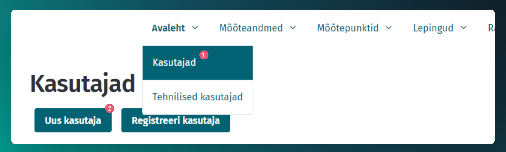
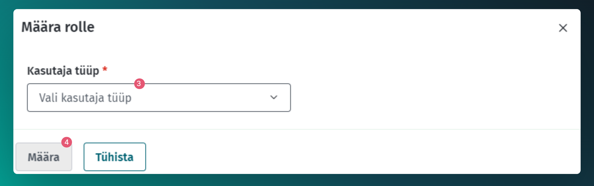
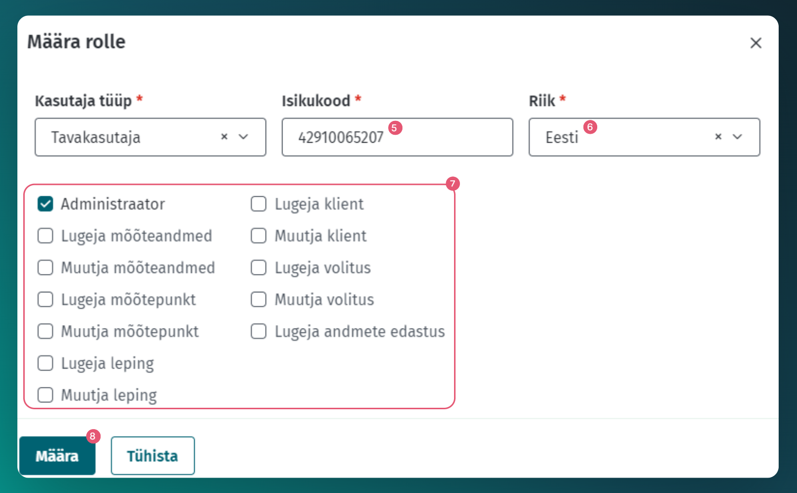
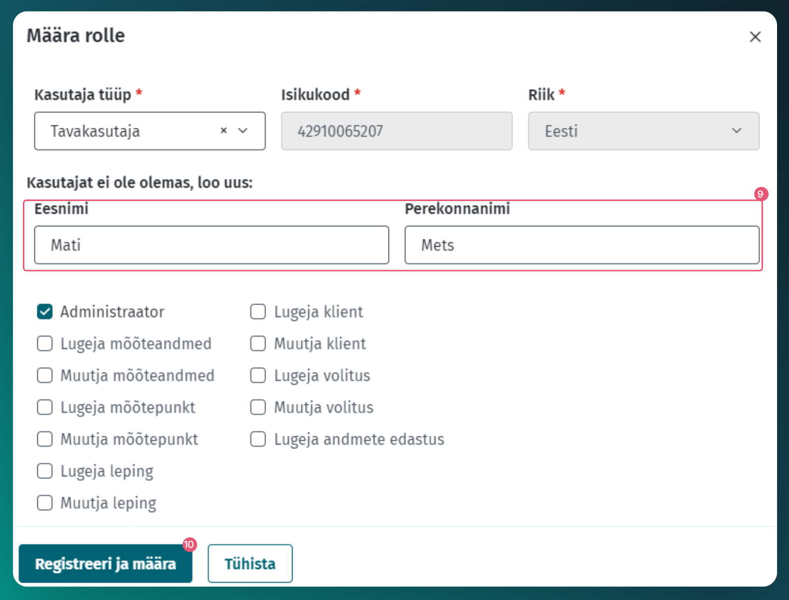
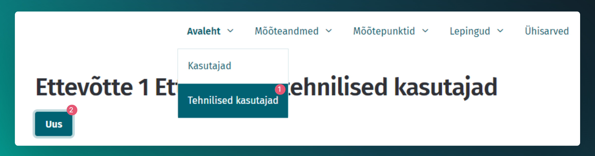
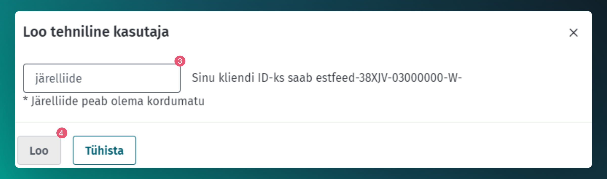
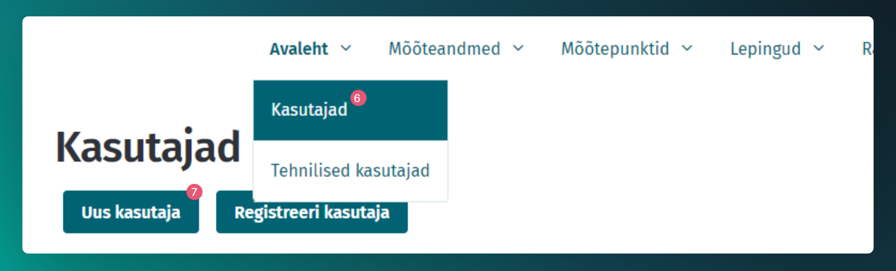
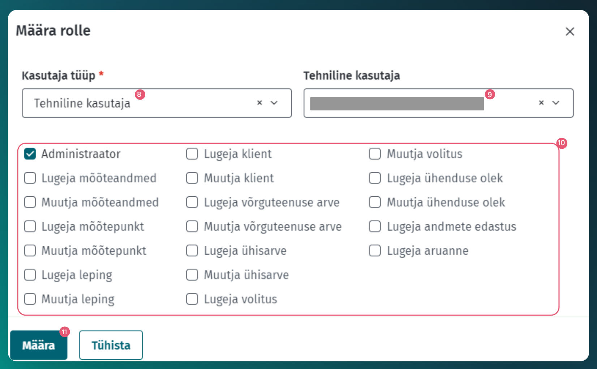

# Kasutajate haldus

## Sisukord

- [Kasutajate haldus](#kasutajate-haldus)
  - [Sisukord](#sisukord)
  - [Sissejuhatus](#sissejuhatus)
  - [Tavakasutajate haldus](#tavakasutajate-haldus)
    - [Tavakasutajate lisamine veebiliidese kaudu](#tavakasutajate-lisamine-veebiliidese-kaudu)
  - [Tehniliste kasutajate haldus](#tehniliste-kasutajate-haldus)
    - [Tehniliste kasutajate lisamine veebiliidese kaudu](#tehniliste-kasutajate-lisamine-veebiliidese-kaudu)

## Sissejuhatus

Andmelao kasutamiseks tuleb turuosalisel läbida liidestumise protsess Eleringiga. Selle käigus määratakse vähemalt üks ADMIN kasutaja, kes seejärel saab hallata enda kasutajaid.

Andmelao süsteemis on võimalik hallata kahte tüüpi kasutajaid:

- Tavakasutajad - füüsilised isikud, kes saavad veebiliidesesse sisse logida ja teostada vajalikke tegevusi
- Tehnilised kasutajad - mitte-füüsilised kasutajad, mis on loodud automaatse andmevahetusliidese (API) kasutamiseks

Tava- ja tehnilised kasutajad on Andmelao süsteemis realiseeritud mõnevõrra erinevalt:

- Tavakasutaja eelduseks on füüsilisest isiku identiteet Andmelao süsteemis
- Tehniline kasutaja pole seotud füüsilise isikuga ja on seega sõltumatu olemasolevatest identiteetidest
- Tavakasutaja võib esindada erinevaid turuosalisi erinevates rollides (nt võrguettevõtja lepingute vaatlejana ja avatud tarnija juures lepingute sisestaja ning muutjana)
- Tehniline kasutaja ei saa esindada erinevaid turuosalisi
- Tavakasutaja peab kasutajaliidese kaudu valima tegevuste teostamiseks õige rolli (nt kui turuosaline on registreeritud nii võrguettevõtjana kui ka suletud jaotusvõrgu operaatorina, siis kasutaja peab õige rolli valima)
- Tehniline kasutaja saab talle määratud rollide piires tegutseda hoolimata turuosalise hetkel kasutuses olevast rollist ja energiakandja liigist

Mõlema kasutaja tüübi puhul on võimalik hallata kasutaja õigusi määrates või eemaldades kasutajarolle.

## Tavakasutajate haldus

Ühel kasutajal võib olla kasutajaõigusi mitmes eri turuosalise + rolli + energiakandja kombinatsioonis:

| Turuosaline | Turuosalise roll | Energiakandja liik | Kasutajaroll     | Tulemus                                                                                                                        |
|-------------|------------------|--------------------|------------------|--------------------------------------------------------------------------------------------------------------------------------|
| Ettevõte X  | Avatud tarnija   | Elekter            | VIEWER_AGREEMENT | Kasutaja näeb elektri mõõtepunktide lepinguid, mille nägemise õigus on ettevõtel X kui avatud tarnijal                         |
| Ettevõte X  | Avatud tarnija   | Gaas               | EDITOR_AGREEMENT | Kasutaja näeb ja saab muuta gaasi mõõtepunktide lepinguid, mille nägemise ja muutmise õigus on ettevõtel X kui avatud tarnijal |
| Ettevõte X  | Võrguettevõtja   | Elekter            | EDITOR_AGREEMENT | Kasutaja näeb ja saab muuta elektri mõõtepunktide lepinguid, mille nägemise õigus on ettevõtel X kui võrguettevõtjal           |

### Tavakasutajate lisamine veebiliidese kaudu

1. Kasutajaõiguste haldamiseks tuleb navigeerida lehele "Avaleht -> Kasutajad".
2. Seejärel tuleb vajutada nuppu "Uus kasutaja"
3. Rippmenüüst vali kasutaja tüüp "Tavakasutaja"
4. Vajuta nuppu "Määra"
5. Lisa isikukood
6. Lisa riik. Et õige riik rippmenüüst kiiremini leida võib hakata lahtrisse riigi nime kirjutama, nt "Eesti".
7. Vali õigused, mis soovid sellele rollile anda. Kui valid õiguse "administraator" ei ole vaja teisi rolle listist valida. Administraatori rollis oleval isikul on õigus ka ise uusi kasutajaid hiljem lisada.
8. Vajuta nuppu "Määra". Kui sellise isikukoodiga isik on süsteemis juba olemas siis kasutaja salvestati ja ta saab nüüd tegutseda nendes õigustes.
9. Kui sellist isikut pole varem süsteemi lisatud küsib süsteem lisaks isiku nime.
10. Vajuta nuppu "Registreeri ja määra"
11. Isik on süsteemi lisatud, talle loodi EIC kood ja anti määratud õigused.
 

## Tehniliste kasutajate haldus

Igal turuosalise vastavate õigustega kasutajal on võimalus Andmelao veebiliideses vajalikke tehnilisi kasutajaid ise hallata.

Igal liidestuval turuosalisel, kes soovib kasutada masinliidest on vaja vähemalt ühte tehnilist kasutajat, kuid järgmistel juhtudel võib olla vaja luua mitu:

- Turosalise süsteem on jaotatud väiksemateks osadeks, mis suhtlevad Andmelaoga sõltumatult ning turuosalisel on soov näiteks turvakaalutlustel eraldada igale alamsüsteemile oma tehniline kasutaja
- Liidestuv süsteem on mitme turuosalise peale ühine ning erinevate turuosaliste nimel sõnumite saatmisel on vaja kasutada turuosalise spetsiifilist tehnilist kasutajat

### Tehniliste kasutajate lisamine veebiliidese kaudu

1. Navigeeri Avaleht -> Tehnilised kasutajad
2. Vajuta nuppu "Uus"
3. Avanenud aknas tuleb lisada järelliide. See peab olema turuosalisel unikaalne. Ülejäänud osa tehnilise kasutaja ID-st lisab Andmeladu automaatselt vastavalt valitud turuosalisele.
4. Vajuta nuppu "Loo"
5. Peale tehnilise kasutaja loomist kuvatakse kasutajale autentimiseks vajalikke vajalikke andmeid:
- Client ID
- Client Secret
> [!WARNING] 
> Client ID ja Client Secret väärtusi kuvatakse ainult 1 kord. Peale kasutaja edukat loomist tuleb väärtused koheselt endale kopeerida, sest hiljem pole võimalik neid väärtusi enam näha.
Nende väärtustega on võimalik masinliideses pärida *token*. Loe täpsemalt dokumendist [Autentimine ja autoriseerimine](03-autentimine-ja-autoriseerimine.md)
6. Seejärel navigeeri "Avaleht" -> "Kasutajad"
7. Vajuta nuppu "Uus kasutaja"
8. Vali kasutaja tüüp "Tehniline kasutaja"
9. Vali listist sobiv tehniline kasutaja
10. Vali õigused, mis soovid sellele rollile anda. Kui valid õiguse "administraator" ei ole vaja teisi rolle listist valida.
11. Vajuta nuppu "Määra". Nüüd on tehnilisele kasutajale õigused lisatud.  
 

