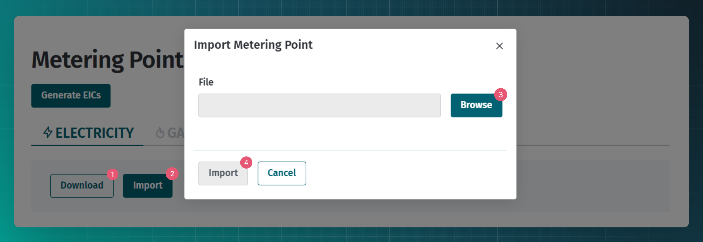

# Mõõtepunktid

## Sisukord

<!-- TOC -->
* [Mõõtepunktid](#mõõtepunktid)
  * [Sisukord](#sisukord)
  * [Sissejuhatus](#sissejuhatus)
  * [Mõõtepunkti andmete edastamine](#mõõtepunkti-andmete-edastamine)
    * [Veebiliides](#veebiliides)
    * [Mõõtepunktide masslaadimine](#mõõtepunktide-masslaadimine)
    * [Masinliidese sõnumid](#masinliidese-sõnumid)
      * [Sõnumid](#sõnumid)
      * [Sõnumite reeglid](#sõnumite-reeglid)
  * [Mõõtepunkti andmete küsimine](#mõõtepunkti-andmete-küsimine)
    * [Masinliidese sõnumid](#masinliidese-sõnumid-1)
      * [Sõnumid](#sõnumid-1)
      * [Sõnumite reeglid](#sõnumite-reeglid-1)
        * [`meter/search/customer` täiendavad reeglid](#metersearchcustomer-täiendavad-reeglid)
<!-- TOC -->

## Sissejuhatus

Mõõtepunkt on seade, mis mõõdab energia tarbimise ja tootmise koguseid teatud asukohas.

Mõõtepunkte haldavad järgmised turuosalised:

- võrguettevõtja;
- liinivaldaja;
- suletud jaotusvõrgu ettevõtja;
- agregaator;
- tootja;
- laadimispunkti operaator;
- salvestusjaama operaator;
- gaasitankla operaator.

Käesolevas dokumendis nimetatakse neid ühisnimetajaga **Mõõtepunkti haldur**.

Mõõtepunkti haldur vastutab Andmelaos tema piirkonnas olevate mõõtepunktid kohta mõõtepunkti andmete lisamise ja uuendamise eest.

> [!WARNING] 
> NB! Mõõtepunkti haldur on kohustatud mõõtepunkti andmeid uuendama esimesel võimalusel.

## Mõõtepunkti andmete edastamine

Mõõtepunkti haldur saab mõõtepunktide tehnilised andmed edastada Andmelattu:

- ükshaaval veebiliidese kaudu
- masslaadimisega veebiliidese kaudu
- ükshaaval automaatse andmevahetuse sõnumiga `meter`
- masslaadimisega automaatse andmevahetuse sõnumiga `import`

Mõõtepunktide andmed samalaadsed nii andmevahetuse teenustes kui ka veebiliides. Mõõtepunkti andmed on:

- Ühised andmed kõikidele mõõtepunktidele:

| Atribuut teenuses | Tulba nimetus masslaadimise templiidis | Selgitus                         | Kohustuslik? | Muud reeglid                                                                                        |
|-------------------|----------------------------------------|----------------------------------|--------------|-----------------------------------------------------------------------------------------------------|
| meterEic          | Metering Point EIC                     | mõõtepunkti 16 kohaline EIC kood | jah          | Peab olema valiidne EIC kood ja mahtuma eraldatud EIC koodi vahemikku                               |
| meteringType      | Metering Type                          | mõõtmise viis                    | jah          | Üks neist: REMOTE_READING (kaugloetav), VIRTUAL (virtuaalne), NON_REMOTE_READING (mitte kaugloetav) |
| meteringPointType | Metering Point Type                    | mõõtepunkti tüüp                 | jah          | Üks neist: REGULAR (tavaline), INTERNAL (sisemine), BORDER(piiri), AGGREGATION (agregeerimise)      |

- Elektri ja gaasi mõõtepunktide ühised metaandmed:

| Atribuut teenuses      | Tulba nimetus masslaadimise templiidis | Selgitus                                 | Kohustuslik? | Muud reeglid                                                                                                                                                                                                                  |
|------------------------|----------------------------------------|------------------------------------------|--------------|-------------------------------------------------------------------------------------------------------------------------------------------------------------------------------------------------------------------------------|
| consumptionScale       | Consumption Scale                      | tarbimise maht mõõtepunktis              | jah          | Üks neist: SMALL (väiketarbija), LARGE (suurtarbija)                                                                                                                                                                          |
| connectionState        | Conection State                        | ühenduse olek mõõtepunktis               | jah          | Üks neist: CONNECTED (ühendatud), DISCONNECTED (katkestatud)                                                                                                                                                                  |
| resolution             | Resolution                             | mõõtepunkti resolutsioon                 | jah          | Üks neist: PT15M (15 minutit), PT1H (1 tund)                                                                                                                                                                                  |
| customerType           | Customer Type                          | tarbimise tüüp mõõtepunktis              | jah          | Üks neist:  CONSUMER (tarbija), GRID_OPERATOR (võrguettevõtja), PRODUCER (tootja), MICRO (mikrotootja), LINE_OPERATOR (liinivaldaja), ENERGY_STORAGE_UNIT (salvestusjaam), CHARGING_POINT_OPERATOR (laadimispunkti operaator) |
| production             | Production                             | kas mõõtepunktis toimub energia tootmist | jah          | Üks neist: TRUE (jah), FALSE (ei)                                                                                                                                                                                             |
| productionSource       | Production Source                      | energia tootmise allikas                 | ei           | Üks neist: SOLAR (päike), WIND (tuul), HYDRO (vesi), BIOGAS (biogaas), BIOMASS (biomass), NATURAL_GAS (gaas), OIL_SHALE (põlevkivi), OTHER_RENEWABLE (muu taastuv), OTHER_NON_RENEWABLE (muu mittetaastuv)                    |
| transmissionNetworkEic | Transmission Network EIC               | ülekandevõrgu 16 kohaline EIC kood       | jah          | Määratud ülekandevõrgu EIC kood peab eksisteerima süsteemis. Energiakandja tüüp peab ühtima mõõtepunkti omaga.                                                                                                                |
| apartmentAssociation   | Apartment Association                  | kas tegu on korteriühistuga              | jah          | Üks neist: TRUE (jah), FALSE (ei)                                                                                                                                                                                             |

- Elektri mõõtepunkti spetsiifilised metaandmed:

| Atribuut teenuses     | Tulba nimetus masslaadimise templiidis | Selgitus                                  | Kohustuslik? | Muud reeglid                                                                                |
|-----------------------|----------------------------------------|-------------------------------------------|--------------|---------------------------------------------------------------------------------------------|
| isolatedMeteringPoint | Isolated Metering Point                | kas tegemist on isoleeritud mõõtepunktiga | jah          | Üks neist: TRUE (jah), FALSE (ei)                                                           |
| electricalHeating     | Electrical Heating                     | kas mõõtepunktis toimub elektriga kütmist | jah          | Üks neist: TRUE (jah), FALSE (ei)                                                           |
| chargingPoint         | Charging Point                         | kas mõõtepunktis toimub elektri laadimist | jah          | Üks neist: TRUE (jah), FALSE (ei)                                                           |
| storageCapacity       | Storage Capacity                       | energiasalvestusvõimsus (kW)              | ei           | Peab olema täis- või komakohaga (max. 2 komakohta)number. Väärtuse puudumisel jätta tühjaks |
| storageEnergy         | Storage Energy                         | energiasalvesti mahtuvus (kWh)            | ei           | Peab olema täis- või komakohaga (max. 2 komakohta)number. Väärtuse puudumisel jätta tühjaks |
| productionCapacity    | Production Capacity                    | tootmise maht (kW)                        | ei           | Peab olema täis- või komakohaga (max. 2 komakohta)number. Väärtuse puudumisel jätta tühjaks |
| transmissionCapacity  | Transmission Capacity                  | ülekande maht (kW)                        | ei           | Peab olema täis- või komakohaga (max. 2 komakohta)number. Väärtuse puudumisel jätta tühjaks |

- Agregeerimise mõõtepunkti spetsiifilised metaandmed:

| Atribuut teenuses | Tulba nimetus masslaadimise templiidis | Selgitus                             | Kohustuslik? | Muud reeglid                                             |
|-------------------|----------------------------------------|--------------------------------------|--------------|----------------------------------------------------------|
| parentMeterEic    | Parent Metering Point EIC              | ülemmõõtepunkti 16 kohaline EIC kood | jah          | Peab viitama Andmelaos registreeritud tava mõõtepunktile |

- Ühised aadressi andmed kõikidele mõõtepunktidele:

| Atribuut teenuses | Tulba nimetus masslaadimise templiidis | Selgitus                                              | Kohustuslik?                            | Muud reeglid                                                                                                                                    |
|-------------------|----------------------------------------|-------------------------------------------------------|-----------------------------------------|-------------------------------------------------------------------------------------------------------------------------------------------------|
| adrId             | Adr ID                                 | Maaameti ADS süsteemi aadressi ID (ADR_ID)            | jah kui county ja municipality on puudu | Peab olema täisarv                                                                                                                              |
| comment           | Comment                                | kommentaar                                            | ei                                      |                                                                                                                                                 |
| county            | County                                 | maakond (ADS tase 1)                                  | jah                                     |                                                                                                                                                 |
| municipality      | Municipality                           | vald, linn(ADS tase 2)                                | jah                                     |                                                                                                                                                 |
| locality          | Locality                               | asustusüksus(ADS tase 3)                              | ei                                      |                                                                                                                                                 |
| streetAddress     | Street Address                         | kohaadress (tänav, maja, korter jne, ADS tasemed 4-8) | jah                                     |                                                                                                                                                 |
| postcode          | Postcode                               | sihtnumber                                            | jah                                     |                                                                                                                                                 |
| latitude          | Latitude                               | koordinaadi laiuskraad                                | ei                                      | LEST97 puhul peab väärtus olema olema 7 kohta enne ja 1-3 kohta peale koma. WGS84 puhul peab väärtus olema 2 kohta enne ja 4-8 kohta peale koma |
| longitude         | Longitude                              | koordinaadi pikkuskraad                               | ei                                      | LEST97 puhul peab väärtus olema olema 6 kohta enne ja 1-3 kohta peale koma. WGS84 puhul peab väärtus olema 2 kohta enne ja 4-8 kohta peale koma |
| coordinateSystem  | Coordinate Sytem                       | koordinaatsüsteem                                     | jah, kui koordinaadid on antud          | Üks neist: WGS84, LEST97                                                                                                                        |

> [!NOTE]
> Aadressi andmete struktuur ja validatsioonid on täiendamisel

### Veebiliides

Vajadusel on võimalik järgmine vaba mõõtepunkti EIC kood genereerida veebiliidese kaudu navigeerides "Metering points" -> "Metering Point Bulk Import" lehele. Täpsustada tuleb soovitud EIC koodide arv.

Mõõtepunkti lisamiseks veebiliideses on 2 võimalust:

- ükshaaval;
- masslaadimisega.

Ükshaaval laadimiseks tuleks navigeerida "Metering points" lehele.

1. Alustuseks tuleks vajutada nupule "New".
2. Seejärel on vaja avanevas modaalaknas täita kõik kohustuslikud väljad (märgitud tärniga).
3. Kui "Create" nupp on mitteaktiivne on tõenäoliselt jäänud mõni kohustuslik väli täitmata.

Mõõtepunktide masslaadimine on võimalik MS Excel faili abil navigeerides "Metering points" -> "Metering Point Bulk Import" lehele.

1. Vajutades lehel "Download" nupule on võimalik allalaadida template.
2. "Import" nupp avab modaalakna.
3. Seejärel on võimalik lisada mõõtepunki(de) andmetega täidetud fail.

Mõõtepunktide otsimiseks tuleks navigeerida "Metering points" lehele.

1. Soovi korral on võimalik lisada 1 või rohkem otsingukriteeriumit.
2. Ilma ühtegi välja täitmata ja kohe "Search" nuppu vajutades väljastatakse kõigi mõõtepunktide andmed.
Ühe või rohkema otsingukriteeriumi lisamisel väljastatakse vaid nendele kriteeriumitele vastavad mõõtepunktid.
3. Võimalik on otsingut täpsustada täiendavate kriteeriumitega, need valikud avanevad vajutades "Detailed search" nupule.

Peale mõõtepunkti otsingu tulemuste saamist on võimalik:
1. vaadata mõõtepunkti mõõteandmeid;
2. vaadata mõõtepunktiga seotud lepinguid;
3. muuta mõõtepunkti andmeid.

Kirjeldatud on mõõtepunkte haldavate turuosaliste õigused, teistel rollidel mõõtepunkti muutmise õigus puudub.

### Mõõtepunktide masslaadimine

Nii veebiliideses kui ka andmevahetuse liideses on loodud võimalus mõõtepunkide masslaadimiseks MS Excel faili abil. Selleks tuleb veebiliidese või teenuse `template` kaudu laadida alla energikandja liigi spetsiifiline templiit, lisada andmed ning täidetud templiit uuesti veebi või teenuse `import` vahendusel üles laadida.

Mõõtepunkti andmed on kirjeldatud peatükis [Mõõtepunkti andmete edastamine](#mõõtepunkti-andmete-edastamine), kuid esineb üks erisus - kuivõrd andmete templiit on juba energiakandja tüübi spetsiifiline, siis mõõtepunkti tüüpi tuleb täpsustada ainult elektri või gaasi mõõtepunkti puhul (REGULAR või INTERNAL).

### Masinliidese sõnumid

#### Sõnumid

| Sõnum                                | Eesmärk                                             |
|--------------------------------------|-----------------------------------------------------|
| `POST /api/{version}/meter`          | Mõõtepunkti lisamine                                |
| `PUT /api/{version}/meter`           | Mõõtepunkti muutmine                                |
| `POST /api/{version}/template/meter` | Mõõtepunktide masslisamise templiidi alla laadimine |
| `POST /api/{version}/meter/import`   | Mõõtepunktide massimport templiidi abil             |

Sõnumite struktuuride ja validatsioonide kirjelduste kohta loe dokumendist [Andmelao kirjeldus ja infovahetuse üldpõhimõtted](01-avp-kirjeldus-ja-infovahetuse-yldpohimotted.md)

#### Sõnumite reeglid

- Mõõtepunkti EIC kood peab jääma võrguettevõtja mõne EIC koodide vahemiku piiresse
- Mõõtepunki sõnumi `marketParticipantContext.commodityType` määrab mõõtepunkti energiakandja liigi ning sellest tulenevalt lubatud metaandmestiku:
  - väärtuse `ELECTRICITY` puhul - lubatud ja nõutud on elektri või agregeerimise metaandmestik;
  - väärtuse `NATURAL_GAS` puhul - lubatud ja nõutud on gaasi või agregeerimise metaandmestik;
- Mõõtepunkti tüüp defineerib lubatud metaandmestiku:
  - regulaarne, piirimõõtepunkt, sisemine - lubatud on gaasi või elektri metaandmestik;
  - agregeerimise - lubatud on agregeerimise metaandmestik;
- Mõõtepunkti resolutsioon on täiendav info ja ei mõjuta mõõteandmete edastamist tulevikus vaid iseloomustab, kas mõõtepunkt suudab  reaalsuses tarbimist mõõta 15 minuti, 1 tunni või päeva täpsusega.
- XY koordinaatide reeglid:
  - XY koordinaadid ei ole nõutud;
  - XY koordinaadid peavad olema numbrid, mis võivad sisaldada komakohtasid;
  - XY koordinaadid peavad jääma Eestit ümbritseva mõttelise ristküliku sisse;
- Elektri tava mõõtepunkti loomiseks peab `marketParticipantRole` väärtus olema üks neist:
  - GRID_OPERATOR
  - LINE_OPERATOR
  - CLOSED_DISTRIBUTION_NETWORK
  - PRODUCER_OPERATOR
  - CHARGING_POINT_OPERATOR
- Gaasi tava mõõtepunkti loomiseks peab `marketParticipantRole` väärtus olema üks neist:
  - GRID_OPERATOR
  - PRODUCER_OPERATOR
- Piiri mõõtepunkti loomiseks peab `marketParticipantRole` väärtus olema üks neist:
  - GRID_OPERATOR
- Agregeerimise mõõtepunkti loomiseks peab `marketParticipantRole` väärtus olema AGGREGATOR
- Aadressi tekstilisel kujul saatmise korral on andmekvaliteedi huvides palve kasutada ametlikke [EHAK klassifikaatoris](https://klassifikaatorid.stat.ee/Item/stat.ee/c4c47742-12d7-4fea-bc8c-5aeca9112e2a/88) toodud maakonna, omavalitsuse ja asutusüksuse nimekujusid.

> [!NOTE]
> Andmete saatmise ja pärimise õigused on kirjeldatud dokumendis [Autentimine ja autoriseerimine](03-autentimine-ja-autoriseerimine.md)

## Mõõtepunkti andmete küsimine

Üldiselt võivad kõik õigustatud kasutajad pärida mõõtepunktide andmeid kasutades `search` teenuseid, kuid avatud tarnija ja bilansihaldur saavad pärida ka uute ja muutunud mõõtepunktide andmete uuendusi kasutades teenust `data-distribution/search`.

### Masinliidese sõnumid

#### Sõnumid

| Sõnum                                       | Eesmärk                                     |
|---------------------------------------------|---------------------------------------------|
| `POST /api/{version}/meter/search`          | Mõõtepunkti otsing                          |
| `POST /api/{version}/meter/search/customer` | Mõõtepunkti otsing kliendi EIC koodi alusel |
| `POST /api/{version}/meter/search/border`   | Piirimõõtepunkti otsing                     |
| `POST /api/{version}/meter/export`          | Mõõtepunktide eksportimine                  |
| `POST /api/{version}/eic/amount`            | EIC vahemikust vabade EIC koodide otsing    |
| `POST /api/{version}/eic/range`             | Turusalise EIC koodi vahemike otsing        |

> [!CAUTION] 
> Teenust `POST /api/{version}/meter/search/customer` on lubatud kasutada ainult uue lepingu loomisel ja selle õiguspärast kasutamist monitooritakse

Sõnumite struktuuride ja validatsioonide kirjelduste kohta loe dokumendist [Andmelao kirjeldus ja infovahetuse üldpõhimõtted](01-avp-kirjeldus-ja-infovahetuse-yldpohimotted.md)

> [!NOTE]
> Sõnumite näidiste kogumik on loomisel

#### Sõnumite reeglid

> [!NOTE]
> Andmete saatmise ja pärimise õigused on kirjeldatud dokumendis [Autentimine ja autoriseerimine](03-autentimine-ja-autoriseerimine.md)

##### `meter/search` reeglid

- Andmeladu väljastab kõik mõõtepunkti andmed juhul kui:
  - andmete pärija on mõõtepunkti omanik
  - andmete pärijal on Kliendiportaali kaudu väljastatud ligipääsuõigus
  - andmete pärija on avatud või nimetatud tarnija, kellel on hetkel aktiivne (või oli viimase 12 kuu jooksul aktiivne) avatud või nimetatud tarne leping antud mõõtepunktis
  - andmete pärija on agregaator, kellel on hetkel aktiivne (või oli viimase 12 kuu jooksul aktiivne) agregeerimise leping mõnes antud mõõtepunkti alammõõtepunktis
  - andmete pärija on ülemmõõtepunkti omanik ja päritakse mõne alammõõtepunkti andmeid
- Ülejäänud juhtudel andmeid ei tagastata

##### `meter/search/customer` reeglid

- Andmeladu väljastab kõik mõõtepunkti andmed juhul kui:
  - andmete pärijal on Kliendiportaali kaudu väljastatud ligipääsuõigus
  - andmete pärija on avatud või nimetatud tarnija, kellel on hetkel aktiivne (või oli viimase 12 kuu jooksul aktiivne) avatud või nimetatud tarne leping antud mõõtepunktis
  - andmete pärija otsib juriidilise isiku või organisatsiooni mõõtepunkte ja kinnitab, et tal on süsteemiväline kirjalikku taasesitust võimaldavas vormis volitus (`legalConsent` väärtus on `true`)
- Ülejäänud juhtudel tagastatakse ainult mõõtepunkti EIC kood
