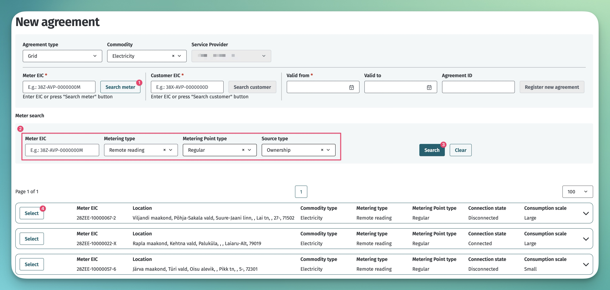
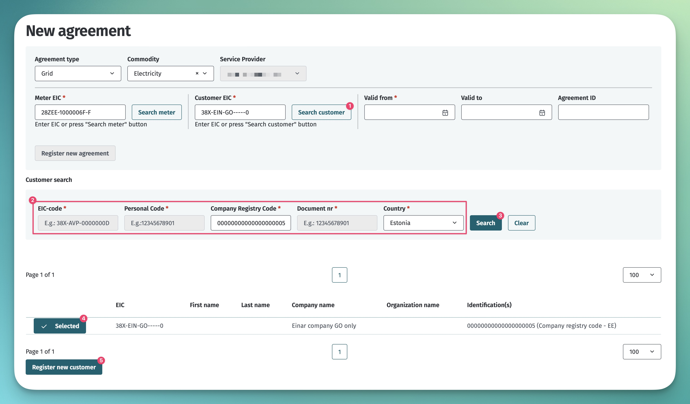

# Võrguleping ja võrgu kasutamise leping

## Sisukord

- [Võrguleping ja võrgu kasutamise leping](#võrguleping-ja-võrgu-kasutamise-leping)
  - [Sisukord](#sisukord)
  - [Sissejuhatus](#sissejuhatus)
  - [Võrgulepingute edastamine](#võrgulepingute-edastamine)
    - [Masinliidese sõnumid ja reeglid](#masinliidese-sõnumid-ja-reeglid)
    - [Veebiliides](#veebiliides)

## Sissejuhatus

Võrguleping või võrgu kasutamise leping määrab võrgu kasutamise tingimused mõõtepunktis ja on eelduseks, et saaks toimuda energia müük ja agregeerimine.

Võrguleping sõlmitakse liitumispunkti võrguettevõtja ja turuosalise vahel. Samuti sõlmitakse võrguleping võrguettevõtja ja tema ülem-võrguettevõtja vahel. Näiteks Eleringi ja mõne jaotusvõrgu ettevõtte vahel. Selline piirimõõtepunkti võrguleping omab koosmõjus portfellilepinguga mõju automaatselt genereeritud avatud tarne lepingutele, mille kohta loe täpsemalt dokumendist [Portfellileping](06.1-portfellileping.md)

Võrgulepingud jagunevad tava- ja piirimõõtepunkti võrgulepinguteks.

> **Warning**
> 
> Esialgses skoobis tekitatakse automaatsed avatud tarne lepingud ainult portfellilepingu loomisel. Piirimõõtepunkti võrgulepingu loomisel portfellilepingu kontroll ja avatud tarne lepingute automaatne loomine lisandub hiljem.

Võrgu kasutamise leping sõlmitakse liini valdaja või suletud jaotusvõrgu valdaja ja turuosalise vahel.

## Võrgulepingute edastamine

Lepingute teenuste kasutamise ettnähtud protsess on kirjeldatud dokumendis [Lepingud](06-lepingud.md). Järgnevalt on kirjeldatud Andmelao täiendavad tegevused erinevates võrgulepinguga seotud tegevustes:

- Lepingu lõppkuupäeva vähendamisel määrab Andmeladu kõikidele seotud avatud tarne ja agregeerimislepingutele võrgulepinguga sama lõppkuupäeva.
- Lepingu lõppkuupäeva pikendamisel pikendab Andmeladu nende seotud avatud tarne ja agregeerimislepingute lõppkuupäeva, mis olid eelnevalt võrgulepingu kuupäeva vähendamisega seonduvalt automaatselt lühendatud. Pikendamine toimub maksimaalselt võrgulepingu lõppkuupäevani või avatud tarne lepingu (või agregeerimislepingu) algse lõppkuupäevani.
- Lepingu kustutamisel (enne kehtima hakkamist) kustutab Andmeladu ka tulevikus kehtima hakkavad avatud tarne ja agregeerimise lepingud.
- Piirmõõtpunkti lepingu pikendamine, lühendamine ja kustutamine toob koheselt kaasa ka automaatselt genereeritud avatud tarne lepingute  kehtivusaegade muutmise või kustutamise. Loe ka dokumendist [Portfellileping](06.1-portfellileping.md).
- Andmeladu teeb võrgulepinguga seotud muudatusted kättesaadavaks avatud tarnijale ja agregaatorile `data-distribution/search` teenuse vahendusel.

### Masinliidese sõnumid ja reeglid

Sõnumite kirjelduse kohta loe lepingute ülddokumendist [Lepingud](06-lepingud.md).

Võrgulepingu täiendavad reeglid on:

- Ühel ajahetkel tohib ühel mõõtepunktil olla ainult 1 kehtiv võrguleping.
- Lepingu lõppkuupäeva tohib tagasiulatuvalt muuta ainult juhul, kui see ei mõjuta avatud tarne ega agregeerimise lepingut.
- Lepingus ei tohi sätestada enneaegse lõpetamise tasu.
- Igal võrguettevõtjal peab olema vähemalt 1 piirimõõtepunkti võrguleping ülem-võrguettevõtjaga.
- Lepingut saab lisada ainult võrguettevõtja (GO), tootja (PO), liinivaldaja (LO), laadimispunkti operaatori (CO) või suletud jaotusvõrgu valdaja (ISO) rollis turuosaline, kes on lepingus nimetatud mõõtepunkti omanik, ehk mõõtepunkti lisaja.
- Lepingu teenusepakkujaks (`serviceProvider`) peab olema määratud lepingu registreerija ja lepingu kliendiks (`customer`) võib olla ükskõik milline turuosaline.
- Piirimõõtepunkti võrgulepingut on lubatud luua ainult piirimõõtepunktile.
- Piirimõõtepunkti võrgulepingu kliendiks (`customer`) tohib olla ainult võrguettevõtja (GO) või suletud jaotusvõrgu valdaja (ISO) rollis turuosaline

### Veebiliides

Võrgulepingu lisamiseks veebiliideses peab kasutajarolliks olema valitud "Grid Operator" (võrguettevõtja). Seejärel tuleb navigeerida lehele "Agreements" -> "New agreement", mille peale avaneb uue lepingu lisamise vaade:

Võrgulepingu andmete sisestamine koosneb järgmistest sammudest:

- lepingu tüübi ja energiakandja liigi määramine
- mõõtepunkti määramine
- kliendi määramine
- Kehtivuse ja lepingu välise ID määramine

Mõõtepunkti määramiseks on 2 võimalust:

- kui mõõtepunkti EIC on teada, siis võib selle sisestada koheselt väljale "Meter EIC"
- kui mõõtepunkti EIC ei ole teada, siis saab seda otsida, vajutades nupule "Search meter". Selle peale tulevad nähtavale otsinguparameetrid. Kui otsinguparameetrid on täidetud ja vajutada nupule "Search", siis kuvab süsteem leitud mõõtepunktid. Sobiv mõõtepunkt tuleb välja valida ja vajutada nupule "Select":

Kliendi määramiseks on 3 võimalust:

- kui kliendi EIC on teada, siis võib selle sisestada koheselt väljale "Customer EIC"
- kui kliendi EIC ei ole teada, siis saab seda otsida, vajutades nupule "Search customer". Selle peale tulevad nähtavale otsinguparameetrid:
  - Füüsilist isikut saab otsida isikukoodi või dokumendi numbri alusel
  - Juriidilist isikut saab otsida registrikoodi alusel
  - Muud organisatsiooni saab otsida registrikoodi või dokumendi numbri alusel
  - Kui otsinguparameetrid on täidetud ja vajutada nupule "Search", siis kuvab süsteem leitud kliendid. Kui vastuseks tuleb täpselt üks klient, siis on klient automaatselt välja valitud.
- kui klienti ei leita või kui leitud klient pole õige (nt dokumendi numbri järgi otsing andis vale tulemuse), siis on võimalik uut klienti registreerida, vajutades nupule "Register new customer". Avanenud modaalaknas tuleb väljad täita vastavalt kliendi liigile. Loe täpsemalt erinevate kliendi tüüpide kohustuslike andmete kohta peatükist [Kliendi EIC](04-kliendi-eic.md#kliendi-ja-tema-metaandmete-lisamine-ja-muutmine)

