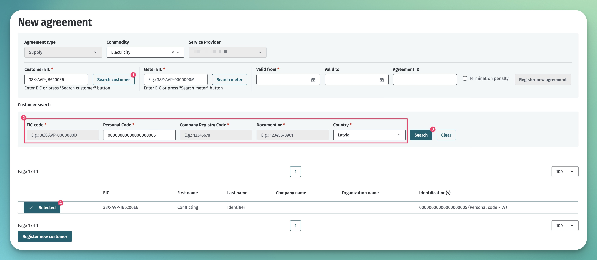

# Avatud tarne leping

## Sisukord

<!-- TOC -->
* [Avatud tarne leping](#avatud-tarne-leping)
  * [Sisukord](#sisukord)
  * [Sissejuhatus](#sissejuhatus)
  * [Avatud tarne lepingu sõlmimise üldpõhimõtted](#avatud-tarne-lepingu-sõlmimise-üldpõhimõtted)
  * [Avatud tarne lepingu lõpetamine](#avatud-tarne-lepingu-lõpetamine)
  * [Üldteenus](#üldteenus)
  * [Avatud tarne lepingu sõlmimine tulenevalt tarbija vahetumisest](#avatud-tarne-lepingu-sõlmimine-tulenevalt-tarbija-vahetumisest)
  * [Avatud tarne lepingu katkemine](#avatud-tarne-lepingu-katkemine)
  * [Avatud tarne lepingu tühistamine](#avatud-tarne-lepingu-tühistamine)
  * [Avatud tarne lepingute edastamine](#avatud-tarne-lepingute-edastamine)
    * [Masinliidese sõnumid ja reeglid](#masinliidese-sõnumid-ja-reeglid)
    * [Veebiliides](#veebiliides)
  * [Avatud tarne lepingute tagasiulatuv sisestamine](#avatud-tarne-lepingute-tagasiulatuv-sisestamine)
<!-- TOC -->

## Sissejuhatus

Iga turuosaline peab sõlmima ühe (ja ainult ühe) avatud tarnijaga lepingu, mis tagab turuosalisele avatud tarne (*avatud tarne leping*), ehk tasakaalustab tema bilansi.

**Avatud tarne** tähendab turuosalisele kogu temale vajaliku elektrienergia müümist või turuosalisele tema bilansi tagamiseks kauplemisperioodil puudu jääva elektrienergia koguse müümist või temalt kauplemisperioodil ülejääva elektrienergia koguse ostmist.

## Avatud tarne lepingu sõlmimise üldpõhimõtted

1. Turuosalisel tuleb avatud tarnija vahetuseks sõlmida uus avatud tarne leping, mille registreerimisel Andmelaos lõpetab Andmeladu vajadusel eelmise avatud tarne lepingu.
2. Kui turuosaline sõlmib uue avatud tarne lepingu uue avatud tarnijaga, sisestab uus avatud tarnija teabe Andmelattu seadusandluses toodud tähtajaks. Teave peab sisaldama avatud tarne lepingu kehtivusaega ning tingimusi (tasunõude olemasolu) ja mõõtepunktide EIC koode, mille suhtes leping on sõlmitud.
3. Avatud tarnija peab enne avatud tarne lepingu sõlmimist Andmelao kaudu kontrollima, kas turuosalisel on õigus kõnealuse mõõtepunkti suhtes tarnijat vahetada ja kas kehtiva avatud tarne lepingu ennetähtaegse lõpetamise korral rakendub tasunõue.
4. Avatud tarnija edastab Andmelattu andmed selle turuosalise avatud tarne lepingu kehtivusaja kohta, kellele ta osutab avatud tarne teenust.
5. Avatud tarnija vahetub elektrituru toimise võrgueeskirjas ettenähtud ajal.

> [!NOTE]
> Tarnijavahetuse protsessi ja reeglite kohta loe täpsemalt dokumendist [Tarnijavahetuse protsess](06.4-avatud-tarnija-vahetus.md)

## Avatud tarne lepingu lõpetamine

1. Avatud tarne lepingu saab lõpetada, edastades lepingu lõppkuupäeva, mis peab olema vähemalt ühe päev tulevikus.
2. Kui avatud tarnija ütleb avatud tarne lepingu üles või lõpetab selle muul viisil, sisestab avatud tarnija Andmelattu lepingu lõppemise andmed koheselt pärast lepingu lõpetamise otsuse tegemist.

## Üldteenus

Kui avatud tarne leping lõpeb, sõlmib avatud tarne teenust saanud turuosaline uue avatud tarne lepingu hiljemalt eelmise lepingu lõppemise ajaks.

Kui turuosalise poolt sõlmitud avatud tarne uue lepingu kohta ei ole avatud tarnija infot edastanud seadusandluses toodud tähtajaks, siis on selle turuosalise uueks avatud tarnijaks võrguettevõtja, kelle võrguga on turuosalise elektripaigaldis ühendatud või selle võrguettevõtja nimetatud müüja (on sõlmitud nimetatud tarnija leping). Loe täpsemalt [Nimetatud tarnija lepingu](06.5-nimetatud-tarnija-leping.md) dokumendist.

Avatud tarne lepinguta teenus jaguneb kolme gruppi:

1. Väiketarbija kuni 63A liitumispunktis on üldteenuse klient. Üldteenuse hind on reguleeritud elektrituruseadusega.
2. Tarbija üle 63A liitumispunktis ostab avatud tarne teenust elektrituruseaduse alusel bilansienergia hinnaga.
3. Tootjad edastavad avatud tarne lepingu puudumisel elektrienergiat võrku tasuta.

## Avatud tarne lepingu sõlmimine tulenevalt tarbija vahetumisest

1. Kui turuosaline vahetub, sõlmib mõõtepunkti uus turuosaline uue avatud tarne lepingu hiljemalt eelmise lepingu lõppemise ajaks.
2. Avatud tarne leping saab jõustuda alates võrgulepingu jõustumise kuupäevast. Võrgulepingu lõpetamise korral lõpeb avatud tarne leping võrgulepingu lõpupäeval südaöösel.
3. Avatud tarnijal on võimalus avatud tarne lepingut sisestada kuni kaks päeva pärast võrgulepingu algusaega ehk 48h jooksul alates võrgulepingu jõustumisest (sõltumata võrgulepingu sisestamise kuupäevast).

Näide:

| Uue võrgulepingu algusaeg                                         | 22.04.2017 kell 00.00     |
|-------------------------------------------------------------------|---------------------------|
| Uue võrgulepingu sisestamise lõpptähtaeg võrguettevõtjale         | 21.04.2017 kell 23.59     |
| Uue avatud tarne lepingu sisestamise lõpptähtaeg avatud tarnijale | 23.04.2017 kell 23.59     |

## Avatud tarne lepingu katkemine

1. Avatud tarne lepingu katkemiseks loetakse lepingu lõppemist lepingu kliendiks olevast turuosalisest sõltumatute asjaolude tõttu.
2. Avatud tarne lepingu katkemise korral vahetub avatud tarnija lepingu katkemise päeval kell 00.00.
3. Kui pärast avatud tarne lepingu katkemist sõlmitakse uus avatud tarne leping, vahetub avatud tarnija uue lepingu sõlmimisele järgneval päeval kell 00.00.

## Avatud tarne lepingu tühistamine

1. Avatud tarnija saab avatud tarne lepingu tühistada 14 päeva lepingu sõlmimisest, seda juhul, kui eraisikust tarbija on tema poolt sidevahendi teel sõlmitud lepingust taganenud.
2. Avatud tarne lepingu tühistamine ei ole lubatud juhul, kui tarbimist on juba alustatud.

## Avatud tarne lepingute edastamine

Lepingute teenuste kasutamise ettnähtud protsess on kirjeldatud dokumendis [Lepingud](06-lepingud.md). Järgnevalt on kirjeldatud Andmelao täiendavad tegevused erinevates võrgulepinguga seotud tegevustes:

- Andmeladu teeb lisandunud või muutunud avatud tarne lepingu info kättesaadavaks võrguettevõtjale ja agregaatorile kasutades teenust `data-distribution/search`
- Avatud tarnija vahetuse puhul teeb Andmeladu eelmisele avatud tarnijale info kättesaadavaks `data-distribution/search` teenuse abil

### Masinliidese sõnumid ja reeglid

Sõnumite kirjelduse kohta loe lepingute ülddokumendist [Lepingud](06-lepingud.md).

> [!NOTE]
> Andmete saatmise ja pärimise õigused on kirjeldatud dokumendis [Autentimine ja autoriseerimine](03-autentimine-ja-autoriseerimine.md)

Avatud tarne lepingu täiendavad reeglid on:

- Ühel ajahetkel tohib ühel mõõtepunktil olla ainult 1 kehtiv avatud tarne leping.
- Lepingu alguskuupäev peab olema:
  - vähemalt üks päev tulevikus, kui puudub eelnev aktiivne avatud tarne leping;
  - vähemalt 14 päeva tulevikus, kui eksisteerib eelnev aktiivne avatud tarne leping;
  - sama või hilisem võrreldes võrgulepingu alguskuupäevaga.
- Lepingu alguskuupäev tohib olla kuni 48h minevikus juhul, kui avatud tarnija registreerib avatud tarne lepingut tagantjärele ja lepingu alguskuupäev langeb kokku võrgulepingu alguskuupäevaga.
- Lepingu lõppkuupäev peab olema:
  - vähemalt 1 päev tulevikus.
  - mitte suurem võrgulepingu lõppkuupäevast.
- Piirmõõtepunktide kohta ei saa avatud tarne lepingut otse lisada. Andmeladu loob ise automaatselt avatud tarne lepingud piirimõõtepunktidesse portfelli lepingu lisamisega. Vaata ka dokumenti [Portfellilepingud](06.1-portfellileping.md).
- Automaatselt genereeritud avatud tarne lepinguid ei saa API ega kasutajaliidese kaudu ei muuta ega tühistada.
- Lepingut saab lisada ainult avatud tarnija (OS) rollis turuosaline.
- Lepingu teenusepakkujaks (`serviceProvider`) peab olema määratud lepingu registreerija ja lepingu kliendiks (`customer`) võib olla ükskõik milline turuosaline.
- Avatud tarne lepingu klient peab olema sama isik, kes on ka võrgulepingu klient.

### Veebiliides

Avatud tarne lepingu lisamiseks veebiliideses peab kasutaja rolliks olema "Avatud tarnija". Seejärel navigeerige lehele "Lepingud" -> "Uus leping", kus avaneb uue lepingu lisamise vaade:

Avatud tarne lepingu lisamise protsess koosneb järgmistest sammudest:

- energiakandja liigi määramine
- kliendi määramine
- mõõtepunkti määramine
- Lepingu kehtivusaja, välise ID ja enneaegse lõpetamise tasu määramine

Kliendi määramiseks on kaks võimalust:

- kui kliendi EIC on teada, saab selle kohe sisestada väljale "Customer EIC".
- kui kliendi EIC ei ole teada, siis saab seda otsida, vajutades nupule "Search customer". Selle peale tulevad nähtavale otsinguparameetrid:
  - Füüsilist isikut saab otsida isikukoodi või dokumendi numbri alusel
  - Juriidilist isikut saab otsida registrikoodi alusel
  - Muud organisatsiooni saab otsida registrikoodi või dokumendi numbri alusel
  - Kui otsinguparameetrid on täidetud ja vajutada nupule "Search", siis kuvab süsteem leitud kliendid. Kui vastuseks tuleb täpselt üks klient, siis on klient automaatselt välja valitud.

Mõõtepunkti määramiseks on kaks võimalust:

- kui mõõtepunkti EIC on teada, siis võib selle sisestada koheselt väljale "Meter EIC"
- kui mõõtepunkti EIC ei ole teada, saab seda otsida vajutades nuppu "Search meter". Süsteem kuvab mõõtepunkte, kus kliendil on vähemalt võrguleping

## Avatud tarne lepingute tagasiulatuv sisestamine

> [!NOTE]
> Tagasiulatuva sisestamise funktsionaalsuse kohta loe dokumendist [Kooskõlastusega lepingute muudatused](06.8-kooskolastusega-lepingute-muudatused.md)
