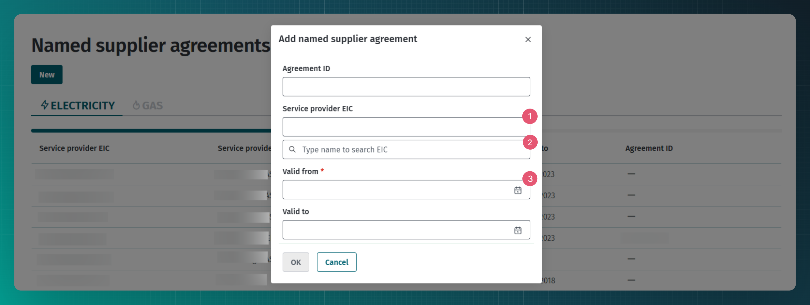
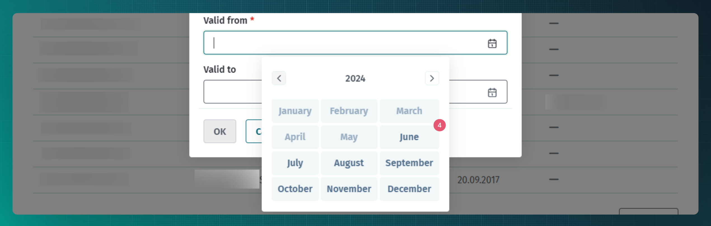

# Nimetatud tarnija leping

## Sisukord

<!-- TOC -->
* [Nimetatud tarnija leping](#nimetatud-tarnija-leping)
  * [Sisukord](#sisukord)
  * [Sissejuhatus](#sissejuhatus)
  * [Nimetatud tarnija lepingute edastamine](#nimetatud-tarnija-lepingute-edastamine)
  * [Nimetatud tarnija lepingute edastamine veebiliidese kaudu](#nimetatud-tarnija-lepingute-edastamine-veebiliidese-kaudu)
  * [Masinliidese sõnumid](#masinliidese-sõnumid)
    * [Sõnumid](#sõnumid)
    * [Sõnumite reeglid](#sõnumite-reeglid)
<!-- TOC -->

## Sissejuhatus

Kui turuosalisel on kehtiv võrguleping, aga puudub avatud tarne leping, loetakse elektrituruseaduse alusel tema avatud tarnijaks tema mõõtepunkti võrguettevõtja. Öeldakse, et turuosaline kasutab üldteenust.

Võrguettevõtja võib delegeerida avatud tarne teenuse osutamise edasi mõnele teisele avatud tarnijale, sellisel juhul peab võrguettevõtja sisestama Andmelattu nimetatud tarnija lepingu.

Andmeladu teavitab võrguettevõtjat ja vajadusel ka nimetatud müüjat sellest, kui kliendil puudub mõnel ajaperioodil avatud tarne leping ning rakendub üldteenus. Loe täpsemalt peatükist [Üldteenuse teavitus](08-yldteenuse-teavitus.md).

## Nimetatud tarnija lepingute edastamine

Andmelattu tuleb edastada nimetatud tarnija leping juhul, kui võrguettevõtjal selline leping eksisteerib.

Lepingute teenuste kasutamise ettnähtud protsess on kirjeldatud dokumendis [Lepingud](06-lepingud.md).

## Nimetatud tarnija lepingute edastamine veebiliidese kaudu

Veebiliidese kaudu avatud tarnija lepingute lisamiseks tuleb võrguettevõtja rollis navigeerida "Agreements" -> "Named supplier agreements" lehele. Vajutades seal "New" nuppu avaneb modaalaken, kus saab lisada lepingu detailid.

Kohustuslik on lisada nimetatud tarnija ning märkida lepingu kehtivuse algus.

1. Lepingule tuleb lisada nimetatud tarnija EIC kood.
2. Kui vajalikku EIC koodi ei tea on võimalik nime järgi otsida.
3. Kohustuslik on määrata lepingu algkuupäev.
4. Leping algab alati kuu esimesest päevast, seetõttu tuleb valida vaid kuu. Lepingu alguseni peab jääma vähemalt 7 päeva.

## Masinliidese sõnumid

### Sõnumid

> **Note**
> Andmete saatmise ja pärimise õigused on kirjeldatud dokumendis [Autentimine ja autoriseerimine](03-autentimine-ja-autoriseerimine.md)

Sõnumite kirjelduse kohta loe lepingute ülddokumendist [Lepingud](06-lepingud.md).

### Sõnumite reeglid

Lepingute üldreeglid on kirjeldatud dokumendis [Lepingud](06-lepingud.md#sõnumite-reeglid)

Nimetatud tarnija lepingu täiendavad reeglid on:

- Lepingu algus tohib olla ainult kuu esimene päev.
- Lepingu algus peab olema vähemalt 7 päeva tulevikus.
- Lepingu lõpp tohib olla ainult kuu viimane päev.
- Lepingu lõpp peab olema vähemalt 7 päeva tulevikus.
- Lepingu andmestikus ei tohi olla mõõtepunkte.
- Lepingus ei tohi sätestada enneaegse lõpetamise tasu.
- Kehtivat lepingut ei saa kustutada.
- Lepingut ei saa kustutada, kui lepingu kehtivuseni on jäänud vähem kui 7 päeva.
- Lepingut saab lisada ainult võrguettevõtja (GO) või suletud jaotusvõrgu operaatori (CDN) rollis turuosaline.
- Lepingu teenusepakkujaks (`serviceProvider`) peab olema määratud avatud tarnija ja lepingu kliendiks (`customer`) peab olema määratud lepingu registreerija.
- Lepingu lisamine iseendale ei ole lubatud (`serviceProvider` ja `customer` ei tohi olla samad).
