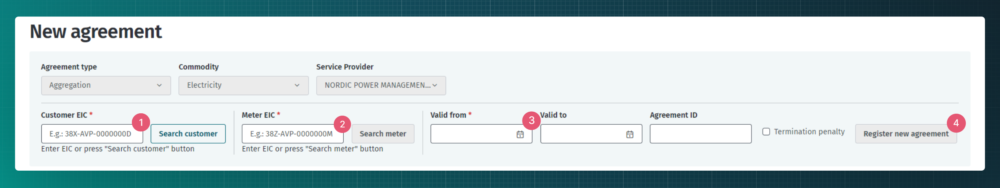

# Agregeerimisleping

## Sisukord

<!-- TOC -->
* [Agregeerimisleping](#agregeerimisleping)
  * [Sisukord](#sisukord)
  * [Sissejuhatus](#sissejuhatus)
  * [Agregeerimislepingute edastamine](#agregeerimislepingute-edastamine)
  * [Agregeerimislepingute edastamine veebiliidese kaudu](#agregeerimislepingute-edastamine-veebiliidese-kaudu)
  * [Masinliidese sõnumid](#masinliidese-sõnumid)
    * [Sõnumid](#sõnumid)
    * [Sõnumite reeglid](#sõnumite-reeglid)
<!-- TOC -->

## Sissejuhatus

Agregeerimise käigus juhitakse määratud võrgumõõtepunkti(de) tarbimist selleks, et energia nõudluse tõusu ajal tarbimist vähendada (või tootmist suurendada) ja energia nõudluse langemise ajal taas tarbimist suurendada (tootmist vähendada). Selleks juhib agregaator võrgumõõtepunkti taga olevate seadmete tarbimist ja/või tootmist ning mõõdab agregeeritud energiakoguseid spetsiaalsete agregeerimise mõõtepunktidega, mis kuuluvad seotud võrgumõõtepunkti alla.

Agregeerimisteenuse pakkumiseks sõlmitakse turuosalise ja agregaatori vahel agregeerimisleping, mis määrab ära agregeerimise tingimused. Tasub märkimist, et Andmeladu ei kogu täpseid agregeerimise tingimusi.

## Agregeerimislepingute edastamine

Agregaator on kohustatud edastama agregeerimislepingu Andmelattu.

Lepingute teenuste kasutamise ettnähtud protsess on kirjeldatud dokumendis [Lepingud](06-lepingud.md). Järgnevalt on kirjeldatud Andmelao täiendavad tegevused erinevates agregeerimislepingutega seotud tegevustes:

- Andmeladu muudab uute või muutunud agregeerimislepingute info kättesaadavaks ülem-mõõtepunkti avatud tarnijale (kasutades `data-distribution/search` teenust), et too saaks prognooside koostamisel arvestada, kas antud mõõtepunkti aktiivenergia tootmist või tarbimist võib agregeerimisega mõjutada.

## Agregeerimislepingute edastamine veebiliidese kaudu

Veebiliidese kaudu agregeerimislepingute edastamiseks peab olema valitud agregaatori roll. Seejärel tuleb navigeerida "Agreements" -> "New agreement" lehele. Avanevas vaates tuleks lisada kliendi EIC kood, mõõtepunkti EIC kood ja lepingu alguskuupäev. Kehtivuse lõppkuupäeva ja lepingu ID lisamine on vabatahtlik. 

Kui vajalikke EIC koode ei tea on võimalik neid lepingut lisades otsida.

- Kliendi EIC koodi lisamiseks tuleb valida "Search customer"
- Avanevas vaates saab lisada sobiva otsingukriteeriumi
- Sobiva kliendi leidmisel "Select" vajutades lisatakse kliendi EIC kood.

- Mõõtepunktide leidmiseks tuleb valida "Search meter".
- Sobiva mõõtepunkti leidmisel "Select" vajutades lisatakse mõõtepunkti EIC lepingule.

## Masinliidese sõnumid

### Sõnumid

> [!NOTE]
> Andmete saatmise ja pärimise õigused on kirjeldatud dokumendis [Autentimine ja autoriseerimine](03-autentimine-ja-autoriseerimine.md)

Sõnumite kirjelduse kohta loe lepingute ülddokumendist [Lepingud](06-lepingud.md).

### Sõnumite reeglid

Lepingute üldreeglid on kirjeldatud dokumendis [Lepingud](06-lepingud.md#sõnumite-reeglid)

Agregeerimislepingu täiendavad reeglid on:

- Agregeerimislepingut on võimalik sõlmida ainult agreegeerimise mõõtepunktis.
- Agregeerimislepingu kehtivusperiood ei tohi kummastki otspunktist ületada ülemvõrgumõõtepunkti võrgulepingu kehtivusaega.
- Lepingu alguskuupäev peab olema vähemalt üks päev tulevikus, kui puudub eelnev aktiivne ülemvõrgumõõtepunktiga seotud agregeerimisleping.
- Lepingu alguskuupäev peab olema vähemalt 14 päeva tulevikus, kui eksisteerib eelnev aktiivne ülemvõrgumõõtepunktiga seotud agregeerimisleping.
- Lepingu alguskuupäev tohib olla kuni 48h minevikus juhul, kui avatud tarnija registreerib avatud lepingut tagantjärele ja lepingu alguskuupäev langeb kokku ülemvõrgumõõtepunkti võrgulepingu alguskuupäevaga.
- Lepingu lõppkuupäev peab olema vähemalt 1 päev tulevikus.
- Lepingut saab lisada ainult agregaatori (AGG) rollis turuosaline.
- Lepingu teenusepakkujaks (`serviceProvider`) peab olema määratud lepingu registreerija ja lepingu kliendiks (`customer`) võib olla ükskõik milline turuosaline.
- Lepingu lisamine iseendale on lubatud.
- Agregeerimislepingu klient peab olema sama isik, kes on ka võrgulepingu klient ülemmõõtepunktis.
