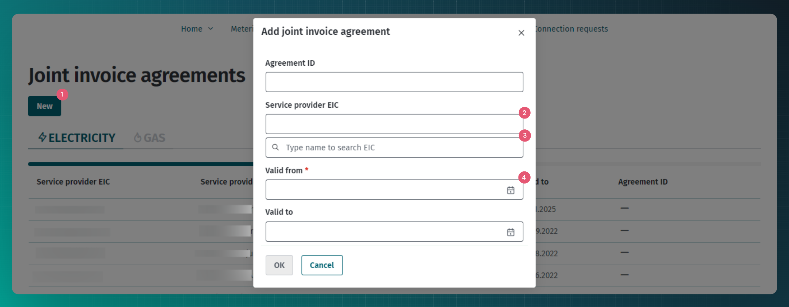
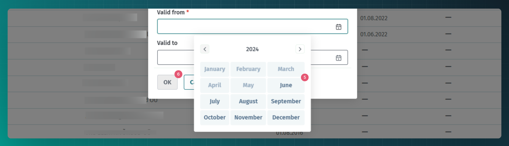

# Ühisarve leping

## Sisukord

<!-- TOC -->
* [Ühisarve leping](#ühisarve-leping)
  * [Sisukord](#sisukord)
  * [Sissejuhatus](#sissejuhatus)
  * [Ühisarve lepingute edastamine](#ühisarve-lepingute-edastamine)
  * [Ühisarve lepingute edastamine veebiliidese kaudu](#ühisarve-lepingute-edastamine-veebiliidese-kaudu)
  * [Masinliidese sõnumid](#masinliidese-sõnumid)
    * [Sõnumid](#sõnumid)
    * [Sõnumite reeglid](#sõnumite-reeglid)
<!-- TOC -->

## Sissejuhatus

Ühisarve võimaldab kõikidel avatud tarnijatel esitada tarbijale ühine arve nii müüdud energia kui ka võrguteenuse eest.

Ühisarveteenuse kasutamiseks sõlmivad avatud tarnija ja võrguteenuse osutaja ühisarve lepingu, mis sätestab ühisarve rakendamise tingimused. Andmelattu tuleb edastada ainult fakt, et leping on sõlmitud. Lepingu täpsemaid tingimusi ei edastata.

Pärast ühisarve lepingu sõlmimist võib võrguteenuse osutaja saata võrguteenuse arve avatud tarnijale kasutades dokumendist [Ühisarve](14-yhisarve.md) kirjeldatud teenuseid.

## Ühisarve lepingute edastamine

Ühisarve lepingut saab Andmelattu edastada ainult võrguoperaator.

Lepingute teenuste kasutamise ettnähtud protsess on kirjeldatud dokumendis [Lepingud](06-lepingud.md). Järgnevalt on kirjeldatud Andmelao täiendavad tegevused erinevates ühisarve lepingutega seotud tegevustes:

- Andmeladu muudab uute või muutunud ühisarve lepingute info kättesaadavaks avatud tarnijale (kasutades andmete levitamise teenust)

## Ühisarve lepingute edastamine veebiliidese kaudu

Veebiliidese kaudu ühisarve lepingute lisamiseks tuleb võrguettevõtja rollis navigeerida "Agreements" -> "Joint invoice agreements" lehele.

1. Lisamiseks tuleb vajutada "New" nuppu
2. Lepingule tuleb lisada avatud tarnija EIC kood.
3. Kui vajalikku EIC koodi ei tea on võimalik nime järgi otsida.
4. Kohustuslik on määrata lepingu algkuupäev.
5. Leping algab alati kuu esimesest päevast, seetõttu tuleb valida vaid kuu. Lepingu alguseni peab jääma vähemalt 7 päeva.
6. Kui kõik kohustuslikud väljad on täidetud on võimalik vajutada nuppu "Ok", seejärel leping salvestatakse.

## Masinliidese sõnumid

### Sõnumid

Sõnumite kirjelduse kohta loe lepingute ülddokumendist [Lepingud](06-lepingud.md).

### Sõnumite reeglid

Lepingute üldreeglid on kirjeldatud dokumendis [Lepingud](06-lepingud.md#sõnumite-reeglid)

Ühisarve lepingu täiendavad reeglid on:

- Lepingu algus tohib olla ainult kuu esimene päev.
- Lepingu algus peab olema vähemalt 7 päeva tulevikus.
- Lepingu lõpp tohib olla ainult kuu viimane päev.
- Lepingu lõpp peab olema vähemalt 7 päeva tulevikus.
- Lepingu andmestikus ei tohi olla mõõtepunkte.
- Lepingus ei tohi sätestada enneaegse lõpetamise tasu.
- Lepingut ei saa kustutada, kui lepingu kehtivuseni on jäänud vähem kui 7 päeva.
- Lepingut saab lisada ainult võrguettevõtja (GO) või suletud jaotusvõrgu operaatori (CDN)rollis turuosaline.
- Lepingu teenusepakkujaks (`serviceProvider`) peab olema määratud avatud tarnija ja lepingu kliendiks (`customer`) peab olema määratud lepingu registreerija.
- Lepingu lisamine iseendale ei ole lubatud (`serviceProvider` ja `customer` ei tohi olla samad).
