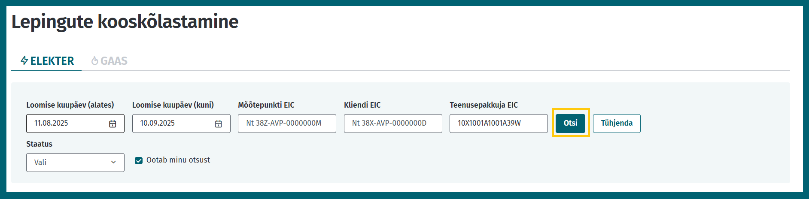

# Kooskõlastust nõudvad lepingumuudatused

## Sisukord

<!-- TOC -->
* [Kooskõlastust nõudvad lepingumuudatused](#kooskõlastust-nõudvad-lepingumuudatused)
  * [Sisukord](#sisukord)
  * [Sissejuhatus](#sissejuhatus)
  * [Lepingute tagasiulatuv sisestamine (algus- või lõppkuupäeva muudatused)](#lepingute-tagasiulatuv-sisestamine-algus--või-lõppkuupäeva-muudatused)
    * [Avatud tarne lepingud](#avatud-tarne-lepingud)
  * [Lepingute kooskõlastused veebiliideses](#lepingute-kooskõlastused-veebiliideses)
    * [Uue kooskõlastust vajava lepingu lisamine](#uue-kooskõlastust-vajava-lepingu-lisamine)
    * [Olemasoleva kooskõlastust vajava lepingu muutmine](#olemasoleva-kooskõlastust-vajava-lepingu-muutmine)
    * [Kooskõlastuste otsimine ja kinnitamine](#kooskõlastuste-otsimine-ja-kinnitamine)
  * [Masinliidese sõnumid](#masinliidese-sõnumid)
    * [Sõnumid](#sõnumid)
    * [Sõnumite reeglid](#sõnumite-reeglid)
        * [`POST /api/{version}/agreement-coordinations` reeglid](#post-apiversionagreement-coordinations-reeglid)
        * [`GET /api/{version}/agreement-coordinations/{id}` reeglid](#get-apiversionagreement-coordinationsid-reeglid)
        * [`GET /api/{version}/agreement-coordinations` reeglid](#get-apiversionagreement-coordinations-reeglid)
        * [`POST /api/{version}/agreement-coordinations/{id}/cancel` reeglid](#post-apiversionagreement-coordinationsidcancel-reeglid)
        * [`POST /api/{version}/agreement-coordinations/{id}/approve` reeglid](#post-apiversionagreement-coordinationsidapprove-reeglid)
        * [`POST /api/{version}/agreement-coordinations/{id}/deny` reeglid](#post-apiversionagreement-coordinationsiddeny-reeglid)
<!-- TOC -->

## Sissejuhatus

Vastavalt ärireeglitele on teatud lepingute sisestamisel või muutmisel vaja eelnevalt asjasse puutuvate turuosaliste eelnevat kooskõlastust. Selliste tegevuste tarbeks on loodud eraldi teenused, mis kooskõlastamise protsessi toetavad.

> [!IMPORTANT]
> Tegemist on arenduses oleva funktsionaalsusega.
## Lepingute tagasiulatuv sisestamine (algus- või lõppkuupäeva muudatused)
### Avatud tarne lepingud

Avatud tarne lepingute tagasiulatuvate muudatuste sisestamiseks on vajalik teatud turuosalisete kooskõlastust. Kooskõlastusi korjatakse kõikidelt korraga ja paralleelselt. Järgnevalt on toodud sõnumite kirjeldused, näited ja reeglid

1. Avatud tarnija sisestab taotluse muuta avatud tarne lepingu algus- või lõppkuupäeva.
2. Taotlus määratakse kooskõlastuseks järgmistele turuosalistele:
   - mõõtepunkti avatud tarnijale – ainult juhul kui mõõtepunktis on kliendil avatud tarne leping;
   - mõõtepunkti avatud tarnija bilansihaldurile – ainult juhul kui mõõtepunktis on kliendil avatud tarne leping (ja see avatud tarnija ise ei ole bilansihaldur);
   - mõõtepunkti üldteenuse pakkujale (võrguettevõtjale või tema nimetatud müüjale);
   - mõõtepunkti üldteenuse pakkuja bilansihaldurile (ainult juhul kui nimetatud müüja puhul ei ole see nimetatud müüja ise bilansihalduriks).
3. Eelmainitud kooskõlastuste ja muude tarnijavahetuse tingimuste vastavusel määratakse taotlus kooskõlastuseks Eleringile.
4. Peale Eleringi poolset kinnitamist teostatakse muudatus.

## Lepingute kooskõlastused veebiliideses

Uusi kooskõlastusi on võimalik algatada ainult avatud tarnija rollis.

### Uue kooskõlastust vajava lepingu lisamine
  1. Ava avatud tarnija rollis leht "Uus leping".
  2. Vali lepingu lisamise vormis, et soovid algatada lepingu kooskõlastust.

  3. Täida kõik nõutud väljad.
  
  4. Vajuta nuppu "Algata kooskõlastus".
  5. Kooskõlastus on algatatud ja leitav lehelt "Lepingute kooskõlastamine".

### Olemasoleva kooskõlastust vajava lepingu muutmine
  1. Ava avatud tarnija rollis leht "Lepingud".
  2. Leia leping, mida soovid muuta. Muuta saab ainult aktiivseid lepinguid.
  
  3. Vajuta nuppu "Muuda".
  4. Tee valik "Lepingute kooskõlastamine"
   
  5. Tee vajalikud muudatused kuupäevades.
  6. Lisa muudatuse põhjendus.
  7. Vajuta nuppu "Algata", et edastada leping kooskõlastusse.
  8. Kooskõlastus on algatatud ja leitav lehelt "Lepingute kooskõlastamine".

### Kooskõlastuste otsimine ja kinnitamine
  1. Ava leht "Lepingute kooskõlastamine".
  2. Lisa soovitud otsingute filtrid ja vajuta "Otsi".
   
  3. Tulemustes kuvatakse lepingute kooskõlastused koos info ja kinnitajatega.
  
  4. Vajutades kinnitajate tabelis dokumendi ikoonile on võimalik vaadata ka olemasolevaid seotud lepinguid.
  
  5. Kinnitamiseks või keeldumiseks tuleb vajutada "Kinnita" või "Keeldu" nuppu.
  6. Seejärel avanevas aknas tuleb oma otsus kinnitada.

## Masinliidese sõnumid

### Sõnumid

| Sõnum                                                      | Eesmärk                                                       |
|------------------------------------------------------------|---------------------------------------------------------------|
| `POST /api/{version}/agreement-coordinations`              | Lepingu muutmise taotluse loomine                             |
| `GET /api/{version}/agreement-coordinations/{id}`          | Lepingu muutmise taotluse otsimine ID alusel                  |
| `GET /api/{version}/agreement-coordinations`               | Lepingu muutmise taotluste otsimine erinevate tunnuste alusel |
| `POST /api/{version}/agreement-coordinations/{id}/cancel`  | Lepingu muutmise taotluse tühistamine                         |
| `POST /api/{version}/agreement-coordinations/{id}/approve` | Lepingu muutmise taotluse kooskõlastamine                     |
| `POST /api/{version}/agreement-coordinations/{id}/deny`    | Lepingu muutmise taotluse kooskõlastusest keeldumine          |

### Sõnumite reeglid

##### `POST /api/{version}/agreement-coordinations` reeglid

- Taotlust saab luua vaid avatud tarne lepingutele (`agreementType = SUPPLY`).
- Taotluse esitaja peab olema avatud tarnija rollis.
- Taotluse esitaja peab taotluses esitatud lepingus olema teenusepakkuja rollis.
- Ühe mõõtepunkti aktiivsete kooskõlastuste perioodid ei tohi kattuda.
- Olemasoleva avatud tarne lepingu muutmisel tuleb esitada soovitud kuupäevad:
  - `proposedValidFrom` näitab uut soovitud lepingu alguskuupäeva;
  - `proposedValidTo` näitab uut soovitud lepingu lõppkuupäeva.
- Uue avatud tarne lepingu lisamisel tuleb esitada lisaks tavapärased avatud tarne lepingu andmed.
- Võrguleping peab katma terve soovitud avatud tarne lepingu perioodi.
- Taotluse lisamisel on põhjenduse lisamine kohustuslik.

##### `GET /api/{version}/agreement-coordinations/{id}` reeglid

- Taotlust saab otsida ainult taotluse lisaja ja kooskõlastaja

##### `GET /api/{version}/agreement-coordinations` reeglid

- Pärida saab maksimaalselt 30 päeva pikkuse perioodi taotlusi.
- Pärida saab vaid mineviku taotlusi - `creationDateTo` ei tohi olla tulevikus.
- `agreementAction` näitab, kas tegu on lepingu loomisega või uuendamisega. Võimalikud valikud on: `CREATE`ja `UPDATE`.

##### `POST /api/{version}/agreement-coordinations/{id}/cancel` reeglid

- Kooskõlastusprotsessi saab tühistada vaid taotluse saatja.
- Tühistamine on võimalik, kui kooskõlastuse staatus on `WAITING_FOR_APPROVAL`. See tähendab, et tühistamine on võimalik vaid juhul, kui keegi ei ole veel taotlust kinnitanud ega tagasi lükanud.

##### `POST /api/{version}/agreement-coordinations/{id}/approve` reeglid

- Kooskõlastust saab anda, kui kooskõlastuse vastuse staatus on `READY_FOR_APPROVAL`.
- Kooskõlastust ei saa anda tühistatud taotlusele.

##### `POST /api/{version}/agreement-coordinations/{id}/deny` reeglid

- Kooskõlastusest keeldumist saab anda, kui kooskõlastuse vastuse staatus on `READY_FOR_APPROVAL`.
- Kooskõlastust ei saa anda tühistatud taotlusele.
- Kooskõlastusest keeldumise korral on põhjenduse lisamine kohustuslik.
- Esimene kooskõlastusest keeldumine lõpetab kooskõlastuse protsessi ja järgmiste kooskõlastusvastuste saatmine pole enam võimalik.