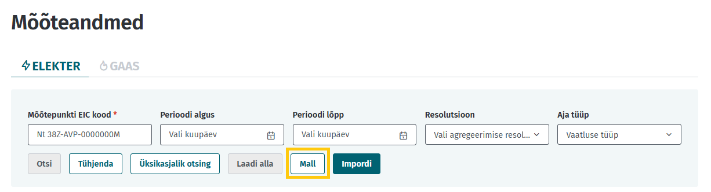
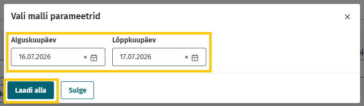
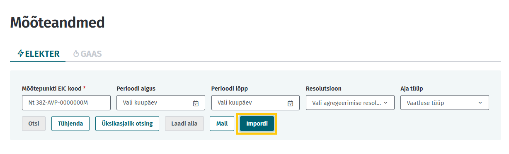
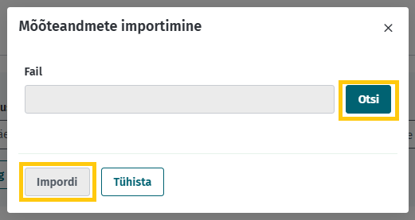
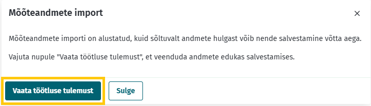
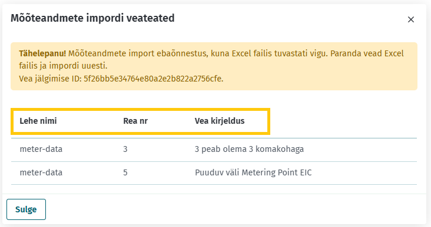
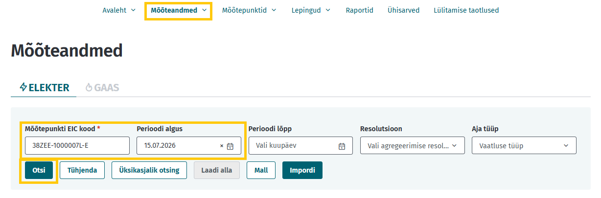

# Mõõteandmed


## Sisukord
* [Sissejuhatus](#sissejuhatus)
* [Mõõteandmete üldised põhimõtted](#mõõteandmete-üldised-põhimõtted)
  * [Mõõteandmete suunad](#mõõteandmete-suunad)
  * [Netomõõdetud mõõteandmed](#netomõõdetud-mõõteandmed)
  * [Mõõteandmete resolutsioon](#mõõteandmete-resolutsioon)
  * [Mõõteandmete edastamine](#mõõteandmete-edastamine)
  * [Mõõteandmetele ligipääs õiguslikud alused](#mõõteandmetele-ligipääs-õiguslikud-alused)
  * [Süsteemiväline nõusolek](#süsteemiväline-nõusolek)
  * [Aja tüüp](#aja-tüüp)
* [Mõõteandmete edastamine API kaudu](#mõõteandmete-edastamine-API-kaudu)
  * [Sõnumite reeglid](#sõnumite-reeglid)
  * [API lühendid](#api-lühendid)
  * [Mõõteandmete vastuvõtmise juhtimine](#mõõteandmete-vastuvõtmise-juhtimine)
* [Mõõteandmete pärimine API kaudu](#mõõteandmete-pärimine-api-kaudu)
  * [Päringu eesmärk](#päringu-eesmärk)
* [Mõõteandmete edastamine veebiliidese kaudu](#mõõteandmete-edastamine-veebiliidese-kaudu)
  * [Mõõteandmete lehele navigeerimine](#mõõteandmete-lehele-navigeerimine)
  * [Mõõteandmete Exceli malli genereerimine](#mõõteandmete-exceli-malli-genereerimine)
  * [Mõõteandmete edastamine Exceli failiga](#mõõteandmete-edastamine-exceli-failiga)
    * [Exceli veergude kirjeldused](#exceli-veergude-kirjeldused)
    * [Netokoguste täitmisel kehtivad järgmised reeglid](#netokoguste-täitmisel-kehtivad-järgmised-reeglid)
    * [Võimalikud vead Exceli täitmisel](#võimalikud-vead-exceli-täitmisel)
  * [Exceli faili importimine Estfeed Datahubi](#exceli-faili-importimine-estfeed-datahubi)
* [Mõõteandmete päringud veebiliidese kaudu](#mõõteandmete-päringud-veebiliidese-kaudu)
  

## Sissejuhatus

Mõõteandmed on konkreetse mõõtepunktiga seotud mõõdetud või prognoositud aktiivenergia kogused kindla ajaperioodi kohta. Mõõteandmed on arvelduse ja turuprotsesside aluseks.

Mõõteandmeid esitavad mõõtepunkti haldurid, näiteks võrguettevõtjad, liinivaldajad ja teised turuosalised, kellel on õigus vastava mõõtepunkti andmeid edastada. Mõõteandmeid kasutavad teised turuosalised, peamiselt avatud tarnijad, bilansihaldurid ja muud õigustatud osapooled.

Estfeed Datahub võimaldab mõõteandmeid:
- edastada Exceli failiga veebiliidese kaudu;
- edastada API kaudu;
- otsida veebiliidese kaudu;
- pärida API kaudu;
- levitada õigustatud turuosalistele andmete levitamise teenuse kaudu.

Mõõteandmete esitamise ja pärimise võimalused sõltuvad turust, turuosalise rollist ja mõõtepunktiga seotud õigustest.

## Mõõteandmete üldised põhimõtted

### Mõõteandmete suunad

Mõõteandmete suund esitatakse järgnevalt:
- **IN** – võrku sisenev energia ehk tootmine.
- **OUT** – võrgust väljuv energia ehk tarbimine.

### Netomõõdetud mõõteandmed

Alates 1. augustist 2026 on vastavalt elektrituruseadusele kahesuunalise arvestiga tarbimiskohtade elektriarvete koostamisel aluseks netomõõteandmed. Netomõõteandmed näitavad iga 15 minuti pikkuse mõõteperioodi kohta toodetud ja tarbitud koguste vahet. Kui mõõteperioodil tarbitakse võrgust rohkem elektrit kui võrku antakse, tekib netotarbimine. Kui mõõteperioodil antakse võrku rohkem elektrit kui võrgust tarbitakse, tekib neto võrku andmine.

Netokogused arvutab elektrituru võrguettevõtja enne andmete edastamist Estfeed Datahubi. Gaasituru turuosalised ja teised elektrituru turuosalised (näiteks agregaatorid või liinivaldajad) netomõõdetud mõõteandmeid edastada ei saa.

Näide, kus tootmine on suurem kui tarbimine:

| Mõõteandme tüüp / suund | Kogus |
|-------------------------|-------|
| Tootmine ehk IN | 15 kWh |
| Tarbimine ehk OUT | 10 kWh |
| Neto tootmine ehk NET IN | 5 kWh |
| Neto tarbimine ehk NET OUT | 0 kWh |

Näide, kus tarbimine on suurem kui tootmine:

| Mõõteandme tüüp / suund | Kogus |
|-------------------------|-------|
| Tootmine ehk IN | 10 kWh |
| Tarbimine ehk OUT | 15 kWh |
| Neto tootmine ehk NET IN | 0 kWh |
| Neto tarbimine ehk NET OUT | 5 kWh |

> [!NOTE]
> Estfeed Datahub võtab vastu võrguettevõtja poolt edastatud netomõõdetud mõõteandmed. Andmete õigsuse eest vastutab võrguettevõtja.

### Mõõteandmete resolutsioon

Mõõteandmete resolutsioon sõltub turust.

| Turg | Resolutsioon |
|------|--------------|
| Elekter | 15 minutit |
| Gaas | 1 tund või 1 päev|

Perioodi algus peab vastama valitud resolutsioonile.

Näited:

- 15 minuti resolutsiooni korral peavad perioodi algusajad olema `hh:00`, `hh:15`, `hh:30` või `hh:45`;
- 1 tunni resolutsiooni korral peavad perioodi algusajad olema täistunnid ehk `hh:00`;
- päevaandmete korral tuleb kogus lisada esimesele gaasipäeva tunnile ehk `07:00`.

Estfeed Datahub ei valideeri, et kogu periood oleks täielikult mõõteandmetega kaetud. Näiteks ei kontrollita, kas elektri puhul on iga 15 minuti vahemik või gaasi puhul iga tunni vahemik eraldi täidetud.

### Mõõteandmete edastamine

Mõõtepunkti haldur tagab enda mõõtepunktide aktiivenergia koguste kindlaksmääramise ja edastab mõõteandmed Estfeed Datahubi.

Elektriturul edastatakse mõõteandmed 15-minutilise resolutsiooniga. Gaasiturul edastatakse mõõteandmed üldjuhul tunnipõhise resolutsiooniga, kuid lubatud on ka päevaandmete edastamine.

Mõõtepunkti haldurid edastavad mõõteandmed järgmistel tähtaegadel:

1. esialgsed eelmise päeva mõõteandmed:
   - elektriturul igal tööpäeval kella 10.00-ks;
   - gaasiturul igal tööpäeval kella 13.00-ks;
2. eelmise kalendrikuu lõplikud mõõteandmed:
   - elektriturul järgneva kuu 5. kuupäevaks;
   - gaasiturul järgneva kuu 7. kuupäevaks.

Mõõteandmeid saavad edastada näiteks:

- võrguettevõtja;
- liinivaldaja;
- suletud jaotusvõrk;
- laadimispunkti operaator;
- agregaator, kui see on tema tururolli ja äriprotsessi järgi lubatud.

Mõõteandmete edastamise üldine protsess on järgmine:

1. Mõõtepunkti haldur koostab mõõteandmete sõnumi või Exceli faili.
2. Mõõtepunkti haldur edastab mõõteandmed Estfeed Datahubi.
3. Estfeed Datahub võtab sõnumi vastu ja annab esmase vastuse selle kohta, kas sõnum õnnestus vastu võtta.
4. Kuna mõõteandmete töötlemine toimub asünkroonselt, lisatakse sõnum töötlemise järjekorda.
5. Mõõtepunkti haldur kontrollib töötlemise tulemust staatuse päringu kaudu.
6. Kui töötlemine õnnestub, salvestatakse mõõteandmed andmebaasi.
7. Kui töötlemisel tekivad vead, teeb Estfeed Datahub vearaporti kättesaadavaks. Vearaport on kättesaadav 7 päeva.
8. Mõõtepunkti haldur lahendab vead vastavalt oma sisemisele äriloogikale ja vajadusel edastab mõõteandmed uuesti.


Võimalikud töötlemise staatuse väärtused on:

- `PROCESSING` – töötlus ei ole veel lõppenud;
- `SUCCESSFUL` – töötlus lõppes vigadeta;
- `ERROR` – töötlus lõppes vigadega.

> [!NOTE]
> Võib tekkida olukord, kus Estfeed Datahub võtab mõõteandmete sõnumi vastu ja vastab, et töötlemine on alustatud, kuid sõnum ei jõua tegelikult töötlemisse ja selle kohta ei looda ka staatuse kirjet.
>
> Mõõtepunkti haldur peab pidama järge, mis igast mõõteandmete sõnumist on saanud ja kas töötlus jõudis lõppolekusse. Kui mõne sõnumi kohta lõppstaatust ei teki, tuleb eeldada, et töötlemisel tekkis ootamatu probleem, ja mõõteandmed uuesti edastada.
>
> Tulemuste jälgimiseks võib näiteks:
>
> - pärida staatust üksiku `originalDocumentIdentification` väärtuse alusel;
> - skaneerida `SUCCESSFUL` ja `ERROR` staatuseid;
> - pidada sisemiselt järge, millised sõnumid on lõppolekusse jõudnud.

### Mõõteandmetele ligipääs õiguslikud alused
Mõõteandmetele ligipääs on piiratud ja sõltub turuosalise rollist, mõõtepunktiga seotud lepingutest ning olemasolevatest õigustest.

Ligipääsureeglid on kirjeldatud dokumendis [Rollipõhised ligipääsuõigused](03.01-rollipohised-ligipaasuoigused.md).

Mõõteandmete päringute tegemiseks on järgmised peamised võimalused:

- avatud tarnija, nimetatud müüja ja portfelliteenuse pakkuja skaneerib mõõteandmete muudatusi andmete levitamise teenuse kaudu;
- õigustatud kasutaja pärib mõõteandmed `GET /metering-data` teenuse kaudu;
- kasutaja otsib mõõteandmeid veebiliideses.

### Süsteemiväline nõusolek

> [!WARNING]
> Alates 01.2027 pole süsteemivälise nõusoleku kasutamine enam lubatud ja kasutaja peab suunama ligipääsuõigust jagama Estfeedi kliendiportaali.

Nii füüsiline kui ka juriidiline isik saab anda oma andmetele ligipääsuõiguse kliendiportaali kaudu. Ligipääsuõiguste üldised põhimõtted on kirjeldatud dokumendis [Rollipõhised ligipääsuõigused](03.01-rollipohised-ligipaasuoigused.md).

Füüsiliste isikute puhul peab ligipääsuõigus olema antud kliendiportaali kaudu.

Juriidiliste isikute puhul on võimalik ka alternatiivne töövoog, kus klient annab ligipääsuõiguse väljaspool Estfeed Datahubi ja kliendiportaali, kuid kirjalikku taasesitamist võimaldavas vormis otse avatud tarnijale.

Sellisel juhul saab avatud tarnija `GET /metering-data` teenuses kinnitada õiguse olemasolu, kinnitades õiguse olemasolu veebiliideses avanevad aknas või lisades päringusse:

```json
{
  "legalConsent": true
}
```

Kui `"legalConsent": true` on lisatud, saab avatud tarnija pärida mõõtepunkti mõõteandmeid eeldusel, et mõõtepunkti võrgulepingu klient on juriidiline isik või organisatsioon.

> [!CAUTION]
> `"legalConsent": true` kasutamine on lubatud ainult kliendi volituse olemasolul. Selle õiguspärast kasutamist monitooritakse.

### Aja tüüp

Mõõteandmete päringutes kasutatakse ajaväärtusena **Reading Time** ehk mõõtmise aega.

Mõõtepunkti haldur edastab mõõteandmetega mõõtmise aja ehk `reading time`. See näitab, millisel ajal on mõõteandmed arvestist saadud.

## Mõõteandmete edastamine API kaudu

Mõõteandmeid on nii elektri kui ka gaasiturul võimalik edastada API kaudu. Sõnumite spetsifikatsioonid on leitavad Swaggerist: https://datahub.elering.ee/swagger-ui/index.html#/ 

| Sõnum | Eesmärk | Turg |
|-------|---------|------|
| `POST /api/v2/metering-data/electricity` | Mõõteandmete lisamine | Elekter |
| `POST /api/v2/metering-data/natural-gas` | Mõõteandmete lisamine | Gaas |
| `GET /api/v2/metering-data/status` | Mõõteandmete sõnumi töötlemise staatuse päring | Elekter, gaas |

### Sõnumite reeglid

API kaudu mõõteandmete edastamisel kehtivad järgmised reeglid:

- perioodi algus peab vastama turu resolutsioonile;
- elektri mõõtekogused esitatakse kWh-des täpsusega kuni 3 kohta pärast koma;
- gaasi mõõtekogused esitatakse kWh-des ja kuupmeetrites täpsusega 3 kohta pärast koma;
- mõõteandmete suund esitatakse mõõtva mõõtepunkti halduri vaatest;
- IN tähendab võrku sisenevat energiat ehk tootmist;
- OUT tähendab võrgust väljuvat energiat ehk tarbimist;
- siseneva ja väljuva energia koguseid võib edastada ka eraldi sõnumitega;
- elektri kahesuunaliste mõõtepunktide puhul tuleb edastada ka netokogused;
- mõõteandmeid on lubatud korrigeerida tagasiulatuvalt kuni 12 kuud;
- mõõteandmeid on lubatud edastada kuni 45 päeva tulevikku;
- kui kasvõi üks mõõtetulemus ei läbi valideerimist, saab kogu sõnum staatuse `ERROR`;
- kui perioodi algus on lubatust kaugemal tulevikus, tagastatakse veakood `period-start-too-far-in-future`;
- `import` teenuses tuleb kasutada sama malli, mille väljastab vastav template-teenus.
- Mõõteandmete saatmisel V2 API kaudu kehtib piirang perioodide arvule, mida saab ühe õnumiga edastada. Korraga on võimalik saata kuni 35 040 perioodi mõõteandmeid. Kui saadetakse igapäevaselt ühe päeva andmeid, saab ühe sõnumiga edastada kuni 365 mõõtepunkti andmed. Pikema perioodi korral tuleb vastavalt vähendada mõõtepunktide arvu.

### API lühendid

| Lühend | Selgitus | Turg |
|--------|----------|------|
| `periods` | Ühe mõõtetulemuse intervall | Elekter, gaas |
| `pS` | Period Start ehk perioodi algus | Elekter, gaas |
| `inQty` | IN ehk võrku siseneva energia kogus | Elekter, gaas |
| `outQty` | OUT ehk võrgust väljuva energia kogus | Elekter, gaas |
| `netInQty` | Neto tootmine ehk NET IN | Elekter |
| `netOutQty` | Neto tarbimine ehk NET OUT | Elekter |
| `rTime` | Reading Time ehk mõõtmise aeg | Elekter, gaas |
| `rType` | Reading Type ehk mõõtmise tüüp | Elekter, gaas |
| `kwh` | Mõõdetud kogused kWh-des | Elekter, gaas |
| `m3` | Mõõdetud kogused kuupmeetrites | Gaas |

### Mõõteandmete vastuvõtmise juhtimine

Vastuvõetud mõõteandmete töötlemine toimub kahes etapis:

1. mõõteandmete sõnum võetakse vastu, vastuseks tagastatakse `202` ja sõnum pannakse töötlemise järjekorda;
2. mõõteandmete töötleja võtab sõnumi järjekorrast, töötleb selle, salvestab andmed andmebaasi ja uuendab töötlemise staatuse.

Kui mõõteandmete töötlemine toimub aeglasemalt kui uusi sõnumeid vastu võetakse, hakkab töötlemise järjekord kasvama.

Kui järjekorda on kogunenud 100 000 päringu andmed, vastab `POST /metering-data` päring:

- HTTP staatusega `503`;
- HTTP päisega `Retry-After: 300`.

Lahendus põhineb järgmistel spetsifikatsioonidel:

- [HTTP 503 Service Unavailable](https://developer.mozilla.org/en-US/docs/Web/HTTP/Status/503)
- [Retry-After header](https://developer.mozilla.org/en-US/docs/Web/HTTP/Headers/Retry-After)


## Mõõteandmete pärimine API kaudu

Mõõteandmeid saab API kaudu pärida järgmiste teenustega. Sõnumite spetsifikatsioonid on leitavad Swaggerist: https://datahub.elering.ee/swagger-ui/index.html#/ 

| Sõnum | Eesmärk | Turg |
|-------|---------|------|
| `GET /api/{version}/metering-data/electricity` | Elektri mõõteandmete otsing | Elekter |
| `GET /api/{version}/metering-data/natural-gas` | Gaasi mõõteandmete otsing | Gaas |


V1 API kaudu tehtavad mõõteandmete päringud ei tagasta elektri netokoguseid. Elektri netokoguste pärimiseks tuleb kasutada V2 mõõteandmete teenuseid.

Täiendavalt on kasutusel andmete levitamise teenused.

### Päringu eesmärk

Mõõteandmete päringus kasutatakse eesmärgi atribuuti `purpose`.

Eesmärk kirjeldab, millises ärilises kontekstis mõõteandmeid päritakse. Näiteks võib avatud tarnija pärida mõõteandmeid avatud tarne lepingu täitmiseks, bilansihalduse eesmärgil või arvelduseks.

Avatud tarnija rollis on võimalikud eesmärgid:

- `OPEN_SUPPLY` – mõõteandmete pärimine avatud tarnijana;
- `PORTFOLIO` – mõõteandmete pärimine bilansihaldurina;
- `BILLING` – mõõteandmete pärimine arvelduse eesmärgil.

Mõõtepunkti halduri rollis on võimalikud eesmärgid:

- `OWN_MP_MANAGEMENT` – enda mõõtepunktide andmete pärimine;
- `OTHER` – teiste mõõtepunktide andmete pärimine.

Energiateenuse osutaja ei pea päringu eesmärki lisama. Teistes rollides on eesmärgi lisamine kohustuslik.


## Mõõteandmete edastamine veebiliidese kaudu

Enne mõõteandmete edastamist peab kasutaja veenduma, et mõõtepunktid oleksid registreeritud ja võrgulepingud sõlmitud.

Mõõteandmete edastamiseks veebiliidese kaudu tuleb navigeerida lehele **Mõõteandmed**. Seejärel peab kasutaja tegema järgmised sammud:
1. Esimesel korral või peale malli uuenemist vajutama nupule "Mall", et laadida Exceli põhi.
2. Mallis tuleb lisada kuupäevade vahemik, mille kohta andmeid soovitakse lisada. Gaasiturul tuleb täiendavalt täpsustada, kas soovitakse lisada andmeid 1 päeva või 1 tunni resolutsioonis.
3. Excelisse tuleb lisada igale reale mõõtepunkti EIC kood, mille andmeid edastatakse ja täita real ülejäänud lahtrid. Et ei tekiks probleeme soovitame tungivalt Exceli vormingut ega kuupäevi ja kellaaegasid mitte muuta. Ebakorrektse vorminguga andmevahetusplatvorm vastu ei võta.
4. Kui Excel on täidetud ja arvutisse salvestatud vajutage andmevahetusplatvormil nuppu "Impordi". 
5. Avanenud aknas lisage eelnevalt täidetud Exceli fail ja vajutage uuesti nuppu "Impordi"
6. Kui Excel oli korrektselt täidetud alustati seejärel andmete üles laadimist. Pöörake tähelepanu, et töötluse alustamine ei taga andmete edukat salvestamist.
7. Andmete edastaja on kohustatud jälgima andmete töötlemise staatust. Seda saab teha peale Exceli üleslaadimist vajutades avanenud aknas nupule "Vaata töötluse tulemust" või lehel "Mõõteandmed" -> "Mõõteandmete staatus".

Täpsemalt on kõik sammud kirjeldatud järgnevates dokumentatsiooni peatükkides

### Mõõteandmete lehele navigeerimine

Mõõteandmete lehe avamiseks veenduge, et olete õiges rollis. Näiteks ei saa mõõteandmeid lisada olles avatud tarnija rollis. Seejärel avage leht "Mõõteandmed" vajutades menüü pealkirja peale.


### Mõõteandmete Exceli malli genereerimine

Mõõteandmete edastamiseks Exceli failiga tuleb esmalt genereerida mõõteandmete mall.



Malli genereerimisel ei sisestata kellaaegasid käsitsi. Süsteem koostab perioodid automaatselt valitud kuupäevade ja turu resolutsiooni alusel.



Elektriturul tuleb malli genereerimiseks valida:

- alguskuupäev;
- lõppkuupäev.

Elektri mõõteandmete mall genereeritakse 15-minutilise resolutsiooniga.

Gaasiturul tuleb malli genereerimiseks valida:

- alguskuupäev;
- lõppkuupäev;
- resolutsioon (gaasiturul saab valida sobiva resolutsiooni vastavalt sellele, kas edastatakse tunniandmeid või päevaandmeid)


### Mõõteandmete edastamine Exceli failiga

Mõõteandmeid saab edastada Exceli failiga veebiliidese kaudu.

Soovitatav on Exceli fail koostada alati Estfeed Datahubi poolt genereeritud malli põhjal. Mall sisaldab vajalikku struktuuri ja perioode vastavalt valitud turule, kuupäevadele ja resolutsioonile.

Ühes failis võib edastada mitme mõõtepunkti mõõteandmed. Mõõtepunktide andmed võivad olla:

- üksteise järel samal Exceli lehel;
- jaotatud mitme Exceli lehe vahel.

Fail ei tohi sisaldada tühje lehti, valemeid ega mõõteandmetega mitteseotud infot.

Kui saadetakse igapäevaselt ühe päeva andmeid, saab ühe Exceli faili või API sõnumiga edastada kuni 365 mõõtepunkti andmed. Pikema perioodi korral tuleb vastavalt vähendada mõõtepunktide arvu, näiteks 1 aasta andmete saatmisel saab korraga edastada 1 mõõtepunkti andmed.

Näide korrektselt täidetud Excelist:


#### Exceli veergude kirjeldused

| Veeru nimi | Turg | Kirjeldus | Näidis | Kohustuslik? |
|-----------|------|-----------|--------|--------------|
| Meter EIC | Elekter, gaas | Mõõtepunkti EIC kood. Kood peab olema lisatud kõigile tabeli ridadele. Turuosalisel peab olema õigus mõõtepunkti mõõteandmeid edastada. Ühes failis võib saata mitme mõõtepunkti mõõteandmed, need võivad olla üksteise järel ühel lehel või jagatud mitme Exceli lehe vahel. | `38ZEE-1000009--Z` | Jah |
| Period Start | Elekter, gaas | Perioodi algus. Väärtus genereeritakse malli koostamisel automaatselt vastavalt valitud kuupäevadele ja resolutsioonile. | `01.11.2024 00:00:00` | Jah |
| IN Quantity kWh | Elekter, gaas | Võrku antud kogus kWh-des. | `1,534` | Ei, kui OUT kogus on täidetud |
| OUT Quantity kWh | Elekter, gaas | Võrgust võetud kogus kWh-des. | `1,234` | Ei, kui IN kogus on täidetud |
| IN Quantity M3 | Gaas | Võrku antud kogus kuupmeetrites. | `1,534` | Ei, kui OUT Quantity M3 on täidetud |
| OUT Quantity M3 | Gaas | Võrgust võetud kogus kuupmeetrites. | `1,234` | Ei, kui IN Quantity M3 on täidetud |
| NET IN Quantity kWh | Elekter | Neto võrku antud kogus. Positiivne juhul, kui tootmine on suurem kui tarbimine. | `0,300` | Kohustuslik kahesuunaliste elektri mõõtepunktide puhul, kui edastatakse netokoguseid |
| NET OUT Quantity kWh | Elekter | Neto võrgust võetud kogus. Positiivne juhul, kui tarbimine on suurem kui tootmine. | `0,000` | Kohustuslik kahesuunaliste elektri mõõtepunktide puhul, kui edastatakse netokoguseid |
| Reading Type IN | Elekter, gaas | Võrku antud koguse mõõtmise tüüp. Võimalikud väärtused on mõõdetud või estimeeritud. Exceli mallis on võimalik sobiv väärtus valida rippmenüüst. | `METERED` või `ESTIMATED` | Jah, kui IN kogus on täidetud |
| Reading Type OUT | Elekter, gaas | Võrgust võetud koguse mõõtmise tüüp. Võimalikud väärtused on mõõdetud või estimeeritud. Exceli mallis on võimalik sobiv väärtus valida rippmenüüst. | `METERED` või `ESTIMATED` | Jah, kui OUT kogus on täidetud |

#### Netokoguste täitmisel kehtivad järgmised reeglid

- netokoguseid saavad edastada ainult lubatud tururollid, kelleks on `GRID_OPERATOR` ja `CLOSED_DISTRIBUTION_NETWORK`;
- kui üks netokogus on täidetud, peab olema täidetud ka teine netokogus;
- `NET IN` ja `NET OUT` ei tohi olla samal perioodil mõlemad positiivsed;
- kui `NET IN` on suurem kui `0,000`, peab `NET OUT` olema `0,000`;
- kui `NET OUT` on suurem kui `0,000`, peab `NET IN` olema `0,000`;
- kui IN ja OUT kogused on mõlemad `0,000`, peavad ka netokogused olema `0,000`;
- netokoguste täpsus peab olema 3 kohta pärast koma.

#### Võimalikud vead Exceli täitmisel

| Probleem | Lahendus |
|----------|----------|
| Mõõtepunkt ei kuulu turuosalisele või turuosalisel puudub õigus andmeid edastada. | Turuosaline saab edastada mõõteandmeid ainult nende mõõtepunktide kohta, mille jaoks tal on vastav õigus. |
| Fail sisaldab tühje Exceli lehti. | Exceli fail ei tohi sisaldada täiesti tühje lehti ega muid mõõteandmetega mitteseotud lehti. |
| Fail sisaldab valemeid. | Andmed tuleb sisestada väärtustena, mitte valemitena. |
| Kogused on esitatud rohkem 3 komakohaga. | Eemaldage üleliigsed komakohad failist. |
| Perioodi algus ei vasta resolutsioonile. | 1 tunni resolutsiooni korral peab perioodi algus olema täistund. 15 minuti resolutsiooni korral peab perioodi algus olema veerandtund. |
| Kuupäev või kellaaeg on vales vormingus. | Kasutada tuleb mallis olevat kuupäeva ja kellaaja vormingut. |
| Kohustuslikud veerud ei ole täidetud. | Täita tuleb kõik kohustuslikud väljad vastavalt Exceli veergude kirjeldusele. |
| Mõõtepunkti EIC kood puudub osadelt ridadelt. | Mõõtepunkti EIC kood peab olema lisatud kõigile mõõteandmete ridadele. |
| Excelit proovitakse saata vales tururollis. | Mõõteandmeid saab edastada ainult rollis, millel on selleks õigus. Kui turuosaline tegutseb mitmes rollis, peab saatmise hetkel olema valitud sobiv roll. |
| Netokogused on täidetud vastuolus IN ja OUT kogustega. | Kontrollida tuleb, et netokogused oleks arvutatud õigesti ning ainult üks netokogus oleks positiivne. |
| Netokogustest on täidetud ainult üks veerg. | Kui täidetakse `NET IN`, peab olema täidetud ka `NET OUT`, ja vastupidi. |

Näidis probleemsest Excelist, pildil on märgitud mitmed probleemid:
- lahtrisse A5 on lisamata jäänud mõõtepunkti EIC kood
- lahtritesse C4 ja D4 on lisatud vaid netokogused, kuid IN ja OUT koguste veerud on jäetud tühjaks.
- lahtrisse D3 on lisatud 4 komakohaga väärtus, kuigi esmapilgul ei ole seda näha on lahtri peale vajutades siiski üleliigsed komakohad nähtavad.
- lahtrisse H4 on jäetud lisamata väärtus 'Metered'.


Palun veenduge, et Excel vastab nõuetele. Vajadusel proovige Excelit laadida väiksemate osade kaupa ehk kustutage osad read. See aitab täpsemalt probleemi mõista.

### Exceli faili importimine Estfeed Datahubi

Mõõteandmete importimiseks valige mõõteandmete lehelt nupp "Impordi". Seejärel valige avanevas modaalis üleslaadimiseks sobiv fail ja vajuta nuppu "Impordi".



Eduka importimise korral kuvatakse kasutajale vastav teade ja suunatakse kasutaja vaatama Exceli töötlemise staatust. Võrguettevõtja peab veenduma, et Excel saab edukalt töödeldud:


Kui faili on juhtunud mõni viga annab süsteem sellest teada. Mõõtepunktide andmed võivad olla lisatud ka mitmele MS Excel faili lehele, seetõttu annab süsteem kasutajatele teada, millisel lehel probleem on. Lisaks on võimalik näha vigase rea numbrit. Probleemi kirjeldus aitab mõista probleemi sisu. Kui probleem on leitud ja fail parandatud peaks vajutama "Cancel" ning importimise protsessi kordama.



## Mõõteandmete päringud veebiliidese kaudu

Mõõteandmete päringud võimaldavad õigustatud kasutajal otsida ja alla laadida mõõteandmeid. Mõõteandmeid saab otsida veebiliideses lehel **Metering data**.

Otsimiseks tuleb sisestada:

- mõõtepunkti EIC kood;
- otsinguperioodi alguskuupäev;
- soovi korral otsinguperioodi lõppkuupäev.

Mõõteandmete Excelisse laadimiseks tuleb esmalt vajutada nuppu **Otsi**. Seejärel muutub nupp **Laadi alla** aktiivseks.

