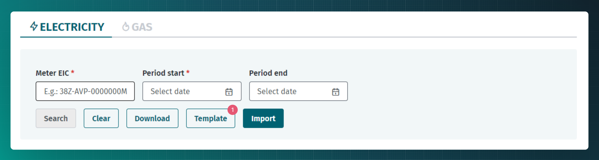
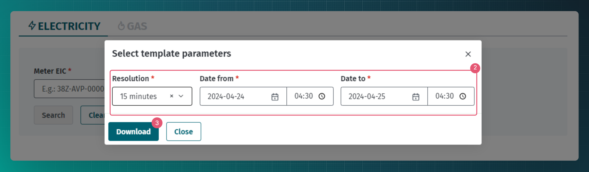
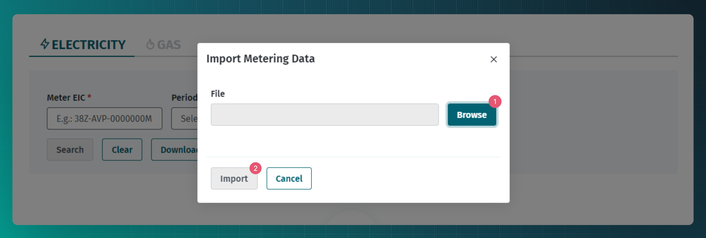
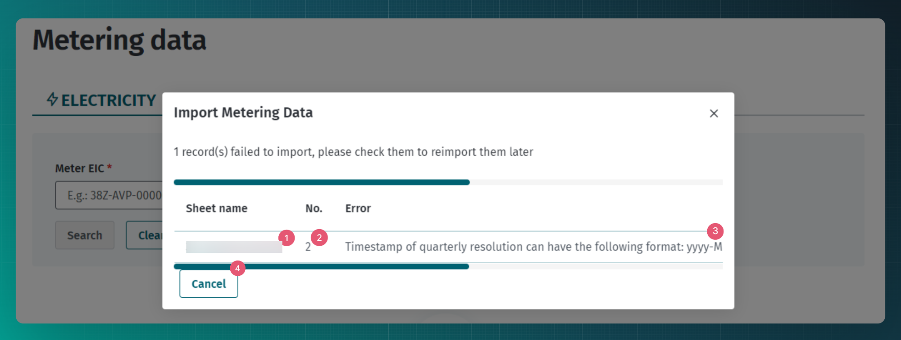
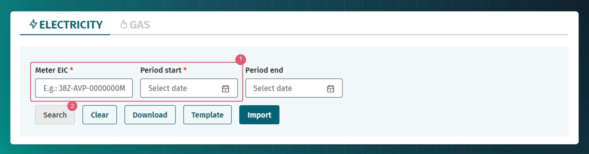

# Mõõteandmed

## Sisukord

<!-- TOC -->
* [Mõõteandmed](#mõõteandmed)
  * [Sisukord](#sisukord)
  * [Sissejuhatus](#sissejuhatus)
    * [Neto mõõdetud mõõteandmed](#neto-mõõdetud-mõõteandmed)
      * [Netomõõdetud elektri koguste näited](#netomõõdetud-elektri-koguste-näited)
      * [Muudatused API kasutajatele](#muudatused-api-kasutajatele)
      * [Muudatused veebiliidese kasutajale](#muudatused-veebiliidese-kasutajale)
  * [Mõõteandmete edastamine](#mõõteandmete-edastamine)
    * [Mõõteandmete vastuvõtmise juhtimine](#mõõteandmete-vastuvõtmise-juhtimine)
    * [Mõõteandmete edastamine veebiliidese kaudu](#mõõteandmete-edastamine-veebiliidese-kaudu)
    * [Mõõteandmete edastamine Exceli teel](#mõõteandmete-edastamine-exceli-teel)
      * [Võimalikud vead Exceli täitmisel](#võimalikud-vead-exceli-täitmisel)
    * [Masinliidese sõnumid](#masinliidese-sõnumid)
      * [Sõnumid](#sõnumid)
      * [Sõnumite reeglid](#sõnumite-reeglid)
  * [Mõõteandmete päringud](#mõõteandmete-päringud)
    * [legalConsent](#legalconsent)
    * [Aja tüüp](#aja-tüüp)
    * [Mõõteandmete otsimine veebiliidese kaudu](#mõõteandmete-otsimine-veebiliidese-kaudu)
    * [Masinliidese sõnumid](#masinliidese-sõnumid-1)
      * [Sõnumid](#sõnumid-1)
<!-- TOC -->

## Sissejuhatus

Mõõteandmed on konkreetse mõõtepunktiga seotud prognoositud või mõõdetud aktiivenergia tarbimise andmed teatud ajaperioodi kohta. Mõõteandmed on arveldamise aluseks ja neid esitavad mõõtepunkti haldurid ning tarbivad teised turuosalised (peamiselt avatud tarnijad).

### Neto mõõdetud mõõteandmed

Alates **01.08.2026** on elektriturul võrguettevõtted kohustatud edastama Estfeed Datahubi kahesuunaliste mõõtepunktide kohta neto mõõdetud mõõteandmed. Andmed tuleb võrguettevõtjal ise arvutada lahutades tootmise kogusest tarbimine. Testimine on testkeskkonnas võimalik, testkeskkonna ligipääsu puudumisel tuleb sõlmida turuosalisel testkeskkonna kasutamise leping kirjutades datahub@elering.ee.

#### Netomõõdetud elektri koguste näited 

**Näide 1 (rohkem tootmist):**
| Mõõteandme tüüp / suund | Kogus |
|-----------------------------------------|---------------------------|
| Tootmine (IN) | 15 kWh |
| Tarbimine (OUT) | 10 kWh |
| Neto - tootmine (NETO IN) | 5 kWh |
| Neto - tarbimine (NETO OUT) | 0 kWh |

**Näide 2 (rohkem tarbimist):**
| Mõõteandme tüüp / suund | Kogus |
|-----------------------------------------|---------------------------|
| Tootmine (IN) | 10 kWh |
| Tarbimine (OUT) | 15 kWh |
| Neto - tootmine (NETO IN) | 0 kWh |
| Neto - tarbimine (NETO OUT) | 5 kWh |

#### Muudatused API kasutajatele

> [!WARNING]
> `POST /api/v1/meter-data` sõnumit pole elektrituru võrguettevõtetel võimalik kasutada alates 20.07.2026 11:00. Teised rollid, näiteks liinivaldaja ja agregaator saavad V1 versiooni kasutamist veel 6 kuud peale uue versiooni kasutuselevõttu jätkata.

#### Muudatused veebiliidese kasutajale

Mõõteandmeid on jätkuvalt võimalik edastada Exceli vahendusel, kuid muutub Exceli struktuur. Uut Exceli malli saab allalaadida veebiliidesest alates 20.07.2026.

> [!WARNING]
> Uuenevad ka import ja template API lahendused, kuid tegu on veebiliidese jaoks mõeldud API-dega ja seetõttu ei ole need täpsemalt siin dokumentatsioonis kirjeldatud.

> [!WARNING]
> Kuna tegu on alles arenduses oleva funktsionaalsusega ei ole kõik uued API-d veel kirjeldatud Swaggeris.

## Mõõteandmete edastamine

Mõõtepunkti haldur tagab tema mõõtepunktide aktiivenergia koguse kindlaksmääramise ning esitab Andmelattu kahesuunalised tunnipõhised aktiivenergia koguste mõõteandmed.

Agregaator (elektriturul) edastab tarbimise juhtimise energia kogused.

Mõõtepunkti haldurid edastavad mõõtepunktide lõikes mõõteandmed järgmistel tingimustel:

1. nende mõõtepunktide kohta, kus mõõtmine toimub kauglugemise teel, edastatakse Andmelattu esialgsed mõõteandmed elektriturul igal tööpäeval kella 10.00-ks, gaasiturul kella 13:00-ks;
2. kalendrikuu lõplikud mõõteandmed mõõtepunktides, kus mõõtmine toimub kauglugemise teel, edastatakse Andmelattu elektriturul järgneva kuu 5. kuupäevaks, gaasiturul järgneva kuu 7. kuupäevaks;

Võrgu- ja liinikao koguseid arvutab Andmeladu.

Võrguettevõtja on tüüpkoormusgraafikute haldaja ja vastutab tunnipõhiste koguste edastamise eest Andmelattu.

Võrguettevõtja ja liinivaldaja saab mõõteandmed edastada Andmelattu nii veebiliidese kaudu masslaadimisega kui ka automaatse andmevahetuse sõnumiga.

Mõõteandmete edastamiseks on loodud vastavad Andmelao teenused. Ettenähtud kasutamise protsess on järgmine:

**NB! kuni 20.07.2026 on elektriandmete edastamiseks kasutuses `meter-data` teenus**

- Mõõtepunkti haldur saadab uue või muutunud mõõteandmete sõnumi kasutades elektriandmete edastamiseks teenust `metering-data/electricity` (alates 20.07.2026 kell 11:00) ja gaasiandmete edastamiseks `metering-data/natural-gas` (alates 2026 november).
- Kuivõrd mõõteandmete töötlemine toimub Andmelaos asünkroonselt, siis esmalt annab Andmeladu kiire vastuse, kas sõnum õnnestus kätte saada või mitte.
- Seejärel paneb Andmeladu sõnumi töötluse järjekorda.
- Mõõtepunkti haldur kontrollib andmete töötluse tulemust, kasutades teenust `meter-data/status`(sõnumi positsioonil `originalDocumentIdentification` tuleb edastada eelnevalt edastatud mõõteandmete sõnumi `header`-is olnud samanimelise atribuudi väärtus. UUID väärtust ei tohi taaskasutada). Võimalikud tulemused on:
  - `PROCESSING` - töötlus ei ole veel lõppenud
  - `SUCCESSFUL` - töötlus lõppes vigadeta
  - `ERROR` - töötlus lõppes vigadega
- Kui sõnumi töötlemine õnnestub vigadeta, siis andmed lisatakse või muudetakse andmebaasis ning Andmeladu teeb mõõteandmete lisandumise või muutumise kättesaadavaks avatud tarnijatele läbi andmete levitamise teenuse. Loe täpsemalt peatükist [Andmete levitamine](30-andmete-levitamine.md).
- Kui sõnumi töötlemisel tekivad vead, siis Andmeladu koostab vearaporti ja teeb selle kättesaadavaks mõõtepunkti haldurile teenuse `meter-data/status` vastuses.
- Mõõtepunkti haldur loeb talle adresseeritud vearaportit ning lahendab selle vastavalt oma sisemisele äriloogikale.

> [!WARNING]
> **NB! Andmeladu edastab võrguettevõtjate poolt sisestatud mõõteandmed muutmata kujul. Andmeladu ei kontrolli mõõteandmete sisu**

> [!WARNING]
> Mõõteandmete saatmisel V2 API kaudu kehtib piirang perioodide arvule, mida saab ühe Exceli faili või API sõnumiga edastada. Korraga on võimalik saata kuni 35 040 perioodi mõõteandmeid. See tähendab, et kui saadetakse igapäevaselt ühe päeva andmeid, saab ühe Exceli faili või API sõnumiga edastada kuni 365 mõõtepunkti andmed. Pikema perioodi korral tuleb vastavalt vähendada mõõtepunktide arvu.

> [!WARNING]
> `meter-data/status` teenus ei väljasta kirjeid, mis on loodud rohkem kui 7 päeva tagasi.

> [!NOTE]
> Tasub teada, et eksisteerib üliväike, kuid teoorias siiski võimalik olukord, kus Andmeladu võtab mõõteandmete sõnumi vastu ja vastab "protsessimine alustatud" vastusega, kuid tegelikkuses jääb sõnum töötlemata ja selle kohta ei looda ka ´meter_data_status´ kirjet.
> Mõõtepunkti haldur peaks pidama järge, mis igast mõõteandmete sõnumist on saanud ja kas töötlus lõppes mingi tulemusega. Kui mõnele mõõteandmete sõnumile ei tekigi tõpptulemust, siis tuleb eeldada, et Andmelaos tekkis mõõteandmete töötlemisel ootamatu probleem (nt rakenduse ootamatu sulgumine) ja edastada mõõteandmed uuesti.
> Tulemuste jälgimiseks on erinevaid võimalusi. Nt pärida staatust ükshaaval `originalDocumentIdentification` alusel (juhul, kui andmemahud on väikesed) või skanneerida `SUCCESSFUL` ja `ERROR` staatuseid ja pidada sisemiselt järge, millised sõnumid on lõppolekusse jõudnud

### Mõõteandmete vastuvõtmise juhtimine

Vastuvõetud mõõteandmete töötlemine on 2 etapiline protsess:
- mõõtetulemus võetakse vastu (200) ja pannakse töötlemise järjekorda;
- mõõteandmete töötleja võtab järjekorrast mõõtetulemuse, märgib staatuse, salvestab andmebaasi ja uuendab staatuse.

Kui mõõteandmete töötlmine toimub aeglasemalt kui uusi tulemusi vastu võetakse hakkab töötlemise järjekord kasvama.

Kui järjekorda on juba kogunenud 100 000 päringu andmed, siis POST /metering-data päring vastab päringu tegijale
- HTTP status 503
- HTTP header Retry-After: 300

Lahendus põhineb spetsifikatsioonidel:
- https://developer.mozilla.org/en-US/docs/Web/HTTP/Status/503
- https://developer.mozilla.org/en-US/docs/Web/HTTP/Headers/Retry-After

### Mõõteandmete edastamine veebiliidese kaudu

Mõõteandmete edastamiseks veebiliidese kaudu tuleb navigeerida "Metering data" lehele.

Mõõteandmete mugavamaks edastamiseks on võimalik alla laadida template. Template koostamiseks tuleks valida mõõteandmete resolutsioon ning ajavahemik, selle põhjal koostatakse eeltäidetud template. Tähelepanu tuleks pöörata valitud ajavahemikule - valitud kellaajad peavad vastama mõõteandmete resolutsioonile.

Exceli täitmise juhendi leiab siit: [Mõõteandmete edastamine Exceli teel](#mõõteandmete-edastamine-exceli-teel)

Mõõteandmete importimiseks tuleks vajutada "Metering data" lehel nuppu "Import". Seejärel on võimalik võimalik lisada mõõteandmete fail. 

Kui faili on juhtunud mõni viga annab süsteem sellest teada.
1. Mõõtepunktide andmed võivad olla lisatud ka mitmele MS Excel faili lehele, seetõttu annab süsteem kasutajatele teada, millisel lehel probleem on.
2. Lisaks on võimalik näha vigase rea numbrit.
3. Probleemi kirjeldus aitab mõista probleemi sisu.
4. Kui probleem on leitud ja fail parandatud peaks vajutama "Cancel" ning importimise protsessi kordama.

### Mõõteandmete edastamine Exceli teel

Mõõteandmete saatmiseks on võimalik kasutada Exceli faili. Seda saab saata [veebiliidese kaudu](#mõõteandmete-edastamine-veebiliidese-kaudu) või kasutades API `metering-data/import` teenust.

Mõõteandmete edastamiseks tuleks alustuseks veebiliidesest alla laadida mõõteandmete mall. Selleks leiab juhendi siit: [mõõteandmete edastamine veebiliidese kaudu](#mõõteandmete-edastamine-veebiliidese-kaudu).

Järgnevalt on välja toodud Exceli veergude kirjeldused ja näidised:

| Veeru nimi       | Turg | Kirjeldus                 | Näidis | Kohustuslik?                  
|------------------|---|---------------------------|---------------------------| ---------------------------|
| Meter EIC        | Elekter, Gaas | Mõõtepunkti EIC kood. Kood peab olema lisatud kõigile tabeli ridadele. Turuosaline peab olema mõõtepunkti omanik. Ühes failis võib saata mitme mõõtepunkti mõõteandmed, need võivad olla üksteise järel ühel lehel või jagatud mitme Exceli lehe vahel.      | 38ZEE-1000009--Z | Jah
| Period Start     | Elekter, Gaas | Perioodi algus. Kellaaeg, mis aja tarbimise / tootmise kogustega on tegu. Soovitus on kasutada mallis sisalduvat kuupäeva vormingut, vale kuupäeva vorminguga ei ole võimalik mõõteandmeid lisada. Õige vorming on dd.mm.yyyy hh:mm.  | 01.11.2024 00:00:00 | Jah
| IN Quantity kWh  | Elekter, Gaas | Võrku antud kogus. | 1,534 | Ei, kui "OUT Quantity kWh " kogus on lisatud
| OUT Quantity kWh | Elekter, Gaas | Võrgust võetud kogus.      | 1,234 | Ei, kui "IN Quantity kWh" kogus on lisatud
| IN Quantity M3  | Gaas | Võrku antud kogus kuupmeetrites. | 1,534 | Ei, kui "OUT Quantity M3" kogus on lisatud
| OUT Quantity M3 | Gaas | Võrgust võetud kogus kuupmeetrites.      | 1,234 | Ei, kui "IN Quantity M3" kogus on lisatud
| NET IN Quantity kWh  | Elekter | Võrku antud kogus. | 0,300 | Lubatud tururollidele GRID_OPERATOR ja CLOSED_DISTRIBUTION_NETWORK. Ei tohi olla täidetud, kui „inQty“ ja „outQty“ puuduvad. Kui üks netokogus on täidetud, peab ka teine olema täidetud. Kui on täidetud siis: a) Peab olema 0,000, kui „netOutQty“ on suurem kui 0,000 b) Peab olema 0,000, kui nii „inQty“ kui ka „outQty“ on mõlemad 0,000 c) Täpselt 3 kohta pärast koma.
| NET OUT Quantity kWh  | Elekter | Võrku antud kogus. | 0,000 | Lubatud tururollidele GRID_OPERATOR ja CLOSED_DISTRIBUTION_NETWORK. Ei tohi olla täidetud, kui „inQty“ ja „outQty“ puuduvad. Kui üks netokogus on täidetud, peab ka teine olema täidetud. Kui on täidetud siis: a) Peab olema 0,000, kui „netOutQty“ on suurem kui 0,000 b) Peab olema 0,000, kui nii „inQty“ kui ka „outQty“ on mõlemad 0,000 c) Täpselt 3 kohta pärast koma.
| Reading Type IN  | Elekter, Gaas | Võrku antud koguse mõõtmise tüüp. Kas mõõdetud või estimeeritud. Exceli mallis on võimalik rippmenüüst valida õige valik, peale lahtris klikkimist tuleb selleks vajutada lahtri kõrvale tekkiva noole peale. | METERED või ESTIMATED | Jah, kui "Quantity KWH IN" lahter on täidetud.
| Reading Type OUT | Elekter, Gaas | Võrgust võetud koguse mõõtmise tüüp. Kas mõõdetud või estimeeritud. Exceli mallis on võimalik rippmenüüst valida õige valik, peale lahtris klikkimist tuleb selleks vajutada lahtri kõrvale tekkiva noole peale.  | METERED või ESTIMATED | Jah, kui "Quantity KWH OUT" lahter on täidetud.

Edukaks mõõteandmete saatmiseks on oluline, et Excel oleks täidetud korrektselt ja vastaks reeglitele.

#### Võimalikud vead Exceli täitmisel

| Probleem       | Lahendus
|------------------|---------------------------
| Mõõteandmete resolutsioon on vale. | Elektriturul on võimalik saata vaid 15 minuti resolutsiooniga andmeid. Gaasiturul on võimalik saata 1 tunni ja 1 päeva resolutsiooniga andmeid 
| Mõõtepunkt ei kuulu turuosalisele. | Turuosaline saab saata mõõteandmeid vaid neile kuuluvatesse mõõtepunktidesse.
| Fail sisaldab tühjasid Exceli lehtesid. | Kuigi Excelisse võib lisada mõõteandmed mitmele lehele jaotatuna peab jälgima, et Exceli fail ei sisaldaks täiesti tühjasid või muud informatsiooni sisaldavaid Exceli lehti.
| Fail sisaldab valemeid. | Andmed peaksid olema sisestatud puhtas teksti vormingus - ilma valemiteta.
| Kellaaeg ja resolutsioon ei ole vastavuses. | 1 tunni resolutsiooni korral peaksid perioodi algusajad vastama täistundidele. 15 minuti resolutsiooni korral peaksid perioodi algusajad vastama veerandtundidele.
| Kellaaeg on vales vormingus. | "Period start" aja vorming peab olema sama, mida kasutatakse mallis. "Reading time" aja vorming peab olema sama, mis "Period start" aja vorming.
| Kõik kohustuslikud veerud ei ole täidetud | Eelnevalt toodud tabelis on välja toodud, millised väljad on kohustuslikud.
| Mõõtepunkti EIC kood puudub osadelt ridadelt | Mõõtepunkti EIC kood peab olema lisatud kõigile tabeli ridadele.
| Excelit proovitakse saata vales tururollis tegutsedes | Mõõteandmeid saavad saata võrguettevõtja, liinivaldaja, suletud jaotusvõrk ja laadimispunkti operaator. Teistes rollides pole mõõteandmeid võimalik saata. Kui turuosaline tegutseb mitmes rollis peab saatmise hetkel olema valitud sobiv roll.

### Masinliidese sõnumid

Uues API päringus on lisaks eesmärgi atribuut (Purpose). Päringus peaks määrama ka päringu tegemise eesmärgi. Näiteks, kas päring tehakse arvelduse eesmärgil või päritakse enda mõõtepunkte. Esialgu selle väärtuse lisamine ei mõjuta päringu vastust, kuid tulevikus hakkab see mõjutama ka päringu vastust. Selle muudatuse eesmärk on muuta API päring kiiremaks ja võimaldada pärida andmeid mitme mõõtepunkti EIC alusel. Energiateenuse osutaja ei tohiks lisada eesmärki, teistes rollides on see kohustuslik.

Mõõteandmete otsimine on võimalik peale uue lahenduse kasutuselevõttu 6 kuud ka V1 API kaudu, kuid V1 API ei tagasta neto mõõdetud väärtuseid.

Avatud tarnija rollis on võimalikud eesmärgid:
- `OPEN_SUPPLY` ehk peamine viis avatud tarnijana mõõteandmete pärimiseks.
- `PORTFOLIO` ehk bilansihaldurina mõõteandmete pärimine
- `BILLING` ehk arvelduse eesmärgil andmete pärimine

Mõõtepunkti halduri rollis on võimalikud eesmärgid
- `OWN_MP_MANAGEMENT` ehk enda mõõtepunktide andmete pärimine
- `OTHER` ehk teiste mõõtepunktide andmete pärimine

Mõõteandmeid on esialgu võimalik otsida ühe mõõtepunkti kaupa, kuid tulevikus lisandub ka võimalus mitme mõõtepunkti andmete korraga pärimiseks.

API teenuses kasutatavate lühendite selgitused:                                          

| lühend    | selgitus                                                          | turg           | rakendamise info     |
|-----------|-------------------------------------------------------------------|----------------|------------------------|
| periods   | ühe mõõtetulemuse intervall (elektris 15 minutit, gaasis 1 tund)  | Elekter, Gaas  |                        |
| pS        | Period Start ehk perioodi algus                                   | Elekter, Gaas  |                        |
| inQty     | IN ehk siseneva energia mõõtetulemus                              | Elekter, Gaas  |                        |
| outQty    | OUT ehk väljuva energia mõõtetulemus                              | Elekter, Gaas  |                        |
| netInQty  | neto tootmine (NETO IN)                                           | Elekter        | alates 01.08.2026      |
| netOutQty | neto tarbimine (NETO OUT)                                         | Elekter        | alates 01.08.2026      |
| rTime     | Reading Time ehk mõõtmise aeg                                     | Elekter, Gaas  |                        |
| rType     | Reading Type ehk mõõtmise tüüp (E - estimeeritud, M - mõõdetud)   | Elekter, Gaas  |                        |
| kwh       | mõõdetud kogused kWh                                              | Elekter, Gaas  |                        |
| m3        | mõõdetud kogused kuupmeetrites                                    | Elekter, Gaas  |                        |

Andmeladu ei valideeri, et gaasi mõõteandmetes iga 1 tunni või elektriandmetes 15 minuti vahemik oleks mõõteandmetega täidetud.

> [!NOTE]
> Andmete resolutsioon on Andmelao poolt jäigalt fikseeritud - Alates 01.04.2025 on elektri resolutsiooniks 15minutit. gaasi puhul on resolutsiooniks 1 tund.> 
> Gaasi puhul on lubatud edastada ka päeva andmeid. Sellisel juhul tuleb päeva mõõteandmed lisada enda poolt sobivasse gaasipäeva tundi.

#### Sõnumid

| Sõnum                                     | Eesmärk                                                              | Turg |
|-------------------------------------------|----------------------------------------------------------------------|---------|
| `POST /api/{version}/metering-data/electricity`| Mõõteandmete lisamine | Elekter |
| `POST /api/{version}/metering-data/natural-gas`| Mõõteandmete lisamine  | Gaas|
| `GET /api/{version}/metering-data/electricity/template`| Mõõteandmete masslaadimine templiidi genereerimine ja alla laadimine | Elekter |
| `GET /api/{version}/metering-data/natural-gas/template`| Mõõteandmete masslaadimine templiidi genereerimine ja alla laadimine | Gaas |
| `POST /api/{version}/meter-data/status`   | Mõõteandmete sõnumi töötlemise staatuse päring                       | Elekter, Gaas |
| `POST /api/{version}/metering-data/electricity/import`| Mõõteandmete masslaadimine templiidi abil  | Elekter |
| `POST /api/{version}/metering-data/natural-gas/import` | Mõõteandmete masslaadimine templiidi abil  | Gaas |  

#### Sõnumite reeglid

- Perioodi ajaperioodi väärtus peab olema vastavuses resolutsiooniga. Näiteks:
  - kui resolutsioon on 1 tund, siis perioodi alguse kellaaeg peab olema täistund (hh:00);
  - kui resolutsioon on 15 minutit, siis perioodi alguse kellaaeg peab olema veerandtund (hh:00, hh:15, hh:30, hh:45).
- Elektri mõõtekogused esitatakse alati kWh-des täpsusega kuni 3 kohta peale koma.
- Gaasi mõõtekogused esitatakse nii kWh-des kui ka kuupmeetrites täpsusega 3 kohta peale koma.
- Mõõteandmete suund esitatakse alati mõõtva mõõtepunkti halduri poolt vaadatuna:
  - in – võrku sisenev energia (tootmine);
  - out – võrgust väljuv energia (tarbimine).
- Siseneva ja väljuva energia koguseid võib edastada ka eraldi sõnumitega.
- Mõõteandmeid on lubatud korrigeerida tagasiulatuvalt kuni 12 kuud.
- Mõõteandmeid on lubatud edastada tulevikku (periood on tulevikus). Hetkel on maksimaalne lubatud väärtus 45 päeva tulevikus. Iga mõõtetulemust valideeritaks eraldi. Kui kasvõi üks mõõtetulemus ei läbi validatsioone, vastab süsteem koodiga ERROR, veakoodiks `period-start-too-far-in-future`.
- Teenuses `import` tuleb kasutada sama templiiti, mida väljastab teenus `export` või `metering-data/electricity/template` / `metering-data/natural-gas/template`

## Mõõteandmete päringud

Mõõteandmete edastamiseks on loodud vastavad Andmelao teenused. Andmetele ligipääs on piiratud. Reeglid on  kirjeldatud dokumendis [Rollipõhised ligipääsuõigused](03.01-rollipohised-ligipaasuoigused.md)

Mõõteandmete päringute teostamiseks on järgmised võimalused:

- Avatud tarnija, nimetatud müüja ja portfelliteenuse pakkuja skaneerib mõõteandmete muudatusi kasutades andmete levitamise teenust
- Õigustatud kasutaja pärib mõõteandmed kasutades teenust `GET /metering-data/`

### legalConsent

Nii füüsiline kui ka juriidiline isik saab läbi kliendiportaali anda andmetele ligipääsuõiguse, nagu kirjeldatud peatükis [Rollipõhised ligipääsuõigused](03.01-rollipohised-ligipaasuoigused.md)

Kui füüsiliste isikute ligipääsuõigus on oma olemuselt absoluutne, siis juriidiliste isikute puhul on võimalik ka alternatiivne töövoog, kus juriidiline isik on andnud ligipääsuõiguse Andmelao ja kliendiportaali väliselt, kuid kirjalikus taasesitamist võimaldavad vormis otse avatud tarnijale.

Sellise olukorra olemasolu saab avatud tarnija `GET /metering-data/` teenuses kinnitada, lisades päringusse `"legalConsent": true`. Sellisel juhul on avatud tarnijal võimalik pärida mistahes mõõtepunkti mõõteandmeid eeldusel, et mõõtepunkti võrgulepingu kliendiks on juriidiline isik või organisatsioon.

> [!CAUTION] 
> `"legalConsent": true` kasutamine on lubatud vaid kliendi volituse olemasolul ja selle õiguspärast kasutamist monitooritakse

### Aja tüüp

Võrreldes vana süsteemiga on kadunud `billingSequence` kontseptsioon. Selle asemel edastab mõõtepunkti haldur koos mõõteandmetega mõõtmise aja (ing. **reading time**). 
Mõõteandmete vastuvõtmisel lisab Andmeladu andmetele salvestamise aja (ing. **snapshot time**).

Kuna mõlemad ajaväärtused on Andmelao süsteemis olemas, siis võimaldab Andmeladu mõõteandmeid otsida nende ajaväärtuste alusel. Näited:

1. Avatud tarnija on huvitatud viimasest teadaolevast mõõteandmete seisust mõõtepunktis X. Selleks on tal 2 võimalust:
  * Jätab atrbibuudid `observationTimeType` ja `observationTime` sõnumisse lisamata
  * väärtustab ta sõnumis atribuudid:
  * `observationTimeType` = `SNAPSHOT_TIME`.
  * `observationTime` = hetke kuupäev ja kellaaeg
2. Avatud tarnija on huvitatud mõõteandmete seisust mõõtepunktis X kuupäeva 01.01.2024 00:00 seisuga. Selleks väärtustab ta sõnumis atribuudid:
  * `observationTimeType` = `SNAPSHOT_TIME`
  * `observationTime` = `2024-01-01T00:00:00+02:00`
3. Avatud tarnija on huvitatud mõõteandmete seisust mõõtepunktis X, kus mõõtmise aeg ei ole suurem kui 31.12.2023 23:59. Selleks väärtustab ta sõnumis atribuudid:
  * `observationTimeType` = `READING_TIME`
  * `observationTime` = `2023-12-31T23:59:59+02:00`

> [!WARNING]
> Hetkel pole toetatud `observationTimeType` = `SNAPSHOT_TIME` ja `observationTime` koos kasutamine (näide nr 2). Vastav arendus on defineeritud ja hetkeseisuga planeeritud aastasse 2024.

### Mõõteandmete otsimine veebiliidese kaudu

Mõõteandmeid saab otsida navigeerides "Metering data" lehele. Selleks tuleb sisestada otsitava mõõtepunkti EIC kood ning otsinguperioodi algkuupäev. Soovi korral võib määrata ka lõppkuupäeva.

Mõõteandmete Excelisse laadimiseks on vaja alustuseks vajutada "Otsi" nuppu, seejärel muutub "Laadi alla" nupp aktiivseks.

### Masinliidese sõnumid

#### Sõnumid

| Sõnum                                   | Eesmärk                   | Turg |
|-----------------------------------------|---------------------------|-----|
| `GET /api/{version}/metering-data/electricity` | Mõõteandmete otsing       | Elekter |
| `GET /api/{version}/metering-data/natural-gas` | Mõõteandmete otsing | Gaas |
| `GET /api/{version}/metering-data/electricity/export` | Mõõteandmete eksportimine | Elekter |
| `GET /api/{version}/metering-data/natural-gas/export` | Mõõteandmete eksportimine | Gaas |