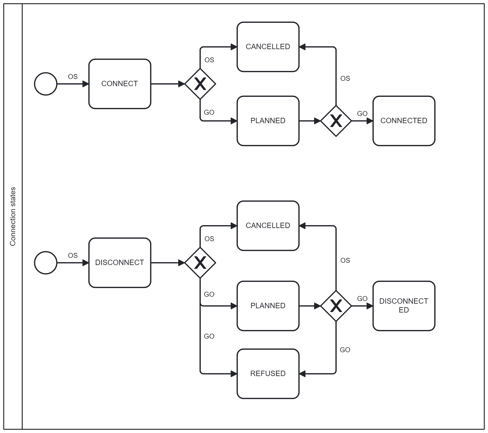

# Võrguühenduse välja- ja sisselülitamine

## Sisukord

<!-- TOC -->
* [Võrguühenduse välja- ja sisselülitamine](#võrguühenduse-välja--ja-sisselülitamine)
  * [Sisukord](#sisukord)
  * [Sissejuhatus](#sissejuhatus)
  * [Väljalülitamise ja sisselülitamise taotlus ja kinnitus](#väljalülitamise-ja-sisselülitamise-taotlus-ja-kinnitus)
    * [Masinliidese sõnumid](#masinliidese-sõnumid)
      * [Sõnumid](#sõnumid)
      * [Sõnumite reeglid](#sõnumite-reeglid)
<!-- TOC -->

## Sissejuhatus

Kui Võrguteenuse osutaja ja avatud tarnija on sõlminud ühisarve lepingu, siis saadetakse turuosalisele alati ühisarve (turuosaline ei saa seda valida) ja avatud tarnijal tekib õigus nõuda võrguühenduse väljalülitamist juhul, kui turuosaline ei ole oma ühisarvet tasunud.

## Väljalülitamise ja sisselülitamise taotlus ja kinnitus

Väljalülitamise ja sisselülitamise taotluse ja kinnituse edastamiseks on loodud vastavad Andmelao teenused. Ettenähtud kasutamise protsess on järgmine:

1. Avatud tarnija saadab välja- või sisselülitamise taotluse, kasutades teenust `initiate` ja määrates soovitud tegevuse (`CONNECT` või `DISCONNECT`.)
2. Andmeladu kontrollib, et määratud adressaadi ja saatja vahel on kehtiv (või on viimase 6 kuu jooksul olnud) ühisarve leping ning kas määratud kliendil selles mõõtepunktis on kehtiv avatud tarne leping saatjaga (või on olnud kehtiv viimase 12 kuu jooksul) ja kas määratud kliendi ja mõõtepunkti kombinatsioonil on kehtiv (või on olnud kehtiv viimase 12 kuu jooksul) võrguleping adresaadiga:
   - kui ei ole, siis Andmeladu vastab veateatega;
   - kui on, siis Andmeladu salvestab andmed andmebaasi.
3. Avatud tarnija vajadusel tühistab taotluse kasutades `message` teenust ja määrates oleku `CANCELLED`.
4. Võrguettevõtja skaneerib välja- või sisselülitamise taotlusi kasutades teenust `connection-state/search`.
5. Võrguettevõtja otsib vajadusel välja- või sisselülitamise taotlusi kasutades teenust `search`.
6. Võrguettevõtja muudab taotluse olekut kasutades teenust `message`. Võimalikud variandid on:
   - mõõtepunkti välja- või sisselülitamise plaani võtmine (`PLANNED`);
   - mõõtepunkti väljalülitamisest keeldumine (`REFUSED`);
   - mõõtepunkti välja- või sisselülitamise kinnitamine (`CONNECTED` või `DISCONNECTED`).
7. Avatud tarnija skaneerib võrguettevõtja vastuseid kasutades teenust `connection-state/search`.
8. Avatud tarnija otsib vajadusel välja- või sisselülitamise taotlusi kasutades teenust `search`.
9. Võrguettecõtja ja avatud tarnija saavad pärida välja- või sisselülitamise taotluse sõnumite ja vastuste ajalugu kasutades teenust `message-history`

> [!TIP]
> Kui teenuse `message-history` poole pöördub see turuosaline, kes ei olnud viimast sõnumit loonud (kes on sõnumi adressaat), siis sätitakse sõnumid loetuks. 
> Atribuudi `read` abil saab seega filtreerida loetud ja lugemata sõnumitega välja- või sisselülitamise taotlusi.
> Kui sama taotluse juurde lisatakse uusi sõnumeid, siis sätitakse sõnumid jälle mitte loetuks.

Sõnumiga `message` saadetavate olekute diagramm:

### Masinliidese sõnumid

#### Sõnumid

| Sõnum                                                  | Eesmärk                                                          |
|--------------------------------------------------------|------------------------------------------------------------------|
| `POST /api/{version}/connection-state/initiate`        | Sisse- või väljalülitamise taotluse lisamine                     |
| `POST /api/{version}/connection-state/search`          | Sisse- või väljalülitamise taotluste otsing                      |
| `POST /api/{version}/connection-state/message`         | Sisse- või väljalülitamise taotlusele jätkusõnumite edastamine   |
| `POST /api/{version}/connection-state/message-history` | Sisse- või väljalülitamise taotluste jätkusõnumite ajaloo otsing |

#### Sõnumite reeglid

- `initiate` teenuses on ainukesed lubatud olekud `CONNECT` või `DISCONNECT`.
- `initiate` teenus on avatud ainult avatud tarnijatele.
- `message` teenuses on avatud tarnijale lubatud edastada ainult `CANCELLED` olekut.
- `message` teenuses on võrguettevõtjale lubatud edastada `PLANNED`, `REFUSED`, `CONNECTED` ja `DICONNECTED` olekuid.
- Kui välja- või sisselülitamise taotluse olek on `CONNECTED`, `DISCONNECTED`, `REFUSED` või `CANCELLED`, siis täiendavate `message` sõnumite saatmine ei ole võimalik.
