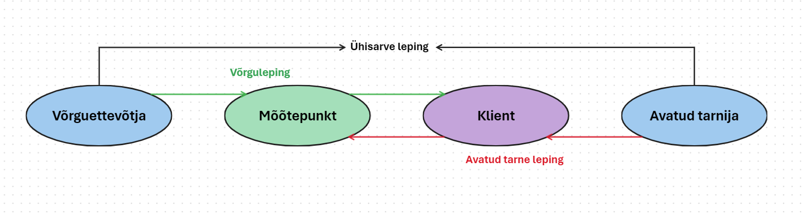

# Estfeed veebiliidese kasutusjuhend

## Sisukord

<!-- TOC -->

  * [Tavakasutaja lisamine ning õiguste andmine](#tavakasutaja-lisamine-ning-õiguste-andmine)
    * [Uue kasutaja lisamine ettevõtte alla](#uue-kasutaja-lisamine-ettevõtte-alla)
    * [Kasutaja õiguste muutmine](#kasutaja-õiguste-muutmine)
  * [Tehnilise kasutaja loomine ning õigused](#tehnilise-kasutaja-loomine-ning-õigused)
    * [Uue tehnilise kasutaja loomine](#uue-tehnilise-kasutaja-loomine)
    * [Olemasolevale tehnilisele kasutajale õiguste andmine või nende muutmine](#olemasolevale-tehnilisele-kasutajale-õiguste-andmine-või-nende-muutmine)
  * [Kasutaja õiguste lisamine või muutmine](#kasutaja-õiguste-lisamine-või-muutmine)
  * [Uue mõõtepunkti loomine](#uue-mõõtepunkti-loomine)
  * [Mõõtepunktide otsing](#mõõtepunktide-otsing)
  * [Mõõtepunktide masslaadimine](#mõõtepunktide-masslaadimine)
  * [Mõõteandmete üles ja alla laadimine](#mõõteandmete-üles-ja-alla-laadimine)
  * [Mõõteandmete otsing](#mõõteandmete-otsing)
  * [Uue kliendi lisamine süsteemi](#uue-kliendi-lisamine-süsteemi)
  * [Uue lepingu loomine](#uue-lepingu-loomine)
    * [Võrguleping](#võrguleping)
    * [Avatud tarne leping](#avatud-tarne-leping)
    * [Ühisarve leping](#ühisarve-leping)
  * [Lepingute otsing](#lepingute-otsing)
  * [Ühisarved](#ühisarved)
  * [Võrguühenduse sisse või välja lülitamine](#võrguühenduse-sisse-või-välja-lülitamine)
    * [Taotluse saatmine](#taotluse-saatmine)
    * [Taotluste lugemine](#taotluste-lugemine)
    * [Taotlusele vastamine](#taotlusele-vastamine)

## Tavakasutaja lisamine ning õiguste andmine

### Uue kasutaja lisamine ettevõtte alla

- 'Avaleht' -> 'Kasutajad ja õigused'
- 'Uus kasutaja' -> vali kasutaja tüübiks 'Tavakasutaja' 
- Sisesta selle inimese isikukood ja riik, kellele ligipääse anda
- Vali soovitud õigused (Administraator sisaldab kõiki õiguseid; iga kasutaja saab anda maksimaalselt endaga samaväärseid õiguseid)
- 'Määra'
- Soovitud õigused on isikule antud

### Kasutaja õiguste muutmine

- 'Avaleht' -> 'Kasutajad ja õigused'
- (soovi korral täpsusta otsingut nime ja/või isikukoodiga) -> 'Otsi'
- Vali kasutaja, kelle õiguseid muuta
- Kliki vastava rea parema oleval mustal ikoonil "Muuda" 
- Lisa, eemalda või vaheta kasutaja õiguseid vastavalt soovile
- 'Määra'
- Kasutaja õigused on uuendatud

Rohkem selgitusi kasutajatüüpide ja muu kohta: [Kasutajate haldus](03.02-kasutajate-haldus.md)

## Tehnilise kasutaja loomine ning õigused

### Uue tehnilise kasutaja loomine

- 'Avaleht' -> 'Kasutajad ja õigused'
- 'Uus kasutaja' -> vali kasutaja tüübiks 'Tehniline kasutaja'
- Märgi linnuke 'Või loo uus' ette
- Sisesta soovitud järellliide
- Vali õigused, mida on soov sellele tehnilisele kasutajale anda
- 'Lisa kasutaja'
- Kopeeri "Kliendi ID" ning "Kliendi saladus" kuhugi omale **koheselt** ära
- Sulge moodulaken, tehniline kasutaja on loodud ning sellele on õigused antud

> **Pane tähele!** 
> 
>Moodulaknal kuvatakse loodud tehnilise "Kliendi ID" ja "Kliendi Saladus", mis tuleb koheselt omale kuhugi kopeerida, sest "Kliendi Saladust" **hiljem mitte kusagilt kätte ei saa!**

### Olemasolevale tehnilisele kasutajale õiguste andmine või nende muutmine

Selle jaoks on kaks võimalust.

Uue kasutaja mooduli kaudu:
- 'Avaleht' -> 'Kasutajad ja õigused'
- 'Uus kasutaja' -> vali kasutaja tüübiks 'Tehniline kasutaja'
- Vali tehniline kasutaja (kui tehnilisi kasutajaid on üks, valitakse see automaatselt, kui neid on mitu tuleb avada rippmenüü ning valida üks)
- Lisa, eemalda või vaheta tehilise kasutaja õiguseid vastavalt soovile
- 'Määra'
- Tehnilise kasutaja õigused on uuendatud

Otsingu kaudu:
- 'Avaleht' -> 'Kasutajad ja õigused'
- 'Otsi'
- Vali tehniline kasutaja, mille õiguseid muuta
- Kliki vastava rea parema oleval mustal ikoonil "Muuda" 
- Lisa, eemalda või vaheta tehilise kasutaja õiguseid vastavalt soovile
- 'Määra'
- Tehnilise kasutaja õigused on uuendatud

Rohkem selgitusi kasutajatüüpide ja muu kohta:  [Kasutajate haldus](03.02-kasutajate-haldus.md)

## Uue mõõtepunkti loomine

Seda saab teha võrguettevõtja, agregaatori või suletud jaotusvõrgu rollides. 
- 'Mõõtepunktid' -> 'Mõõtepunktide masslaadimine' -> 'Genereeri EIC koodid' -> vali mitut koodi vaja on -> 
'Genereeri'
- Kopeeri genereeritud EIC kood(id)
- 'Mõõtepunktid' -> 'Uus'
- Täida vajalikud lahtrid (kohustuslikud väljad on märgitud punase tärniga)
- 'Loo' 
- Uus mõõtepunkt on loodud

> **Pane tähele!!!**
> 
> -> **Võrguettevõtja** ja **suletud jaotusvõrgu** rollis on uue mõõtepunkti loomiseks vajalik kehtiv "Ülekandevõrgu EIC kood".
> 
> -> **Agregaatori** rollis on vajalik "Ülemmõõtepunkti EIC koodi", mille alla loodav agregeerimispunkt kuuluma hakkab.

Rohkem selgitusi: [Veebiliideses](05-mootepunktid.md)

## Mõõtepunktide otsing

- 'Mõõtepunktid'
- Täpsusta otsingut vastavalt vajadusele (klikkides 'Üksikasjalik otsing' näeb rohkem otsingut täpsustavaid parameetreid)
- 'Otsi'
- Otsingutulemustes näidatakse otsingu parameetritele vastavaid mõõtepunkte.

Rohkem selgitusi: [Veebiliideses](05-mootepunktid.md)

## Mõõtepunktide masslaadimine

- 'Mõõtepunktid' -> 'Mõõtepunktide masslaadimine' -> 'Laadi alla'
- Täitke alla laetud fail ära soovitud mõõtepunktide andmetega ning salvestage see arvutisse
- 'Impordi' -> 'Otsi' -> valige eelnevalt täidetud fail -> 'Impordi'
- Eduka importimise korral on kõik failis kirjeldatud mõõtepunktid süsteemi lisatud. Seda saab kontrollida kui minna mõõtepunktide otsingusse (vt [Mõõtepunktide otsing](#mõõtepunktide-otsing)) ning otsida mõnda mõõtepunki, mis just üles laeti.

Rohkem selgitusi: [Veebiliideses](05-mootepunktid.md)

## Mõõteandmete üles ja alla laadimine

Mõõteandmete Estfeedi üles laadimine:

- 'Mõõteandmed' -> 'Mall' -> vali sobivad parameetrid (*tunni andmete puhul peavad kellaajad olema täistunnid või 15 min andmete puhul veerandtunnid*) -> 'Laadi alla'
- Täida alla laetud mall ära üles laetavate mõõteandmetega ja salvesta oma arvutisse, Exceli täitmise juhendi leiab siit: [Mõõteandmete edastamine Exceli teel](12-mooteandmed.md#mõõteandmete-edastamine-exceli-teel)
- 'Mõõteandmed' -> 'Impordi' -> vali fail, mida üles laadida -> 'Impordi'
- Kui fail oli ilma vigadeta, siis peaks mõõteandmed olema üles laetud või üles laadimisel
- Kas mõõteandmed said üles laetud saab kontrollida kahte moodi:
  -  'Mõõteandmed' -> 'Mõõteandmete olek' -> vali ajavahemik -> 'Otsi'
  - 'Mõõteandmed' -> täida vastavad väljad -> 'Otsi' -> vaata kas üles laetud mõõteandmed tagastatakse otsingu tulemustes

  Rohkem selgitusi: [Mõõteandmete edastamine veebiliidese kaudu](12-mooteandmed.md)

Mõõteandmete alla laadimine:
- 'Mõõteandmed' -> täida nõutud väljad -> 'Otsi' -> 'Laadi alla'
- Fail soovitud mõõteandmetega laetakse alla

## Mõõteandmete otsing

- 'Mõõteandmed'
- Sisesta "Mõõtepunkti EIC kood" ja "Perioodi algus" (otsingut saab täpsustada kasutades erinevaid parameetreid)
- 'Otsi'
- Sisestatud otsingule vastavad mõõteandmed on kuvatud otsingu tulemustes

Rohkem selgitusi: [Mõõteandmete otsimine veebiliidese kaudu](12-mooteandmed.md)

## Uue kliendi lisamine süsteemi

Seda saab teha ainult võrguettevõtja rollis.

- 'Lepingud' -> 'Uus leping' -> 'Otsi mõõtepunkti' -> täpsusta otsingut -> 'Otsi'
- Vali üks või mitu mõõtepunkti
- 'Otsi klienti' -> 'Registreeri uus klient'
- Vali kliendi tüüp (füüsiline isik, juriidiline isik, organisatsioon)
- Täida nõutud väljad
- 'Salvesta'
- Uus klient on süsteemi lisatud ning temaga saab nüüd lepinguid vormistada

Rohkem selgitusi: [Veebiliideses](06.2-vorguleping.md)

## Uue lepingu loomine

### Võrguleping:
Seda saab teha vaid võrguettevõtja rollis.
- 'Lepingud' -> 'Uus leping' 
- Vali lepingu tüüp (Võrk, Piirivõrk)
- 'Otsi mõõtepunkti'
- Otsi valitud parameetrite järgi üles mõõtepunkt, millele soovitakse lepingut luua
- Vali üks või mitu mõõtepnkti
- 'Otsi klienti'
- Vali klient (*või registreeri uus kui soovitud klient ei ole juba süsteemis, selleks vt [Uue kliendi lisamine süsteemi](#Uue kliendi lisamine süsteemi)*)
- Lisage lepingu alguse kuupäev (ja lõpukuupäev)
- 'Registreeri uus leping'
- Uus leping on lisatud

Rohkem selgitusi: [Veebiliideses](06.2-vorguleping.md)

### Avatud tarne leping:
Seda saab teha vaid avatud tarnija rollis.
- 'Lepingud' -> 'Uus leping' 
- Lisa kliendi EIC või vajuta 'Otsi klienti', mille abil saab klienti otsida erinevate parameetrite järgi
- Kui klient on valitud -> 'Otsi mõõtepunkti' -> 'Nõustun'
- Vali üks või mitu mõõtepunkti, millele soovitakse tarne leingut koostada
- Lisage lepingu alguse kuupäev (ja lõpukuupäev)
- 'Registreeri uus leping'
- Uus leping on lisatud

Rohkem selgitusi: [Veebiliideses](06.3-avatud-tarne-leping.md)

### Ühisarve leping:
Seda saab teha vaid suletud jaotusvõrgu või võrguettevõtja rollides. 
- 'Lepingud' -> 'Ühisarve lepingud' -> 'Uus'
- Lisa "teenusepakkuja EIC kood" (kui EIC koodi ei tea, saad otsida ka kliendi nime järgi)
- Lisa kehtivusaja algus (ning soovi korral kehtivusaja lõpp)
- 'OK'
- Ühisarve leping on lisatud

Rohkem selgitusi: [Ühisarve lepingute edastamine veebiliidese kaudu](06.7-yhisarve-leping.md)

## Lepingute otsing

- 'Lepingud'
- Täida soovitud väljad, et täpsustada otsingut (rohkem valikuid 'Üksikasjalik otsing' all)
- 'Otsi'
- Valitud parameetritele vastavad lepingud on kuvatud otsingu tulemustes

## Ühisarved
Ühisarveid näevad ainult võrguettevõtja (kes saadab) ning avatud tarnija (kellele saadetakse).

Ühisarvete otsimine:
- 'Ühisarved'
- Vali ajavahemik ('Loomise alguskuupäev' ja 'Loomiselõppkuupäev')
- 'Otsi'

Kui otsitavas ajavahemikus on olemas ühisarved, siis on need otsingutulemustes kuvatud.

Ühisarvete alla laadimine:
- Otsi soovitud ajavahemikus ühisarveid
- Vali ühisarve, mida alla laadida -> klikka valitud rea kõige paremal olevale alla laadimise ikoonile
- Valitud ühisarve laetakse seadmesse alla ning märgitakse süsteemis "Loetud", kui avatud tarnija on selle arve alla laadinud

## Võrguühenduse sisse või välja lülitamine

Võrguühenduse sisse või välja lülitamise taotluse saatmise eelduseks on vastavate osapoolte vahel juba eksisteerivad ühisarve leping (vt [Ühisarve leping](#Ühisarve-leping)), võrguleping (vt [Võrguleping](#võrguleping)) ning avatud tarne leping (vt [Avatud tarne leping](#avatud-tarne-leping)).

***Joonis 1.** Võrguühenduse lülituste eelduste skeem*

### Taotluse saatmine

Seda saab teha vaid avatud tarnija rollis. Kui kõik eelduseks olevad lepingud on olemas, siis:

- 'Lülitamise taotlused' -> 'Algata'
- Täida kohustuslikud väljad (need on tähistatud punase tärniga)
- *"Saaja EIC kood" - võrguettevõtja EIC kood, kellel on hetkel kehtiv võrguleping valitud mõõtepunktis valitud kliendiga ning kellega on olemas kehtiv ühisarve leping*
- *"Kliendi EIC kood" - kliendi EIC kood, kellel on kehtivad võrgu- ja avatud tarne lepingud valitud mõõtepunktis*
- *"Mõõtepunkti EIC kood" - mõõtepunkti EIC kood, millel on kehtivad võrgu- ja avatud tarne lepingud vastava kliendiga*
- Soovi korral saab lisada ka sõnumi
- 'Saada'
- Võrguühenduse sisse või välja lülitamise taotlus on saadetud

### Taotluste lugemine

Seda saab teha avatud tarnija, suletud jaotusvõrgu või võrguettevõtja rollis.

- 'Lülitamise taotlused'
- Vali ajavahemik, mille sisse peaks otsitava taotluse loomise kuupäev jääma (valida tuleb nii "Loomise alguskuupäev" kui ka "Loomise lõppkuupäev")
- 'Otsi'
- Otsingu tulemustes kuvatakse vastavas ajavahemikus loodud lülitamiste taotlusi
- Avades vastava sõnumi real kõige parempolse ikooni 'Sõnumiajalugu' saab vaadata vastava lülituse taotluse sõnumite ajalugu 

### Taotlusele vastamine

Seda saab teha avatud tarnija või võrguettevõtja rollis.

- 'Lülitamise taotlused'
- Tee vastavas ajavahemikus otsing
- Vali taotluse sõnum, millele soovid vastata
- Kliki paremalt teisel ikoonil 'Kiirvastus'
- Täida ära kõik vajalikud lahtrid
- 'Vasta'
- Lülitamise taotlusele on vastus saadetud. Seda saab kotrollida 'Sõnumiajalugu' alt.