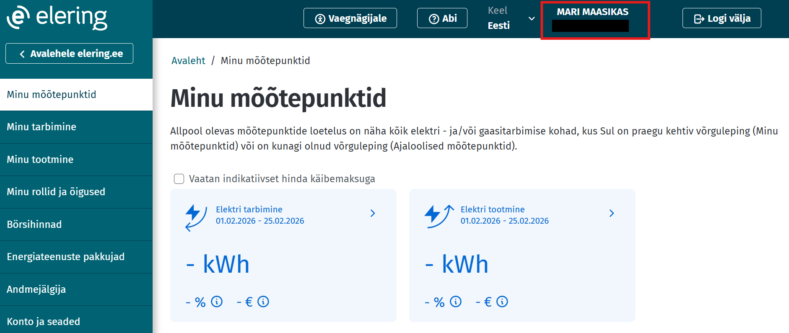
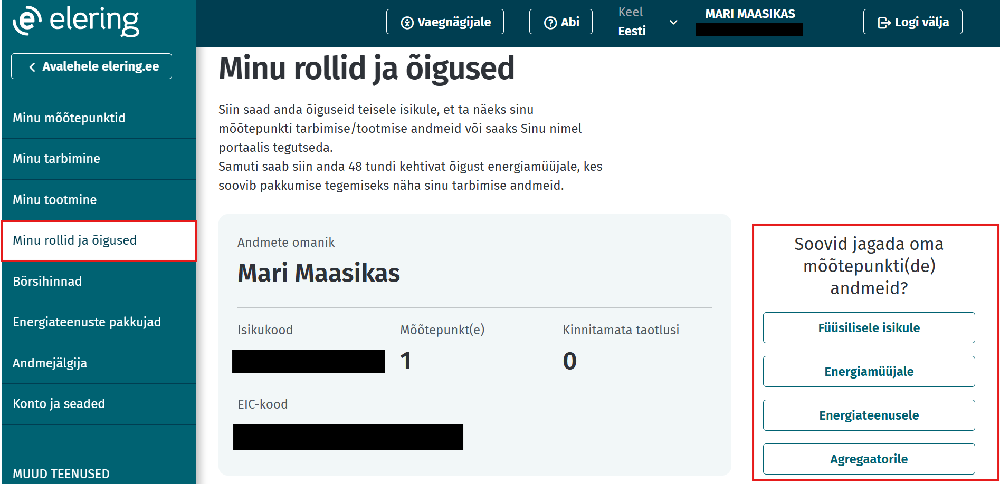

# Õiguste jagamine Kliendiportaalis

## Sisukord

<!-- TOC -->
* [Õiguste jagamine Kliendiportaalis](#õiguste-jagamine-kliendiportaalis)
  * [Sisukord](#sisukord)
  * [Sissejuhatus](#sissejuhatus)
  * [Üldine õiguste jagamise protsess](#üldine-õiguste-jagamise-protsess)
    * [Õiguse jagamine füüsilisele isikule](#õiguse-jagamine-füüsilisele-isikule)
    * [Õiguse jagamine teisele juriidilisele isikule](#õiguse-jagamine-teisele-juriidilisele-isikule-võimaldatud-ainult-juriidilistele-isikutele)
    * [Õiguse jagamine energiamüüjale](#õiguse-jagamine-energiamüüjale)
    * [Õiguse jagamine energiateenusele](#õiguse-jagamine-energiateenusele)
    * [Õiguse jagamine agregaatorile](#õiguse-jagamine-agregaatorile)
    * [Õiguse vastuvõtmine](#õiguse-vastuvõtmine)
<!-- TOC -->

## Sissejuhatus

Kliendiportaalis saab kasutaja hallata oma esindus- ja ligipääsuõigusi. Füüsilise isikuna saad õiguseid jagada teisele füüsilisele isikule, elektri- ja gaasimüüjatele ning energiateenustele. Juriidilise isiku rollis saab õiguseid jagada ka teistele juriidilisele isikule ning määrata esindajale täieõiguslik või piiratud esindusõigus. Õiguse saaja peab talle jagatud õiguse 7 päeva jooksul vastu võtma, vastasel juhul muutub antud õigus kehtetuks. Kõiki antud õigusi saab Kliendiportaalis muuta või tagasi võtta. Täpsemad tingimused on kirjeldatud [Kasutustingimuste punktis 5.5](https://estfeed.elering.ee/terms-of-service).

## Üldine õiguste jagamise protsess

- Logi sisse veebilehel https://estfeed.elering.ee
- Veendu, et oled õiges rollis, kelle alt soovid õigusi jagada. Rolli vahetamiseks kliki enda nimel

- Vali vasakpoolsest menüüst 'Minu rollid ja õigused'
- 'Soovid jagada oma mõõtepunkti(de) andmeid?' -> vali, kellele soovid õigust jagada ja jätka vastava alapeatüki juhendi järgi

### Õiguse jagamine füüsilisele isikule

Õiguse saaja on füüsiline isik ehk eraisik.

- 'Füüsilisele isikule' -> 'Alusta' -> sisesta isikukood ja kliki 'Edasi'
- Vali õigus, mida soovid füüsilisele isikule jagada ja kliki 'Edasi'
- Vali kas soovid füüsilisele isikule jagada elektri või gaasi mõõtepunktide õigust ning kliki 'Edasi'. Kui oled valinud eelmises sammus esindusõiguse ja soovid füüsilist isikut volitada kõigi mõõtepunktide esindajaks, siis kliki 'Vali kõik mõõtepunktid' lingil.
- Vali nimekirjast mõõtepunktid, mille esindajaks soovid füüsilist isikut volitada, ning kliki 'Edasi'
- Vali õiguse kehtivuse aeg ning kliki 'Edasi'. Kui kiirvalikutes sobivat ajaperioodi ei leidu, siis valides 'Määran ise kehtivuse' saab sisestada õiguse algus- ja lõppkuupäeva käsitsi.
- Kontrolli üle õiguse andmed ning kliki 'Kinnita'
- Loodud õiguse leiab 'Minu poolt antud õigused' sakilt "Ootel" staatuses
- Õiguse saaja saab õiguse oma Kliendiportaalis ('Minu rollid ja õigused' -> 'Taotlused') 7 päeva jooksul kas aktsepteerida või tagasi lükata. Kui selle aja jooksul otsust ei tehta, muutub taotlus kehtetuks ja õigus kaob.
- Kui õiguse saaja võtab õiguse vastu, siis muutub õiguse staatus seisu "Aktiivne".
- "Ootel" staatuses õigust saab tühistada ning vaadata õiguse detaile. „Aktiivne“ staatuses õigust saab muuta, tühistada ja vaadata õiguse detaile. Õigust saab tühistada nii õiguse andja kui ka saaja.

### Õiguse jagamine teisele juriidilisele isikule

Õiguse saaja on teine juriidiline isik, näiteks ettevõte või organisatsioon. Ainult juriidiline isik saab jagada õigusi teisele juriidilisele isikule.

- 'Juriidlisele isikule' -> 'Alusta' -> sisesta registrikood ja kliki 'Edasi'
- Vali õigus, mida soovid juriidilisele isikule jagada ja kliki 'Edasi'
- Vali kas soovid juriidilisele isikule jagada elektri või gaasi mõõtepunktide õigust ning kliki 'Edasi'. Kui oled valinud eelmises sammus esindusõiguse ja soovid juriidilist isikut volitada kõigi mõõtepunktide esindajaks, siis kliki 'Vali kõik mõõtepunktid' lingil.
- Vali nimekirjast mõõtepunktid, mille esindajaks soovid juriidilist isikut volitada, ning kliki 'Edasi'
- Vali õiguse kehtivuse aeg ning kliki 'Edasi'. Kui kiirvalikutes sobivat ajaperioodi ei leidu, siis valides 'Määran ise kehtivuse' saab sisestada õiguse algus- ja lõppkuupäeva käsitsi.
- Kontrolli üle õiguse andmed ning kliki 'Kinnita'
- Loodud õiguse leiab 'Minu poolt antud õigused' sakilt "Ootel" staatuses
- Õiguse saaja saab õiguse oma Kliendiportaalis ('Minu rollid ja õigused' -> 'Taotlused') 7 päeva jooksul kas aktsepteerida või tagasi lükata. Kui selle aja jooksul otsust ei tehta, muutub taotlus kehtetuks ja õigus kaob.
- Kui õiguse saaja võtab õiguse vastu, siis muutub õiguse staatus seisu "Aktiivne".
- "Ootel" staatuses õigust saab tühistada ning vaadata õiguse detaile. „Aktiivne“ staatuses õigust saab muuta, tühistada ja vaadata õiguse detaile. Õigust saab tühistada nii õiguse andja kui ka saaja.

### Õiguse jagamine energiamüüjale

Õiguse saaja on registreeritud elektri- või gaasimüüja, kes vajab mõõtepunkti tarbimisandmeid, et pakkuda teenuseid ja arveldusi.

- 'Energiamüüjale' -> 'Alusta'
- Vali kas soovid energiamüüjale jagada elektri või gaasi mõõtepunktide õigust ja kliki 'Edasi'
- Märgi linnukesega energiamüüja(d), kellele soovid õigust jagada, ning kliki 'Edasi'
- Kontrolli üle õiguse andmed ning kliki 'Kinnita'
- Loodud õiguse leiab 'Minu poolt antud õigused' sakilt "Aktiivne" staatuses
- Loodud õigust saab tühistada ja vaadata õiguse detaile

### Õiguse jagamine energiateenusele

Õiguse saaja on energiateenuse osutaja, kes on registreeritud juriidiline isik ja osutab energiateenuseid või rakendab energiatõhususe meetmeid lõpptarbija seadmetes või ruumides.

- 'Energiteenusele' -> 'Alusta'
- Märgi linnukesega energiateenus(ed), kellele soovid oma mõõtepunkti andmeid jagada, ning kliki 'Edasi'
- Vali mõõtepunkt(id), mille andmeid soovid  jagada, ja kliki 'Edasi'
- Vali õiguse kehtivuse aeg ning kliki 'Edasi'. Kui kiirvalikutes sobivat ajaperioodi ei leidu, siis valides 'Määran ise kehtivuse' saab sisestada õiguse algus- ja lõppkuupäeva käsitsi.
- Kontrolli üle õiguse andmed ning kliki 'Kinnita'
- Loodud õiguse leiab 'Minu poolt antud õigused' sakilt "Aktiivne" staatuses
- Loodud õigust saab tühistada ja vaadata õiguse detaile

### Õiguse jagamine agregaatorile

Õiguse saaja on Elering AS poolt registreeritud agregaator, kes ühendab tarbijate tarbimiskoormuse või tootjate tootmisvõimsuse elektriturul müümiseks või ostmiseks.

- 'Agregaatorile' -> 'Alusta'
- Vali mõõtepunkt(id), mille andmeid soovid agregaatoriga jagada, ja kliki 'Edasi'
- Märgi linnukesega agregaator(id), kellele soovid andmeid jagada ning kliki 'Edasi'
- Kontrolli üle õiguse andmed ning kliki 'Kinnita'
- Loodud õiguse leiab 'Minu poolt antud õigused' sakilt "Aktiivne" staatuses
- Loodud õigust saab tühistada ja vaadata õiguse detaile

### Õiguse vastuvõtmine

Ligipääsu- või esindusõiguse taotlus tuleb Kliendiportaalis vastu võtta või tagasi lükata 7 päeva jooksul alates õiguse andmisest, vastasel juhul muutub õigus kehtetuks.

- Logi sisse veebilehel https://estfeed.elering.ee
- Vali vasakpoolsest menüüst 'Minu rollid ja õigused'
- "Taotlused" sakilt leiab ootel õigused, mida saab kinnitada või tagasi lükata