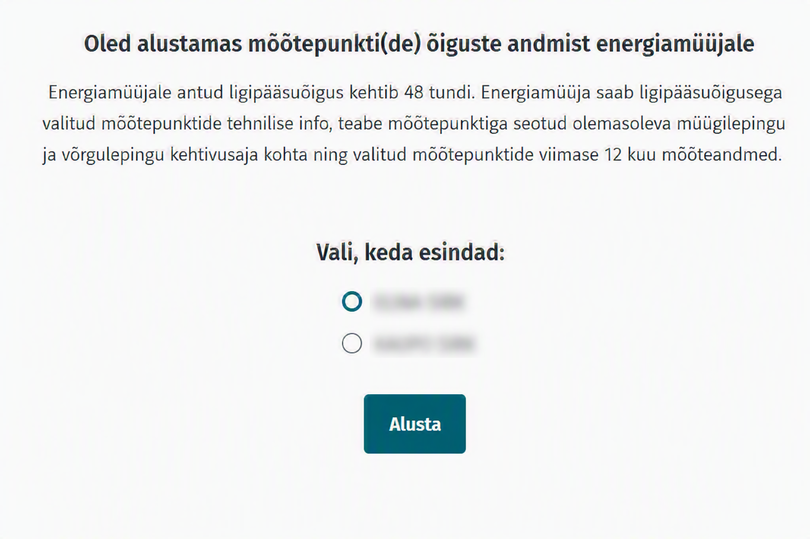
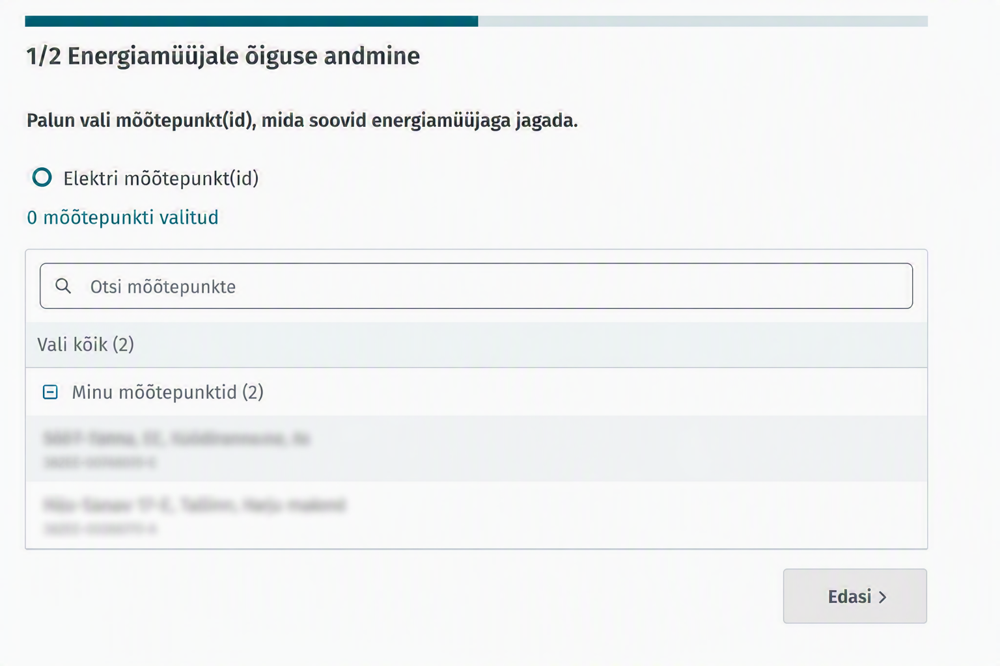
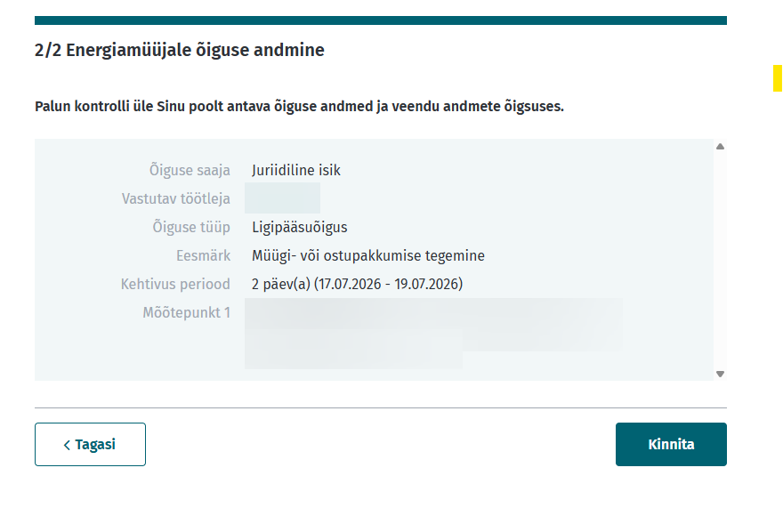

# Sujuva nõusoleku jagamise teenus

## Sisukord
  * [Ülevaade](#ülevaade)
    * [Kasutusjuht](#kasutusjuht)
    * [Kliendi teekond](#kliendi-teekond)
    * [Antavad õigused](#antavad-õigused)
  * [Integratsioon](#integratsioon)
    * [Tagasisuunamine](#tagasisuunamine)
    * [Lubatud URL-id ja whitelistimine](#lubatud-URL-id-ja-whitelistimine)
    * [Uue turuosalise liidestamine](#uue-turuosalise-liidestamine)
  * [Kliendi teekond kliendiportaalis](#kliendi-teekond-kliendiportaalis)

## Ülevaade

Sujuva nõusoleku jagamise teenus võimaldab avatud tarnijal suunata kliendi oma iseteenindusest otse Estfeed kliendiportaali, kus klient saab anda nõusoleku oma mõõteandmete ja mõõtepunktide tehniliste andmete jagamiseks avatud tarnijaga.

Lahendus toimib sarnaselt pangalingile – klient suunatakse avatud tarnija iseteenindusest Estfeed kliendiportaali, annab vajalikud nõusolekud ning seejärel suunatakse automaatselt tagasi teenusepakkuja keskkonda.

Teenuse eesmärk on muuta andmete jagamise protsess kliendile võimalikult lihtsaks ja kiireks.

### Kasutusjuht

Teenust kasutatakse olukordades, kus klient soovib jagada oma andmeid enne lepingu sõlmimist või lepingu sõlmimise protsessi käigus.

Näiteks võib avatud tarnija pakkumise tegemiseks vajada ligipääsu kliendi mõõteandmetele. Sellisel juhul ei pea klient eraldi Estfeed kliendiportaali külastama, vaid saab nõusoleku anda otse müüja iseteenindusest algatatud protsessi kaudu.

### Kliendi teekond

Sujuva nõusoleku andmise protsess koosneb järgmistest sammudest:

1. Klient algatab protsessi turuosalise iseteeninduses.
2. Klient suunatakse Estfeed kliendiportaali.
3. Klient autentib ennast Estfeed kliendiportaalis.
4. Mitme võimaliku rolli olemasolul valib klient, millises rollis ta tegutseda soovib. Näiteks, kui kliendile on jagatud esindusõiguseid või tal on esindusõigus mõnes ettevõttes.
5. Klient valib mõõtepunktid, mille andmeid ta jagada soovib.
6. Kliendile kuvatakse kokkuvõte antavatest õigustest.
7. Klient kinnitab nõusoleku andmise.
8. Kliendile kuvatakse teade nõusoleku edukast või ebaõnnestunud loomisest.
9. Klient suunatakse tagasi teenusepakkuja keskkonda.

### Antavad õigused

Nõusolek annab ligipääsu:

- viimase 12 kuu andmetele mõõteandmetele;
- mõõtepunkti tehnilistele andmetele;

Loodud nõusoleku kehtivusaeg on 48 tundi.

12 kuu andmetele ligipääsu saab avatud tarnija vaid juhul, kui kliendil on võrguleping vähemalt 12 kuud kehtinud. Lühema perioodi puhul saab avatud tarnija lühema perioodi andmed. Kui kliendi võrguleping algab alles tulevikus ei saa klient avatud tarnijale andmetele ligipääsu nõusolekut luua.

## Integratsioon

Teenuse kasutamiseks tuleb turuosalisel suunata klient Estfeed kliendiportaali vastava URL-i kaudu. Näiteks:
`https://estfeed.elering.ee/grant?eic=38X-XXXXXXXXX&energy_type=Electricity&redirect_uri=https://iseteenindus.turuosaline.ee/uus-leping`

Suunamisel edastatakse järgmised parameetrid:

| Parameeter | Kirjeldus |
|------------|-----------|
| `eicCode` | Ettevõte EIC kood, kellele ligipääsu soovitakse jagada.  |
| `energyType` | Energia liik (`electricity` või `gas`) |
| `redirectUrl` | URL, kuhu klient pärast protsessi lõppu tagasi suunatakse |
| `showBackButton` | Määrab, kas kasutajale kuvatakse nupp „Tagasi teenusepakkuja juurde“. Üldjuhul kasutatakse väärtust 'true'.  |

### Tagasisuunamine

Pärast nõusoleku andmist kuvatakse kliendile tulemusvaade.

Kui tagasisuunamise URL on määratud:

- kuvatakse nupp **„Tagasi teenusepakkuja juurde“**;
- kui klient 5 sekundi jooksul nuppu ei vajuta, suunatakse ta automaatselt määratud URL-ile.

### Lubatud URL-id ja whitelistimine

Turvalisuse tagamiseks saab klienti pärast nõusoleku andmise protsessi lõppu suunata ainult eelnevalt lubatud aadressidele.

Kõik `redirectUrl` väärtused peavad olema domeeni täpsusega kantud Estfeedi lubatud URL-ide nimekirja (whitelist).

Kui suunamisaadress ei ole lubatud nimekirjas, siis tagasisuunamist ei toimu.

Lubatud URL-ide haldus toimub Eleringi poolt.

### Uue turuosalise liidestamine

Teenuse kasutuselevõtu protsess on järgmine:
1. Kooskõlastage lahenduse kasutamine Eleringiga kirjutades meilile datahub@elering.ee. Meilile lisage täiendavad andmed:
- teie EIC kood
- testkeskkonna tagasisuunamise URL-id domeeni täpsusega, mida soovite lahenduse testimisel kasutada
- live keskkonna tagasisuunamise URL-id domeeni täpsusega
2. Elering whitelistib teie EIC koodi ja URL-id ja teavitab teid, kui muudatus on tehtud.
3. Lahendus on teie jaoks avatud ja kasutatav. Soovitame testida eelnevalt Estfeedi kliendiportaali testkeskkonnas.

## Kliendi teekond kliendiportaalis
Siin on välja toodud ekraanipildid, milline näeb kasutaja jaoks teekond välja kliendiportaalis.

